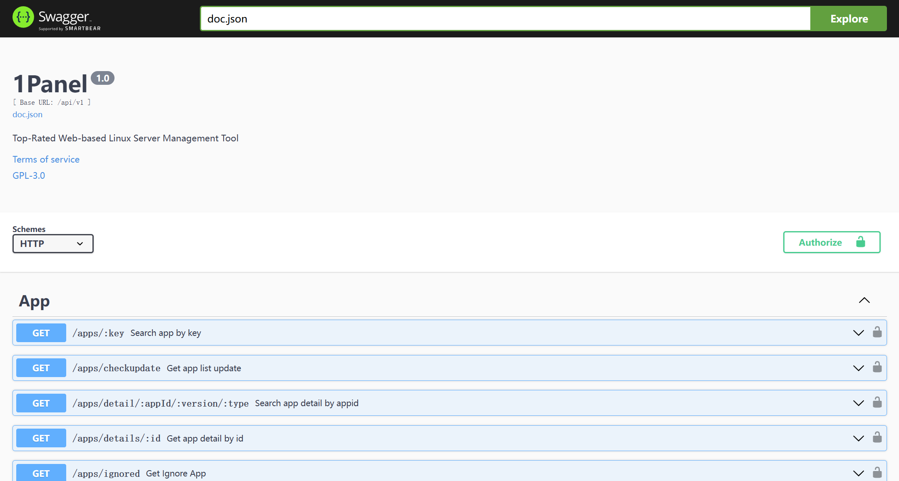
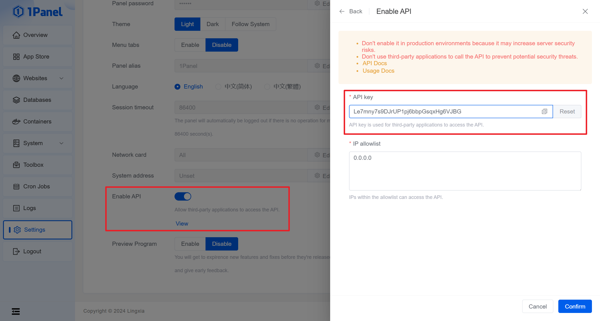

# API Manual

## API Document

1Panel leverages Swagger to offer built-in API documentation, accessible via the following URL:

```text
http://IP:port/1panel/swagger/index.html
```


{: .browser-mockup .with-url }

## API authorization

When calling the 1Panel API, authorization is required based on the following two request headers:

| Header Name | Description |
|:---|:---|
| 1Panel-Token | 1Panel's custom token format, generated with `md5sum('1panel' + API-key + UnixTimestamp)` method |
| 1Panel-Timestamp | The timestamp used in the 1Panel-Token |

The API-key used to generate the 1Panel-Token can be viewed or reset on the 1Panel Console `Settings` - `Panel` page.


{: .browser-mockup .with-url }

## Sample code

=== "shell"
    ```shell
    # Replace with your actual API key
    PANEL_API_KEY="Le7mny7s9DJrUP1pj6bbpGsqxHg6VJBG"
    PANEL_TIMESTAMP=$(date +%s)
    PANEL_TOKEN=$(echo -n "1panel${PANEL_API_KEY}${PANEL_TIMESTAMP}" | md5sum | awk '{print $1}')
    # Replace `http://IP:port` with your actual 1Panel access address
    curl -iL -H "1Panel-Token: ${PANEL_TOKEN}" -H "1Panel-Timestamp: ${PANEL_TIMESTAMP}" "http://IP:port/api/v1/dashboard/base/os"
    ```
