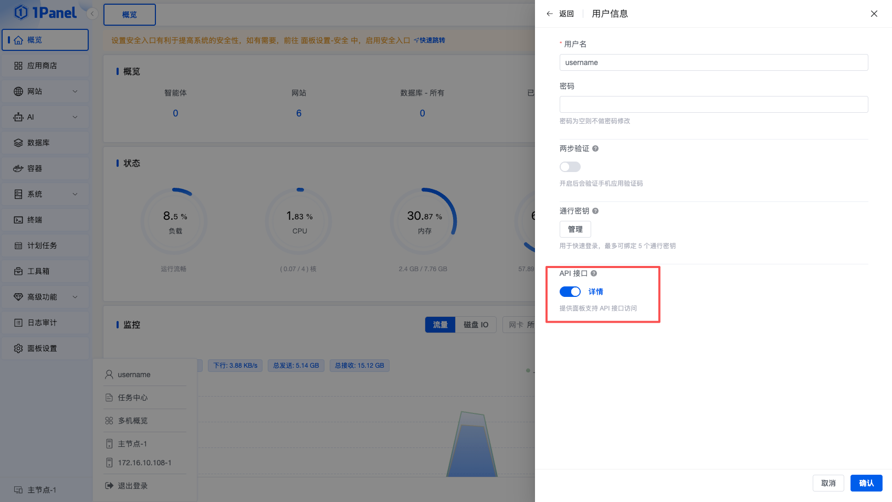

!!! note ""

    本文档介绍如何在第三方服务中使用 API Key 访问 1Panel 接口。

## 1 接口配置说明

!!! note ""

    登录后，可通过访问 Swagger 地址：`{host}:{port}/1panel/swagger/index.html` 查看所有 API。

    API Key 需要在面板中创建并启用，同时配置 IP 白名单和有效时间。

### 1.1 API 接口入口

!!! note ""

    v2.2.1 版本之前，API 接口设置入口位于「面板设置」中。
    v2.2.1 版本之后，点击左下角用户菜单，进入用户信息抽屉，可在「API 接口」区域启用或关闭 API 接口访问，并点击「详情」维护 API Key、IP 白名单和有效时间。

<div class="browser-mockup" markdown>



</div>

## 2 请求鉴权

### 2.1 请求 Header

!!! note ""

    每次 API 请求需要携带以下 Header：

    | Header 名称        | 说明               |
    |------------------|--------------------|
    | 1Panel-Token     | 根据 API Key 计算出的签名 |
    | 1Panel-Timestamp | 当前 Unix 时间戳，单位为秒 |

    示例：

    ```bash
    curl -k -X POST "http://{host}:{port}/api/v2/toolbox/device/base" \
      -H "1Panel-Token: <1panel_token>" \
      -H "1Panel-Timestamp: <current_unix_timestamp>"
    ```

### 2.2 Token 生成方式

!!! note ""

    1Panel 当前兼容以下两种 Token 生成方式。为了兼容历史版本，服务端不要求客户端额外传递版本号或加密方式。

    **方式一：MD5（兼容旧版本，后续版本会去除）**

    ```text
    Token = md5('1panel' + API-Key + UnixTimestamp)
    ```

    **方式二：HMAC-SHA256（推荐新接入使用）**

    ```text
    Token = hmac_sha256(API-Key, '1panel:' + UnixTimestamp)
    ```

    组成部分：

    - `API-Key`：面板 API 接口密钥。
    - `UnixTimestamp`：当前时间戳，秒级。
    - `1panel` / `1panel:`：固定签名内容前缀。

### 2.3 Go 示例

!!! note ""

    MD5 示例：

    ```go
    func generateMD5Token(apiKey, timestamp string) string {
        h := md5.New()
        h.Write([]byte("1panel" + apiKey + timestamp))
        return hex.EncodeToString(h.Sum(nil))
    }
    ```

    HMAC-SHA256 示例：

    ```go
    func generateHMACToken(apiKey, timestamp string) string {
        mac := hmac.New(sha256.New, []byte(apiKey))
        mac.Write([]byte("1panel:" + timestamp))
        return hex.EncodeToString(mac.Sum(nil))
    }
    ```

## 3 注意事项

!!! note ""

    - 请确保客户端和服务器时间同步，建议使用 NTP。
    - IP 白名单支持单个 IP 和 CIDR；如需放行所有 IPv4，可配置 `0.0.0.0/0`；如需放行所有 IPv6，可配置 `::/0`。
    - 旧版本客户端可继续使用 MD5 方式生成 Token。
    - 新接入系统建议使用 HMAC-SHA256 方式生成 Token。
