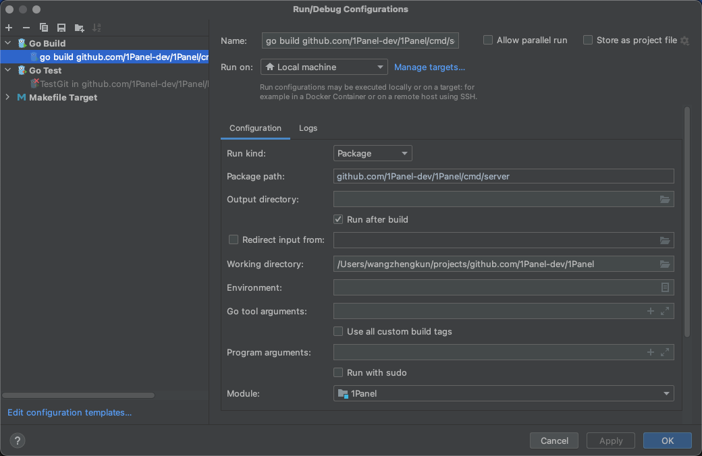
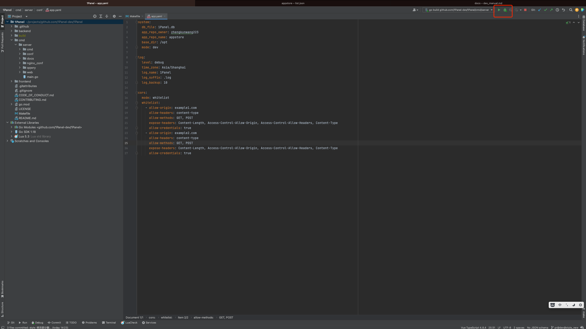

# Building from Source

## Source Code Structure

```text
.
├── backend                      # Backend project root directory
├── build                        # Build directory
├── cmd                          # Backend startup directory
└── frontend                     # Frontend project root directory
```

## Setting Up the Development Environment

### Environment Preparation

#### Backend

The 1Panel backend utilizes the Golang language with the Gin framework and employs go.mod as the project management tool. Developers must first install golang version 1.22 or higher in their development environment.

#### Frontend

The 1Panel frontend leverages Vue.js as the frontend framework, Element-Plus as the UI framework, and npm as the package management tool. Developers should first download Node.js as the runtime environment. For IDEA users, it is recommended to install the Vue.js plugin to facilitate development.

#### Installing npm

Visit the [website](https://nodejs.org/en/download/), select the appropriate installation package, and proceed with the installation.

### Initial Configuration

1Panel will default to loading the configuration file located at /opt/1panel/conf/app.yaml.

Please refer to the configuration below to create the corresponding directory and configuration file.

```yaml
system:
    db_file: 1Panel.db
    base_dir: /opt
    mode: dev
    repo_url: https://resource.fit2cloud.com/1panel/package
    app_repo: https://apps-assets.fit2cloud.com
    is_demo: false
    port: 9999
    username: admin # Initial username
    password: admin123 # Initial password

log:
    level: debug
    time_zone: Asia/Shanghai
    log_name: 1Panel
    log_suffix: .log
    max_backup: 10
```

## Running the Code

### Running the Backend Service

Create a new git project and enter the main project's git address: git@github.com:1Panel-dev/1Panel.git


### Creating a Go Build Startup Item



### Running the Backend

First, enter the frontend directory under the project directory and execute `npm run build:dev` to package frontend resources.



### Running the Frontend

1. Enter the frontend directory under the project directory and use npm i to install frontend dependency packages  
2. After installation, use `npm run dev` to start the frontend. Once the frontend is started, it can be accessed via http://localhost:4004/
3. Use the default username admin and default password admin123 to log in
