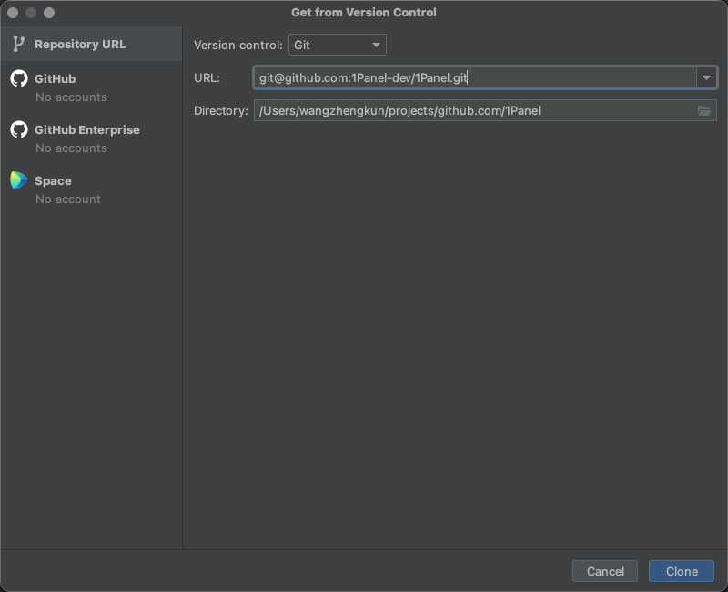
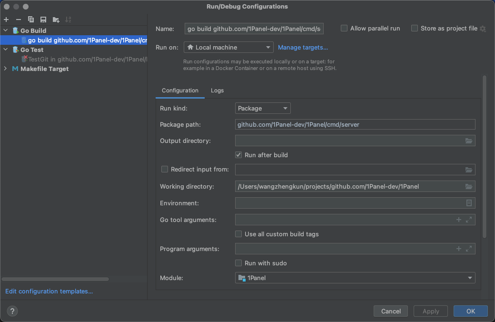
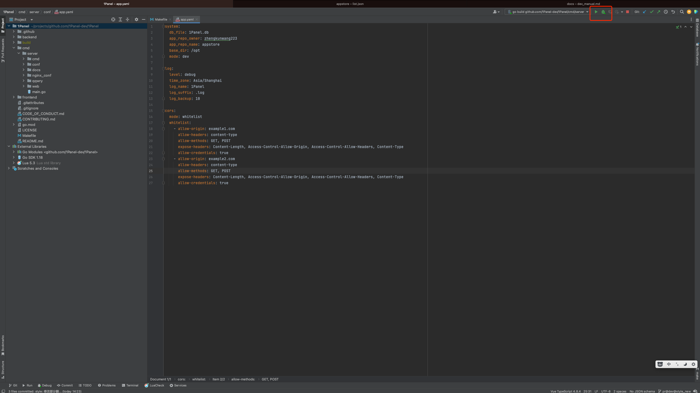

## 1 项目结构

```
.
├── backend                                         # 后端项目主目录
├── build                                           # 编译目录
├── cmd                                             # 后端启动目录
└── frontend                                        # 前端项目主目录

```

## 2 配置开发环境

### 2.1 环境准备

!!! Abstract "后端"
    1Panel 后端使用了 Golang 语言的 Gin 框架，并使用 go.mod 作为项目管理工具。开发者需要先在开发环境中安装 go 1.22 或者以上版本

!!! Abstract "前端"
    1Panel 前端使用了 Vue.js 作为前端框架，Element-Plus 作为 UI 框架，并使用 npm 作为包管理工具。开发者请先下载 Node.js 作为运行环境，IDEA 用户建议安装 Vue.js 插件，便于开发。  
    npm 版本 9.6.x ，Node.js 版本 20.2.x

!!! Abstract "安装 npm"
    [进入网站](https://nodejs.org/en/download/)， 选择相应的安装包进行安装即可。

### 2.2 初始化配置

!!! Abstract "配置文件"
    1Panel 会默认加载该路径下的配置文件 /opt/1panel/conf/app.yaml，**请参考下面配置创建对应目录及配置文件**。  

    ```
    system:
        db_file: 1Panel.db
        base_dir: /opt
        mode: dev
        repo_url: https://resource.fit2cloud.com/1panel/package
        app_repo: https://apps-assets.fit2cloud.com
        is_demo: false
        port: 9999
        username: admin #初始用户名
        password: admin123 #初始密码
    
    log:
        level: debug
        time_zone: Asia/Shanghai
        log_name: 1Panel
        log_suffix: .log
        max_backup: 10
    ```

## 3 代码运行

### 3.1 运行后端服务

!!! Abstract ""
    新建一个 git 项目 输入主工程 git 地址: git@github.com:1Panel-dev/1Panel.git

{width="900px"}  

### 3.2 新建 Go build 启动项



### 3.3 运行后端

!!! Abstract ""

    - 需要先进入工程目录下的子目录 frontend, 执行 npm run build:dev 打包前端资源



### 3.4 运行前端

!!! Abstract ""

    - 进入工程目录下的子目录 frontend, 用 npm i 安装前端依赖包  
    - 安装完成后，使用 npm run dev 命名启动前端,前端启动后即可通过 http://localhost:4004/ 地址访问
    - 使用默认用户名 admin 默认密码 admin123 登录

