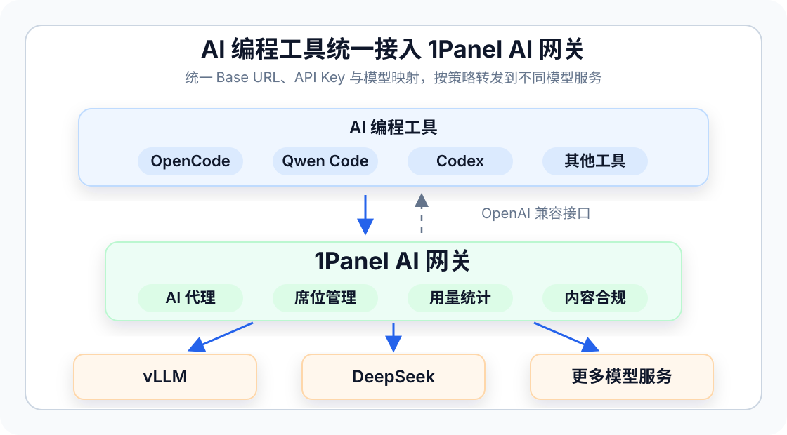

## 1 AI 编程工具如何接入 1Panel AI 网关？

<div class="browser-mockup" markdown>



</div>

!!! note ""
    大多数 AI 编程工具只要支持 OpenAI 兼容接口，就可以接入 1Panel AI 网关。接入时主要填写三个参数：

    - **Base URL**：填写 AI 网关的外部访问地址，通常格式为 `http://<服务器 IP>:<端口>/v1`
    - **API Key**：填写 AI 网关中创建的 API Key
    - **Model**：填写 AI 网关模型映射中的请求模型名称，例如 `qwen3-coder`

    `Model` 不一定是上游模型的真实名称。客户端请求的模型名称需要先在 **AI -> AI 网关 -> 模型池** 中完成映射，再由网关转发到实际模型。

    推荐先使用以下命令确认 AI 网关可以正常访问：

    ```bash
    curl http://<服务器 IP>:4000/v1/chat/completions \
      -H "Authorization: Bearer <API Key>" \
      -H "Content-Type: application/json" \
      -d '{
        "model": "qwen3-coder",
        "messages": [
          {
            "role": "user",
            "content": "Hello"
          }
        ],
        "stream": true
      }'
    ```

## 2 OpenCode 如何接入 AI 网关？

!!! note ""
    OpenCode 支持在配置文件中自定义 Provider，并可以通过 `baseURL` 指向自定义 OpenAI 兼容接口。

    在用户级配置 `~/.config/opencode/opencode.json` 或项目根目录的 `opencode.json` 中添加如下配置：

    ```json
    {
      "$schema": "https://opencode.ai/config.json",
      "provider": {
        "onepanel-ai-gateway": {
          "npm": "@ai-sdk/openai-compatible",
          "name": "1Panel AI Gateway",
          "options": {
            "baseURL": "http://<服务器 IP>:4000/v1"
          },
          "models": {
            "qwen3-coder": {
              "name": "qwen3-coder"
            }
          }
        }
      },
      "model": "onepanel-ai-gateway/qwen3-coder"
    }
    ```

    启动 `opencode` 后，通过 `/connect` 配置该 Provider 的 API Key，然后通过 `/models` 选择模型。

    如果当前 OpenCode 版本未在 `/connect` 中展示自定义 Provider，可以改用 OpenCode 已支持的 OpenAI 兼容 Provider，并将其 `baseURL` 覆盖为 AI 网关的外部访问地址。

## 3 Qwen Code 如何接入 AI 网关？

!!! note ""
    Qwen Code 支持 OpenAI 兼容协议，可以在 `~/.qwen/settings.json` 中通过 `modelProviders.openai` 配置自定义服务地址。

    示例配置如下：

    ```json
    {
      "modelProviders": {
        "openai": [
          {
            "id": "qwen3-coder",
            "name": "1Panel AI Gateway - qwen3-coder",
            "baseUrl": "http://<服务器 IP>:4000/v1",
            "envKey": "ONEPANEL_AI_GATEWAY_API_KEY"
          }
        ]
      },
      "security": {
        "auth": {
          "selectedType": "openai"
        }
      },
      "model": {
        "name": "qwen3-coder"
      }
    }
    ```

    建议将 API Key 写入 `~/.qwen/.env`，不要直接提交到项目代码中：

    ```bash
    ONEPANEL_AI_GATEWAY_API_KEY=sk-xxxx
    ```

    启动 `qwen` 后，可以通过 `/model` 切换到 AI 网关中的模型。

## 4 Codex 如何接入 AI 网关？

!!! note ""
    Codex 支持通过 `config.toml` 配置模型供应商。接入 AI 网关时，建议将配置写入用户级配置文件 `~/.codex/config.toml`，不要写入项目级 `.codex/config.toml`。

    如果希望通过独立 Provider 接入 AI 网关，可以使用如下配置：

    ```toml
    model = "qwen3-coder"
    model_provider = "onepanel-ai-gateway"

    [model_providers.onepanel-ai-gateway]
    name = "1Panel AI Gateway"
    base_url = "http://<服务器 IP>:4000/v1"
    env_key = "ONEPANEL_AI_GATEWAY_API_KEY"
    ```

    然后在终端中设置 AI 网关 API Key：

    ```bash
    export ONEPANEL_AI_GATEWAY_API_KEY="sk-xxxx"
    ```

    启动 Codex CLI 后，Codex 会将请求发送到 AI 网关。`model` 需要填写 AI 网关模型映射中的请求模型名称，例如 `qwen3-coder`。

    如果只是想让 Codex 内置 OpenAI Provider 走代理或网关，也可以在 `~/.codex/config.toml` 中设置：

    ```toml
    model = "qwen3-coder"
    openai_base_url = "http://<服务器 IP>:4000/v1"
    ```

    这种方式仍使用 OpenAI Provider 的认证方式；如果 AI 网关使用独立 API Key，优先使用上面的自定义 Provider 配置。

## 5 其他 AI 编程工具如何接入？

!!! note ""
    Cursor、Continue、Cline、Aider 等工具如果支持 OpenAI 兼容接口，一般也可以按以下方式配置：

    - 将 **OpenAI Base URL** 或 **API Base** 设置为 AI 网关外部访问地址，例如 `http://<服务器 IP>:4000/v1`
    - 将 **API Key** 设置为 AI 网关中创建的 API Key
    - 将 **Model** 设置为 AI 网关模型映射中的请求模型名称

    如果工具支持环境变量，也可以按工具要求设置：

    ```bash
    export OPENAI_API_KEY="sk-xxxx"
    export OPENAI_BASE_URL="http://<服务器 IP>:4000/v1"
    export OPENAI_MODEL="qwen3-coder"
    ```

    不同工具读取的环境变量名称可能不同。如果环境变量不生效，请以该工具设置页面中的 Base URL、API Key、Model 字段为准。

## 6 常见问题如何排查？

!!! note ""
    **返回 401 或 API Key 无效**

    检查 AI 网关 API Key 是否填写正确，API Key 绑定的用户组是否启用，请求头是否为 `Authorization: Bearer <API Key>`。

    **返回 model not found**

    检查客户端填写的模型名称是否等于 AI 网关模型映射中的请求模型名称，而不是上游供应商的真实模型名称。

    **连接失败或返回 404**

    检查 Base URL 是否包含 `/v1`，AI 网关服务是否已启动，监听端口、防火墙和外部访问地址是否配置正确。

    **工具调用或代码编辑失败**

    优先选择支持 tool calling / function calling 的编程模型，例如 Qwen Coder、DeepSeek Coder 等。部分工具对工具调用格式要求较严格，需要更换模型或调整工具侧 Provider 类型。

    **流式输出中断或请求超时**

    检查 AI 网关设置中的最大并发、队列等待超时、非流式请求超时和流式空闲超时，并结合 AI 网关日志、用量统计排查上游模型响应情况。

## 7 参考链接

!!! note ""
    - [OpenCode Providers](https://opencode.ai/docs/providers/)
    - [OpenCode Config](https://opencode.ai/docs/config/)
    - [Qwen Code Authentication](https://qwenlm.github.io/qwen-code-docs/en/users/configuration/auth/)
    - [Codex Configuration](https://developers.openai.com/codex/config-basic)
    - [Codex Advanced Configuration](https://developers.openai.com/codex/config-advanced)
