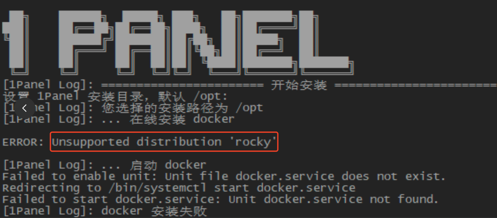

## 1 在线安装 docker 时，提示 "ERROR: Unsupported distribution 'xxx'"

{ width="900px" }

!!! Abstract ""
    **上图的错误是由于 docker 的在线安装脚本不支持该操作系统导致的，目前最好的解决方案就是先手动在服务器上安装并启动 Docker，然后再安装 1Panel。**

=== "RockyLinux"
    !!! Abstract ""

        **设置仓库**
        ```shell
        sudo yum-config-manager \
            --add-repo \
            http://mirrors.aliyun.com/docker-ce/linux/centos/docker-ce.repo
        ```

        **安装 Docker**
        ```shell
        sudo yum install docker-ce docker-ce-cli containerd.io docker-compose-plugin
        ```

        **启动 Docker 服务**
        ```shell
        sudo systemctl start docker.service
        sudo systemctl enable docker.service
        ```

=== "AlmaLinux"
    !!! Abstract ""

        **更新系统**
        ```shell
        sudo dnf update
        sudo dnf install epel-release
        sudo dnf remove podman buildah
        ```

        **添加了 Docker-CE 存储库**
        ```shell
        sudo dnf config-manager --add-repo=https://download.docker.com/linux/centos/docker-ce.repo
        ```

        **安装 Docker-CE**
        ```shell
        sudo dnf install docker-ce docker-ce-cli containerd.io
        ```

        **启动 Docker**
        ```shell
        sudo systemctl start docker.service
        sudo systemctl enable docker.service
        ```
