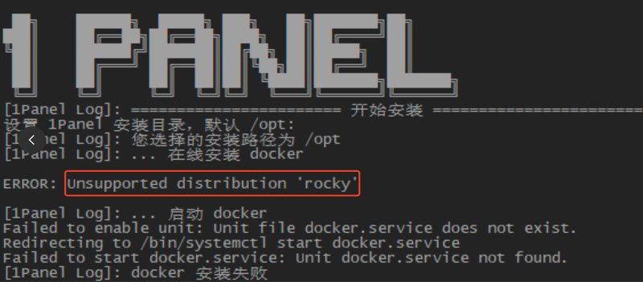
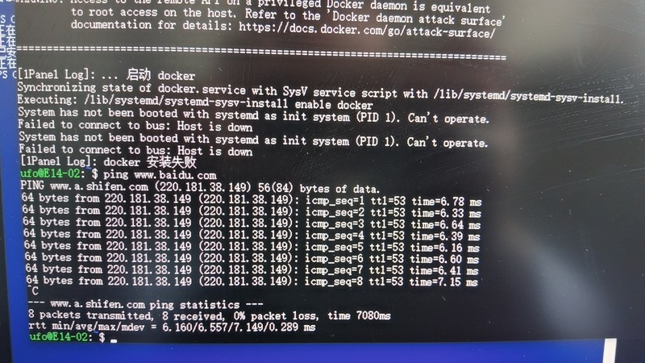

## 1 When installing Docker online, it shows "ERROR: Unsupported distribution 'xxx'"

{ width="550px" }

!!! note ""
    **The error above occurs because the official Docker installation script does not support your operating system.
    The best solution is to manually install and start Docker on your server first, then install 1Panel.**

    You can try running this script:
    ```bash
    bash <(curl -sSL https://linuxmirrors.cn/docker.sh)
    ```
    For more information, please visit the official site: https://linuxmirrors.cn

## 2 Installation fails under Windows WSL

!!! note ""
    **System has not been booted with systemd as init system (PID 1). Can't operate. Failed to connect to bus: Host is down**

{ width="550px" }

!!! note ""
    **The error above occurs because WSL does not enable systemd by default, causing Docker startup failure.**

    - Enable systemd in WSL, and the issue will be resolved.
    - Reference: [Systemd support is now available in WSL!](https://devblogs.microsoft.com/commandline/systemd-support-now-available-wsl/)

## 3 After installing 1Panel on Fedora 37, firewall rules created by the panel do not work

!!! note ""
    **This is caused by Fedora 37 not using `public` as the default zone.
    You can set the default zone manually with the following commands:**

    ```bash
    firewall-cmd --set-default-zone=public
    ```

    ```bash
    firewall-cmd --reload
    ```
