# 智能体

!!! info "适用版本与权限"
    智能体管理适用于社区版、专业版和企业版。社区版最多管理 5 个智能体，专业版和企业版不限制数量。企业版用户需要对应的智能体查看或管理权限。

!!! note ""
    **智能体**（AI Agent）可以理解成一个"能自主干活的 AI 助手"——它不只会聊天，还能按你的设定接入聊天软件、调用工具、执行任务。比如 OpenClaw 是一个可接入飞书、企业微信等渠道的私人助理，Hermes Agent 则是面向编程和自动化场景的助手。

    1Panel 在 **AI -> 智能体** 中集中安装和管理这些受支持的智能体应用。当前页面包含智能体列表、模型账号，以及按智能体类型和版本动态显示的配置能力。

## 1 使用前提

!!! note ""
    - Docker 服务和应用商店状态正常。
    - 已准备要使用的模型服务及 API Key；也可以先在 **AI -> 模型管理 -> 模型账号** 中创建账号。
    - 服务器可以访问智能体应用镜像和所需的软件源。
    - 对外开放 WebUI 或频道前，已完成防火墙、域名、HTTPS 和访问控制配置。

## 2 安装智能体

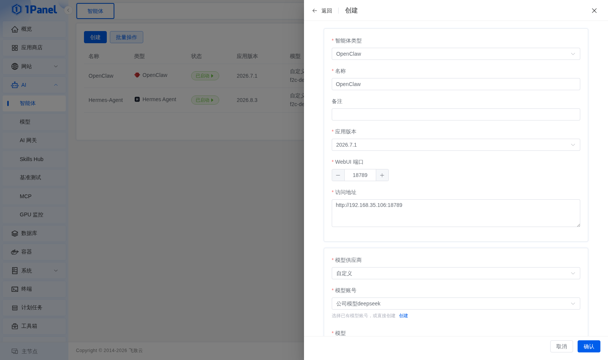

!!! note ""
    1. 进入 **AI -> 智能体**，点击 **创建**。
    2. 选择页面当前支持的智能体类型。
    3. 填写名称、备注、应用版本和 WebUI 端口；访问地址由系统根据节点地址自动生成。
    4. 选择模型供应商和模型账号，按需配置模型，并填写 Token、容器名称、绑定主机 IP、重启规则、CPU/内存限制等认证与容器参数。
    5. 确认参数后提交任务，在任务日志中查看安装结果。

!!! warning "访问地址"
    对外开放 WebUI 或频道前，请确认访问地址只指向可信来源，避免把智能体管理界面直接暴露到公网。

## 3 日常管理

!!! note ""
    智能体列表支持查看状态和版本，并根据当前状态执行概览、配置、终端、对话、启动、停止、重启、升级和删除等操作。不同智能体类型支持的按钮可能不同，更多操作入口在 **更多** 下拉菜单中。

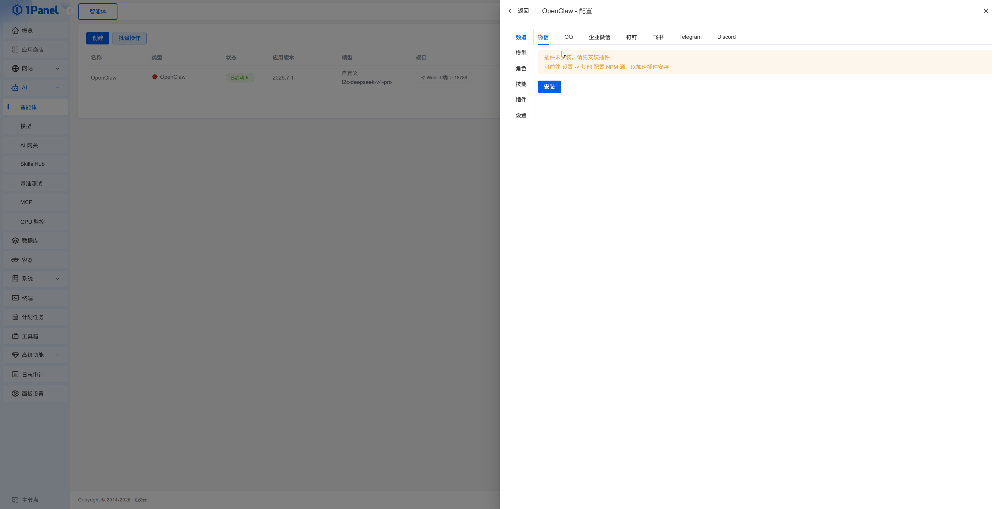

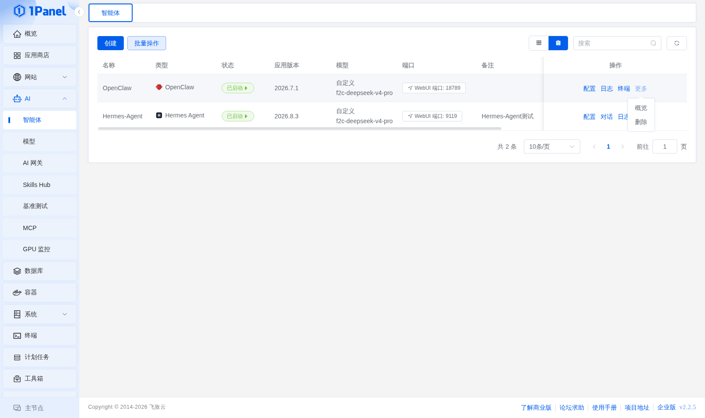

### 3.1 概览

!!! note ""
    概览展示运行状态、应用版本、默认模型、已配置频道数量、技能数量、定时任务数量和会话数量等摘要。页面数据取决于智能体类型及其版本是否支持对应接口。

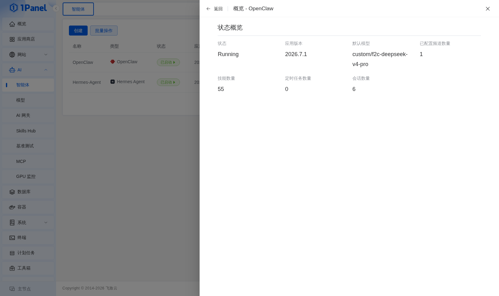

### 3.2 模型

!!! note ""
    模型页用于选择主模型、维护可用模型和备用模型。修改模型账号时，可以选择是否同步更新关联智能体的配置文件。

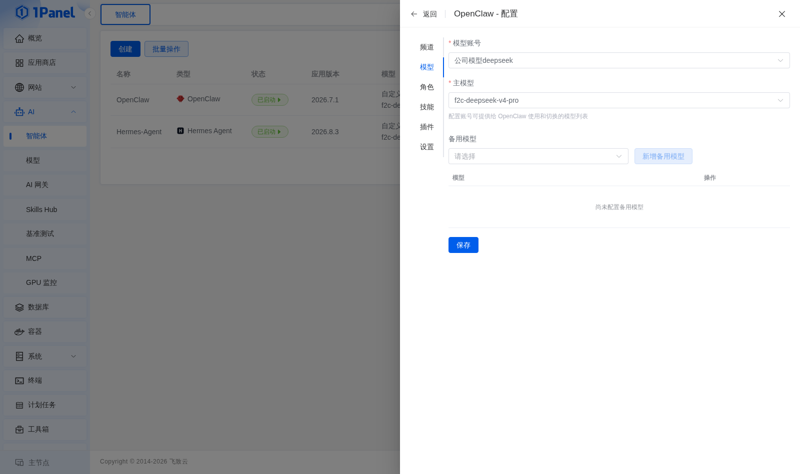

### 3.3 频道

!!! note ""
    频道配置按智能体类型提供微信、企业微信、钉钉、飞书、QQ、Telegram、Discord 等接入项。实际可用频道、插件要求和字段由当前智能体版本决定；部分频道需要先安装对应插件，保存频道配置后系统可能自动重启容器使配置生效。

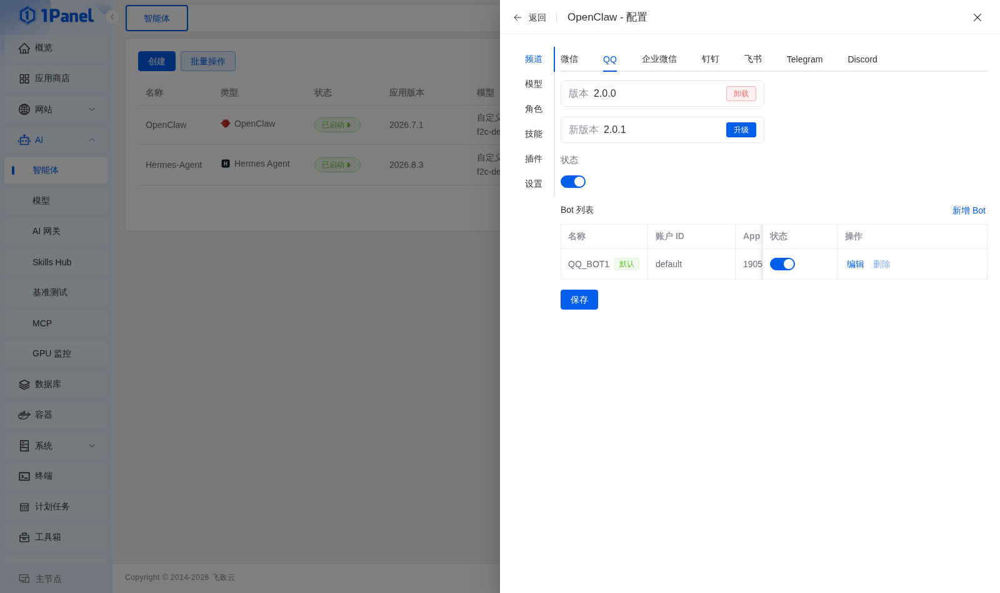

### 3.4 技能与角色

!!! note ""
    **技能**（Skill）可以理解为给智能体安装的"技能包"，让它学会新的本领； **角色**  则用来设定智能体"扮演什么身份、以什么风格工作"。

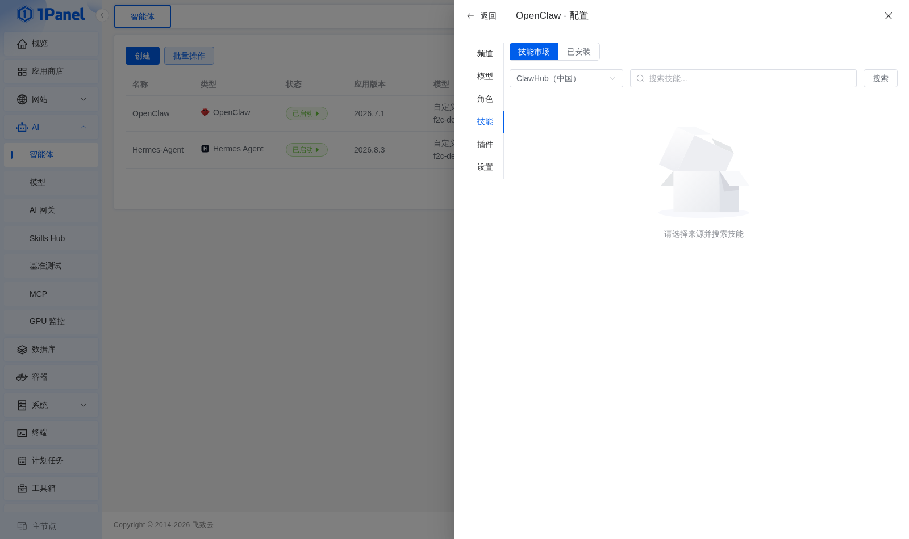

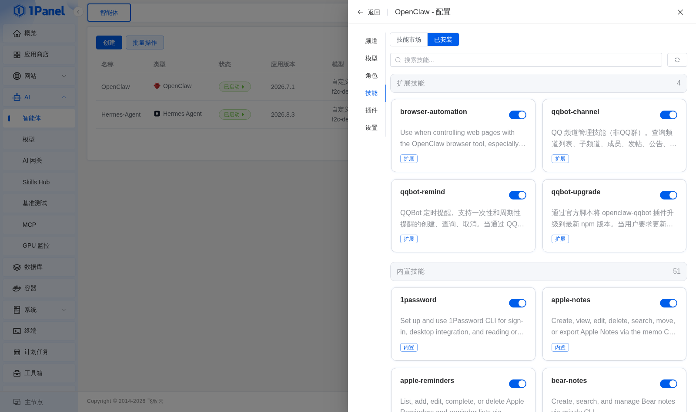

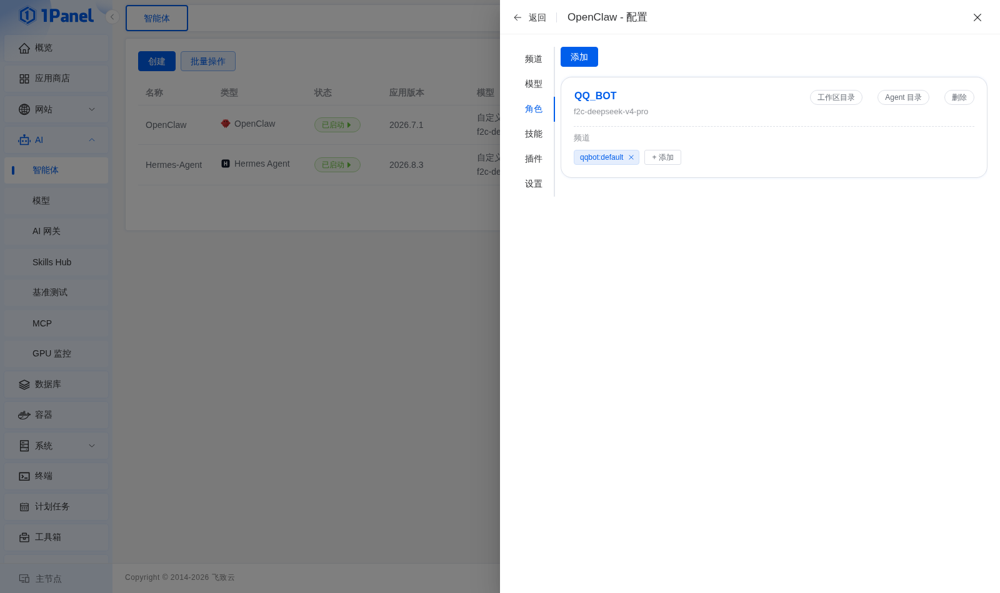

### 3.5 设置

!!! note ""
    设置页包含安全、其他和配置文件等标签，可配置认证方式、时区、浏览器开关、NPM 源等。直接编辑配置文件前建议先备份；保存后需要重启的配置以页面提示为准。

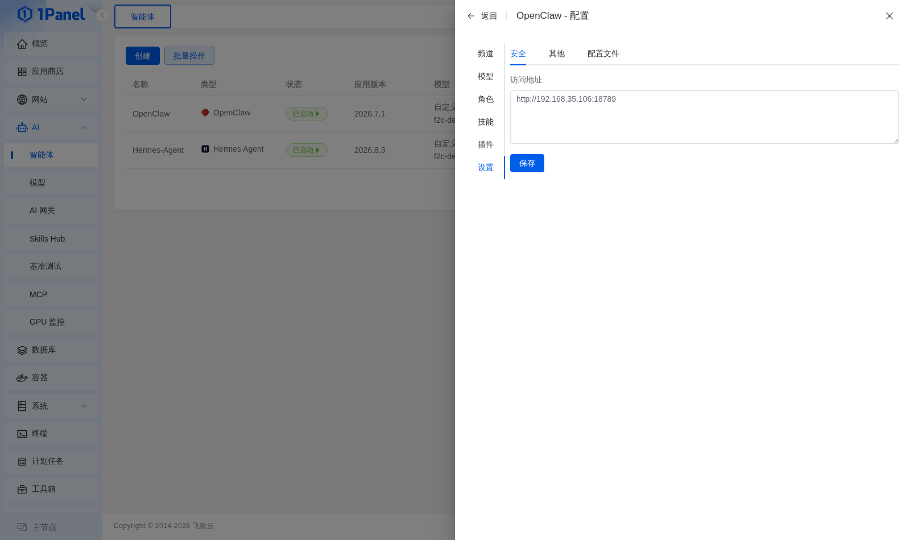

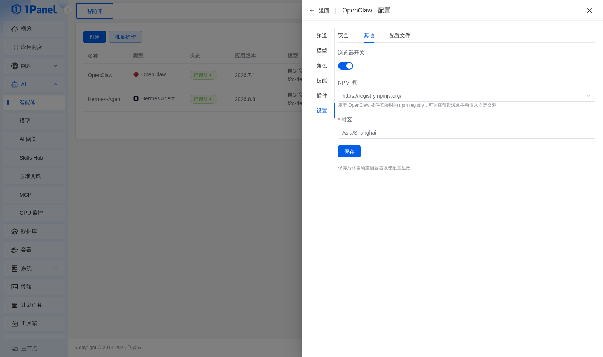

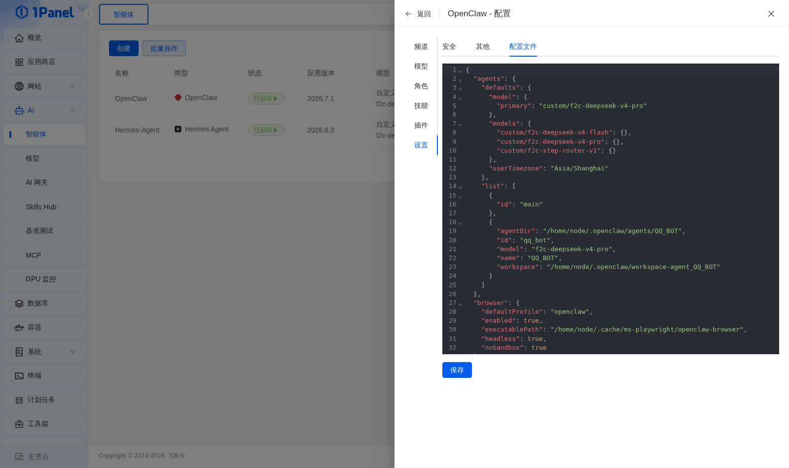

## 4 多节点与批量操作

!!! info "企业版能力"
    企业版可以对不同节点上的智能体执行批量任务，并向目标智能体下发 Skill。提交前应核对目标节点、目标版本和 Skill 来源，任务结果可在任务日志中查看。

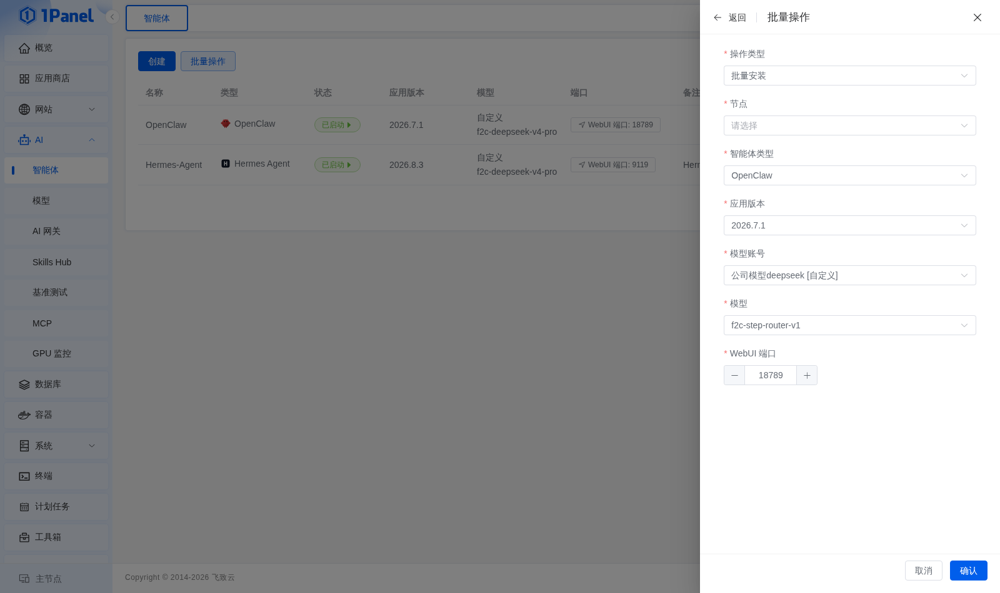

