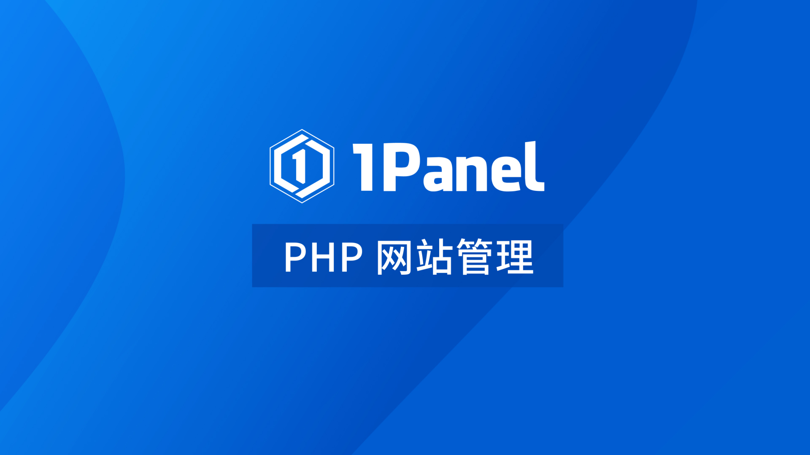
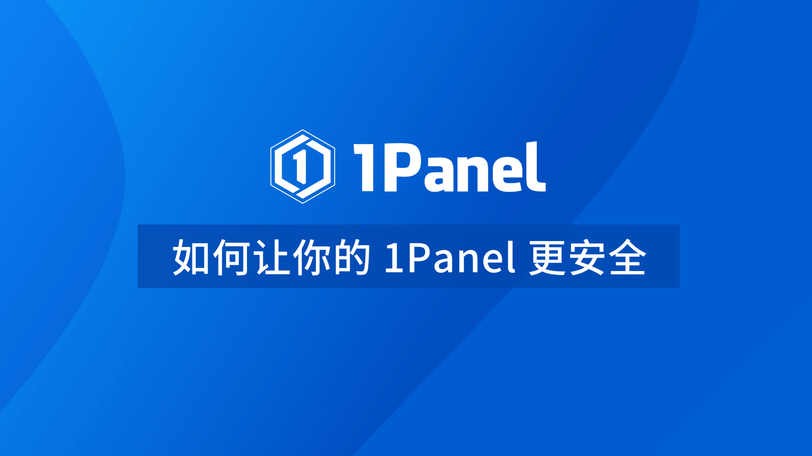
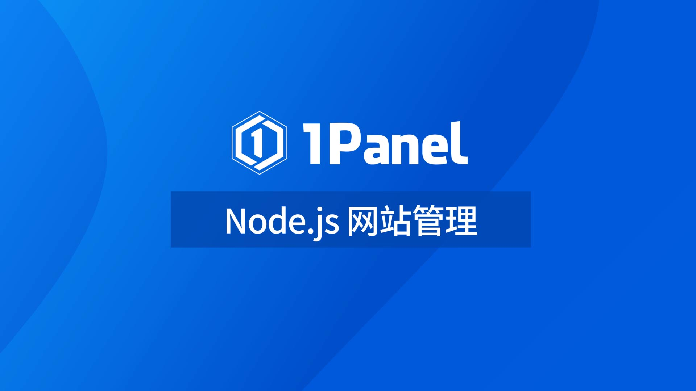
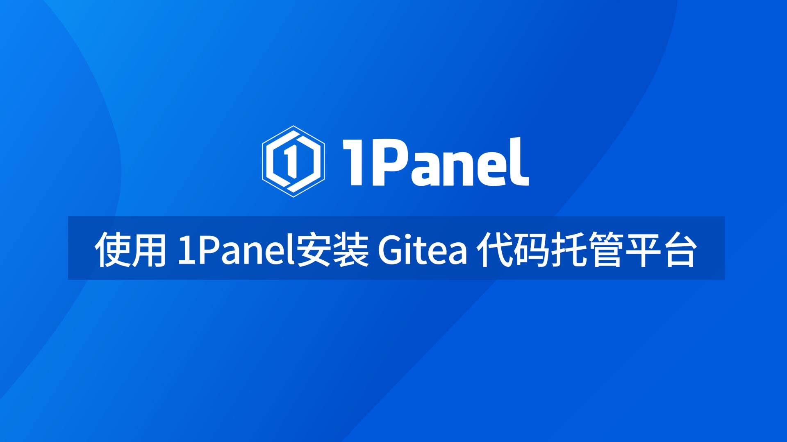

!!! Abstract ""
    1Panel 是一个现代化、开源的 Linux 服务器运维管理面板。

## 1 产品优势

!!! Abstract ""

	- **高效管理**：通过 Web 端轻松管理 Linux 服务器，包括主机监控、文件管理、数据库管理、容器管理等；
	- **快速建站**：深度集成 Wordpress 和 Halo，域名绑定、SSL 证书配置等一键搞定；
	- **应用商店**：精选各类高质量开源工具和应用软件，助力您轻松安装和升级；
	- **安全可靠**：基于容器来管理和部署应用，最小漏洞暴露面，提供防火墙和日志审计等功能；
	- **一键备份**：支持一键备份和恢复，备份数据到各类云端存储，永不丢失。

## 2 教学视频

[{ width="280"}](https://www.bilibili.com/video/BV1rY411z78k/)
[{ width="280" }](https://www.bilibili.com/video/BV1AP411Z7oK/)
[{ width="280" }](https://www.bilibili.com/video/BV1fP411o7vY/)

[{ width="280" }](https://www.bilibili.com/video/BV1hL411o7ck/)
[{ width="280" }](https://www.bilibili.com/video/BV1FY4y1R7p5/)
[{ width="280" }](https://www.bilibili.com/video/BV1uX4y1f7T2/)

[{ width="280" }](https://www.bilibili.com/video/BV1Um4y1m7XQ/)
[{ width="280" }](https://www.bilibili.com/video/BV14V4y1Z733/)
[{ width="280" }](https://www.bilibili.com/video/BV1ih411c7U3/)

[{ width="280" }](https://www.bilibili.com/video/BV1RP411k7s7/)
[{ width="280" }](https://www.bilibili.com/video/BV1sm4y157aQ/)
[{ width="280" }](https://www.bilibili.com/video/BV1uc411R7NS/)

[{ width="280" }](https://www.bilibili.com/video/BV1Ki4y1h7bL/)
[{ width="280" }](https://www.bilibili.com/video/BV1NQ4y1g7oi/)
