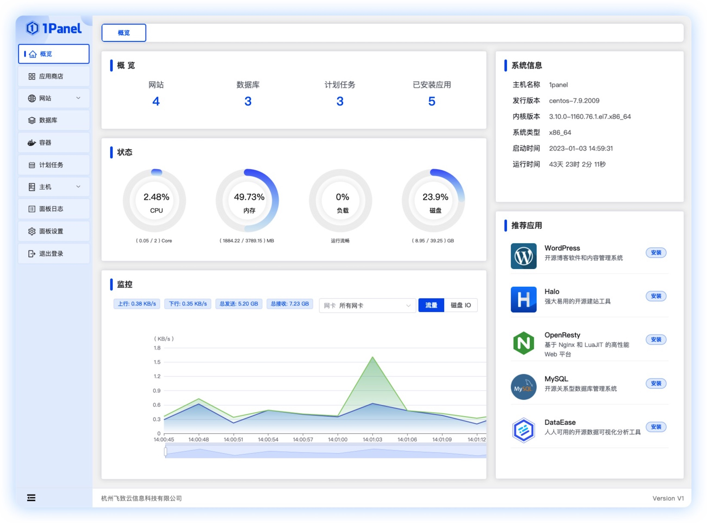

# 产品介绍

!!! Abstract ""
    1Panel 是一个现代化、开源的 Linux 服务器运维管理面板。

## 1 界面展示

{ width="1235px" }

## 2 产品优势

!!! Abstract ""

	- **快速建站**：深度集成 Wordpress 和 Halo，域名绑定、SSL 证书配置等一键搞定；
	- **高效管理**：通过 Web 端轻松管理 Linux 服务器，包括主机监控、文件管理、数据库管理、容器管理及常用应用软件管理；
	- **安全可靠**：最小漏洞暴露面，提供防火墙和安全审计等功能；
	- **一键备份**：支持一键备份和恢复，备份数据云端存储，永不丢失。

## 3 教学视频

### 1、安装部署及应用管理

[{ width="280"}](https://www.bilibili.com/video/BV1rY411z78k/)
### 2、网站管理

[{ width="280" }](https://www.bilibili.com/video/BV1AP411Z7oK/)

### 3、数据库管理

[{ width="280" }](https://www.bilibili.com/video/BV1fP411o7vY/)

### 4、容器管理

[{ width="280" }](https://www.bilibili.com/video/BV1hL411o7ck/)

### 5、计划任务与主机管理

[{ width="280" }](https://www.bilibili.com/video/BV1FY4y1R7p5/)

### 6、面板日志与设置

[{ width="280" }](https://www.bilibili.com/video/BV1uX4y1f7T2/)
