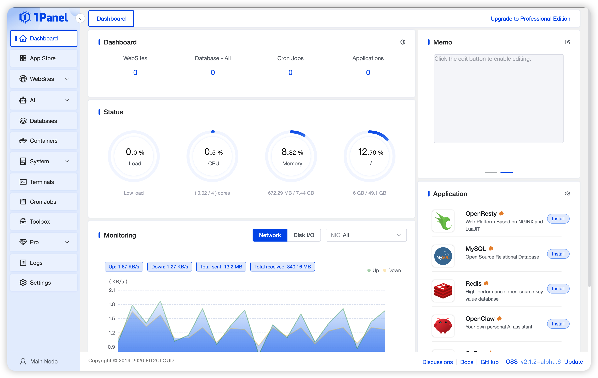

# 1Panel: Modern Open‑Source VPS Control Panel
1Panel is a modern, open‑source VPS control panel that streamlines administration through an intuitive and clean web interface.

It allows you to manage your VPS effortlessly—entirely from a web browser.

Unlike traditional VPS control panels,  
1Panel fully embraces AI, is built with the modern Go programming language, and supports container‑based application deployment and management.

With 1Panel, you can efficiently manage your VPS—even without deep Linux command‑line expertise.

Now, let’s explore what 1Panel can do for you!

## Key Features
### 🔹 One‑Click OpenClaw Deployment
Seamlessly deploy OpenClaw agents, host local LLMs using Ollama, and monitor GPU utilization—all within a unified workspace.

### 🔹 One‑Click Website Deployment
Launch production‑ready websites instantly with automatic domain binding, SSL certificate provisioning, and configuration—zero manual setup required.

### 🔹 Curated App Marketplace
Discover, install, and update trusted open‑source applications (Nextcloud, Bitwarden, Umami, and more) with a single click.

### 🔹 Centralized Server Management
Monitor system resources and manage files, databases, containers, and services effortlessly through a unified, intuitive dashboard.

### 🔹 Enterprise‑Grade Security
Strengthen your defenses with container isolation, firewall controls, audit logging, and secure deployment practices—ensuring compliance and peace of mind.

### 🔹 Intelligent Backup & Restore
Schedule automated backups or perform instant restores to local storage or major cloud platforms (AWS S3, Cloudflare R2, and more), with flexible retention and destination options.

## Community & Trust
1Panel has earned over 34,000 stars on GitHub and surpassed 2 million installations worldwide.  
Its features, performance, stability, and security are trusted by the global open‑source community.

Welcome to try 1Panel and take full control of your VPS!