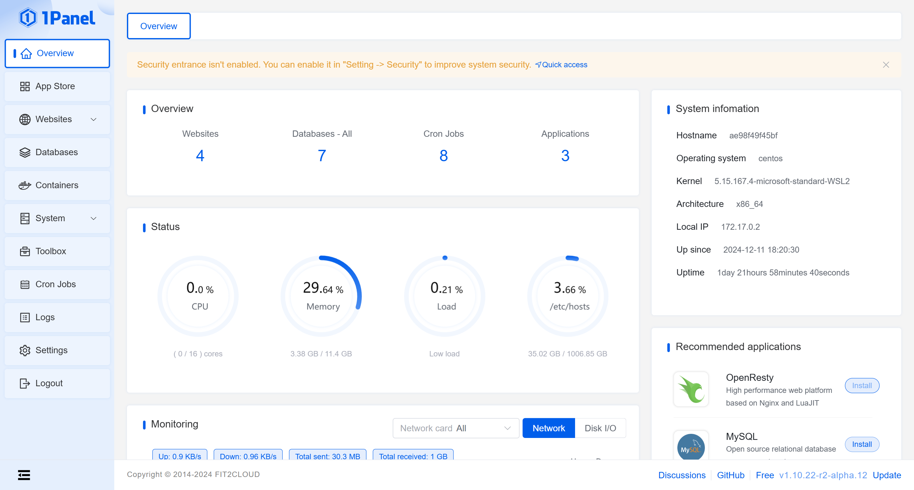

---
hide:
  - navigation
---

# Introduction

## What is 1Panel?

🔥 Top-Rated Web-Based Linux Server Management Tool. 1Panel features an intuitive web interface that seamlessly integrates server management and monitoring, container management, database administration, website management, system backup and restoration, and more, letting you streamlines your server management experience.

## Features

- **Efficient Management**: Through a user-friendly web graphical interface, 1Panel enables users to effortlessly manage their Linux servers. Key features include host monitoring, file management, database administration, and container management.
- **Rapid Website Deployment**: With deep integration of the popular open-source website building software WordPress, 1Panel streamlines the process of domain binding and SSL certificate configuration, all achievable with just one click.
- **Application Store**: 1Panel curates a wide range of high-quality open-source tools and applications, facilitating easy installation and updates for its users.
- **Security and Reliability**: By leveraging containerization and secure application deployment practices, 1Panel minimizes vulnerability exposure. It further enhances security through integrated firewall management and log auditing capabilities.
- **One-Click Backup & Restore**: Data protection is made simple with 1Panel's one-click backup and restore functionality, supporting various cloud storage solutions to ensure data integrity and availability.
