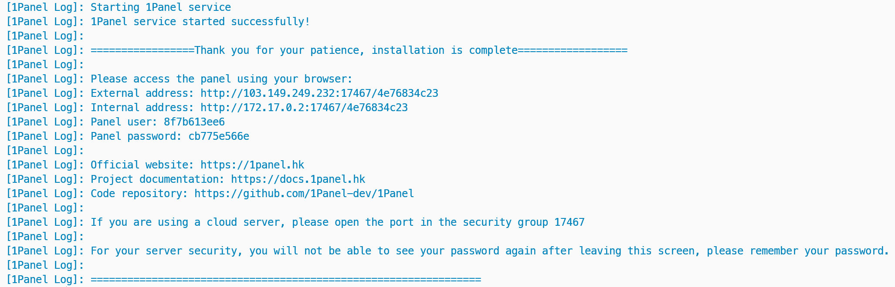

# Installation Guide

## Prerequisites

You need a Linux server that meets the following requirements:

- **Linux distribution**: Debian, Ubuntu, RedHat, CentOS etc.;
- **CPU architecture**: x86_64, aarch64, armv7l, ppc64le, s390x;
- **Memory**: 1GB at least;
- **Network**: Connecting to the Internet.

## Installation

!!! info "Notice"
    The 1Panel binary installed from this script includes additional features of the professional edition beyond the open-source repository code, which require a license for activation. 

    We assure you that the application does not contain backdoors for data collection or script execution.

    If you have any objections, you can build the 1Panel application yourself by following the ["Building from source" documentation](./dev_manual/build_from_source.md).

Execute the script below and follow the prompts to install 1Panel:

```sh
curl -sSL https://resource.1panel.hk/quick_start.sh -o quick_start.sh && bash quick_start.sh
```

After installation, the console will print the access information for 1Panel:



!!! tips "Tips"
    - If you are using a cloud server, please release the service port of 1Panel in the security group.
    - You can use [`1pctl user-info`](#1pctl-cli) command to get the access information again.

## 1pctl CLI

1Panel comes with a built-in CLI tool **1pctl**. You can view the command instructions by running `1pctl help`.

```text
Usage:
  1pctl [COMMAND] [ARGS...]
  1pctl --help

Commands:
  status              Check 1Panel service status
  start               Start 1Panel service
  stop                Stop 1Panel service
  restart             Restart 1Panel service
  uninstall           Uninstall 1Panel service
  user-info           Get 1Panel user information
  listen-ip           Switch 1Panel listening IP
  version             Get 1Panel version information
  update              Update 1Panel system
  reset               Reset 1Panel system
  restore             Restore 1Panel system
```

### 1pctl user-info

Use `1pctl user-info` command to get the current access info.

```text
Panel address: http://$LOCAL_IP:30083/d454db640a
Panel user: e6db602c75
Panel password: ********
Tip: To change the password, you can execute the command: 1pctl update password
```

### 1pctl reset

Use `1pctl reset` command to reset 1Panel system information, including canceling secure entrance login, canceling two-factor authentication, etc..

```text
Reset system info

Usage:
  1panel reset [command]

Available Commands:

  domain      Cancel 1Panel domain binding
  entrance    Cancel 1Panel secure entrance
  https       Cancel 1Panel https login
  ips         Cancel 1Panel authorized ip restrictions
  mfa         Cancel 1Panel two-factor authentication

Flags:
  -h, --help   help for reset

Use "1panel reset [command] --help" for more information about a command.
```

### 1pctl listen-ip

Use `1pctl listen-ip` to change 1Panel listening IP.

```text
Update panel info

Usage:
  1panel listen-ip [command]

Available Commands:

  ipv4        Listen on IPv4
  ipv6        Listen on IPv6

Flags:
  -h, --help   help for listen-ip

Use "1panel listen-ip [command] --help" for more information about a command.
```

### 1pctl update

Use `1pctl update` command to update 1Panel username, password and listening port.

```text
Update panel info

Usage:
  1panel update [command]

Available Commands:

  password    Update panel password
  port        Update panel port
  username    Update panel user

Flags:
  -h, --help   help for update

Use "1panel update [command] --help" for more information about a command.
```
