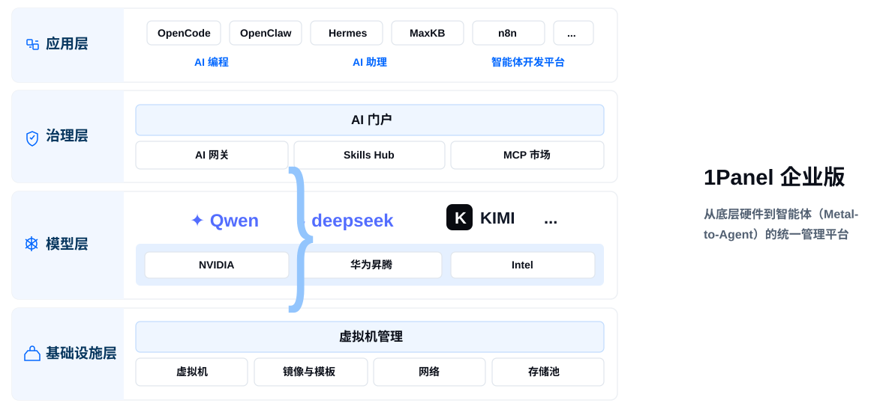

!!! note ""
    1Panel 企业版是轻量级 AI 管理平台，可帮助企业实现从底层硬件到智能体（Metal-to-Agent）的统一管理。更多信息请参考 [1Panel 企业版](https://1panel.cn/enterprise.html)。

## 1 企业版概览


{: .original}

## 2 获取企业版安装包

!!! note ""
    如需获取 1Panel 企业版安装包，请先[申请试用](https://jsj.top/f/umuYtv)。

## 3 安装与升级

!!! note ""
    获取企业版安装包后，将安装包上传至目标服务器并完成解压。安装包中包含 `install.sh` 和 `upgrade.sh` 两个脚本，进入解压后的安装包目录后，可根据实际场景执行相应脚本：

    - 首次安装 1Panel 企业版时，执行 `install.sh` 脚本。
    - 企业版之间升级时，执行 `upgrade.sh` 脚本。

    > `upgrade.sh` 仅适用于企业版之间的升级。

    > 社区版或专业版迁移至企业版时，请使用下文的 **1panel-migrator** 工具完成迁移。

## 4 社区版 / 专业版迁移至企业版

### 4.1 获取迁移工具

!!! note ""
    请下载与服务器架构对应的迁移工具：

    - [Gitee Releases](https://gitee.com/fit2cloud-feizhiyun/1panel-migrator/releases)
    - [GitHub Releases](https://github.com/1Panel-dev/1panel-migrator/releases)

### 4.2 迁移前准备

!!! note ""
    执行迁移前，需先将 1Panel 企业版安装包下载到当前 1Panel 所在服务器。企业版安装包需要放置在与当前 1Panel 安装目录同级的位置。

    示例：

    ```
    /opt/
    ├── 1panel/
    └── 1panel-v2.2.3-linux-amd64.tar.gz
    ```

### 4.3 执行迁移

!!! note ""
    执行以下命令，将当前 1Panel 迁移至企业版：

    ```bash
    1panel-migrator upgrade enterprise
    ```

    执行后，根据终端提示信息操作即可完成迁移。

### 4.4 注意事项

!!! note ""
    - 请根据服务器架构下载对应的迁移工具。
    - 迁移前需要提前下载 1Panel 企业版安装包。
    - 企业版安装包需要放置在与当前 1Panel 安装目录同级的位置。
    - 迁移前建议先确认当前版本是否在支持范围内。
