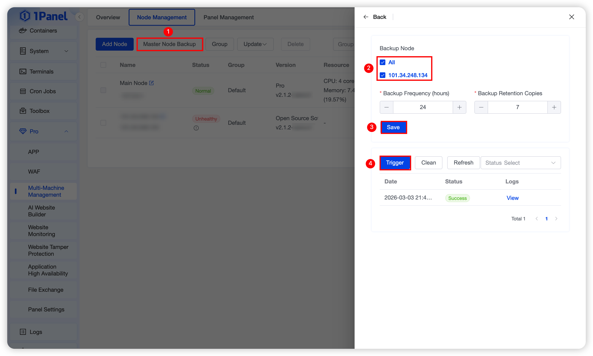
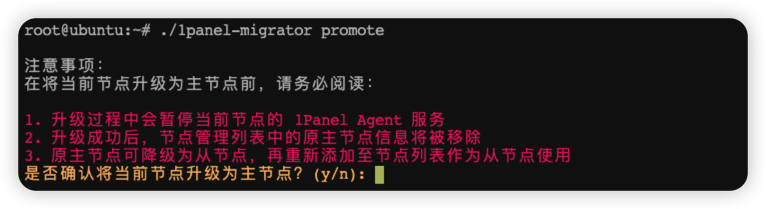
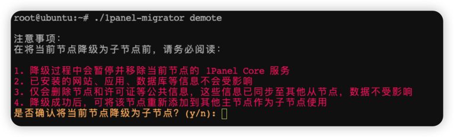

## 1 安装 1panel-migrator

### 1.1 安装包获取

!!! note ""

    请访问以下任一发布页面，手动下载适用于您服务器架构的安装包，并将其放置到 `/tmp` 目录：

    - [Gitee Releases](https://gitee.com/fit2cloud-feizhiyun/1panel-migrator/releases/)
    - [GitHub Releases](https://github.com/1Panel-dev/1panel-migrator/releases/)

    **提示**：请确保安装包版本 **大于等于 v2.0.8**，该版本及以上才支持主从节点切换功能。
    
    每个版本会提供以下架构的安装包（文件名示例）：
    
    - `1panel-migrator-linux-amd64`
    - `1panel-migrator-linux-arm64`
    - `1panel-migrator-linux-arm`
    - `1panel-migrator-linux-ppc64le`
    - `1panel-migrator-linux-s390x`

### 1.2 安装步骤

!!! note ""

    以 amd64 架构为例说明 1panel-migrator 的安装步骤：

    ```bash
    # （1）进入临时目录
    cd /tmp
    
    # （2）添加执行权限
    chmod +x 1panel-migrator-linux-amd64
    
    # （3）移动至系统 PATH 中并重命名
    mv 1panel-migrator-linux-amd64 /usr/local/bin/1panel-migrator
    ```

## 2 从节点 -> 主节点
!!! warning "注意"
    该操作仅适用于主节点迁移场景。迁移成功后，新的主节点将接管并统一管理原有的所有从节点。

    如果仅需将某一节点升级为主节点（且不需要管理其他从节点），请在节点列表中删除该节点（不要勾选“删除节点数据”），随后重新执行安装脚本进行安装。

!!! note ""

    从节点升级为主节点需要先在原来主节点上设置好主节点备份，仅存在备份文件的主节点支持升级到主节点：

    （1）打开节点列表，点击上方主节点备份。

    （2）勾选备份节点，设置自动备份频率及保留份数，保存设置。

    （3）点击执行备份，查看备份结果。

    <div class="browser-mockup" markdown>

    

    </div>

    （4）打开需要升级的从节点，通过安装好的 1panel-migrator 执行升级命令 `1panel-migrator promote` 。

    <div class="browser-mockup" markdown>

    

    </div>

## 3 主节点 -> 从节点
!!! warning "注意"
    节点降级为从节点后，需由其他主节点添加后方可使用，不支持独立访问。

!!! note ""

    打开需要降级的主节点，通过安装好的 1panel-migrator 执行降级命令 `1panel-migrator demote`。

    <div class="browser-mockup" markdown>

    

    </div>
