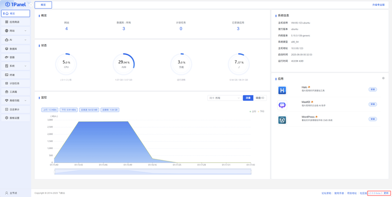

!!! note ""
	🎉 **1Panel 企业版发布！**  1Panel 企业版是轻量级 AI 管理平台，能够帮助企业用户实现从底层硬件到智能体（Metal-to-Agent）的统一管理。 👉 [进一步了解和试用 1Panel 企业版](https://1panel.cn/enterprise.html)

## 1 环境要求
   
!!! note ""
    **安装前请确保您的系统符合安装条件：**

    - 操作系统：支持主流 Linux 发行版本（基于 Debian / RedHat，包括国产操作系统）
    - 服务器架构：x86_64、aarch64、armv7l、ppc64le、s390x、riscv64
    - 内存要求：建议可用内存在 1GB 以上
    - 浏览器要求：请使用 Chrome、Firefox、IE 10+、Edge 等现代浏览器
    - **可访问互联网**
    - 如果是内网环境，推荐使用 [离线安装](enterprise_installation.md) 方式进行部署

!!! note "服务器优惠"
    如果你还没有服务器，欢迎通过以下优惠链接选购。

    - 阿里云：[专属阿里云特价链接 7 折优惠](https://market.aliyun.com/common/dashi/1panel?userCode=kmemb8jp) 
    - 腾讯云：[【腾讯云】2核2G3M云服务器7.92元/月起，2000元代金券免费领](https://curl.qcloud.com/dK2muFbM)，更多云产品优惠请点击[此链接](https://curl.qcloud.com/9Ogon25Y) 

## 2 安装部署

!!! note ""
    GitHub Release 链接：https://github.com/1Panel-dev/1Panel/releases

    
### 2.1 交互式安装

!!! note ""
    执行以下安装脚本，根据命令行提示完成安装。

    ```bash
    bash -c "$(curl -sSL https://resource.fit2cloud.com/1panel/package/v2/quick_start.sh)"
    ```

### 2.2 非交互安装

!!! note ""
    如需在批量部署、云服务器初始化脚本、CI/CD 等自动化场景中安装 1Panel，可以通过环境变量提前配置安装参数，并启用非交互模式。

    ```bash
    # 如需由安装脚本自动安装 Docker，请显式开启
    PANEL_NON_INTERACTIVE=true \
    PANEL_LANG=zh \
    PANEL_INSTALL_DIR=/opt \
    PANEL_PORT=18080 \
    PANEL_ENTRANCE=panelEntrance \
    PANEL_USERNAME=panelAdmin \
    PANEL_PASSWORD='ChangeMe_123456' \
    PANEL_INSTALL_DOCKER=y \
    PANEL_DOCKER_MODE=auto \
    PANEL_CONFIGURE_ACCELERATOR=n \
    PANEL_REPLACE_DAEMON_JSON=n \
    bash -c "$(curl -sSL https://resource.fit2cloud.com/1panel/package/v2/quick_start.sh)"
    ```

!!! warning "注意"
    - 请在生产环境中替换示例中的端口、安全入口、用户名和密码。
    - 非交互模式下，未配置的参数将使用默认值。
    - 为避免安装脚本在自动化场景中修改主机环境，Docker 安装和镜像加速默认不启用。如需自动安装 Docker，请显式设置 `PANEL_INSTALL_DOCKER=y`。
    - 如果服务器已安装 Docker，通常无需设置 `PANEL_INSTALL_DOCKER`；如需配置 Docker 镜像加速，请显式设置 `PANEL_CONFIGURE_ACCELERATOR=y`。
    - 示例中的环境变量仅对当前安装命令生效，不会写入系统环境。

!!! note "非交互安装参数"
    | 环境变量 | 命令行参数 | 说明 |
    | --- | --- | --- |
    | `PANEL_NON_INTERACTIVE` | `--non-interactive`、`-y` | 启用非交互模式，可设置为 `true`、`1`、`y`、`yes` |
    | `PANEL_LANG` | `--lang` | 设置安装语言，支持 `en`、`zh`、`fa`、`pt-BR`、`ru` |
    | `PANEL_INSTALL_DIR` | `--install-dir` | 设置安装目录，需使用绝对路径，默认 `/opt` |
    | `PANEL_PORT` | `--port` | 设置面板端口，未设置时随机生成可用端口 |
    | `PANEL_ENTRANCE` | `--entrance` | 设置安全入口，支持 3-30 位字母、数字、下划线 |
    | `PANEL_USERNAME` | `--username` | 设置面板用户名，支持 3-30 位字母、数字、下划线 |
    | `PANEL_PASSWORD` | `--password` | 设置面板密码，支持 8-30 位字母、数字及 `_!@#$%*,.?` 特殊字符 |
    | `PANEL_INSTALL_DOCKER` | `--install-docker` | 是否安装 Docker，可设置为 `y` 或 `n`，非交互模式默认 `n` |
    | `PANEL_DOCKER_MODE` | `--docker-mode` | Docker 安装方式，支持 `auto`、`builtin`、`online` |
    | `PANEL_CONFIGURE_ACCELERATOR` | `--configure-accelerator` | 是否配置 Docker 镜像加速，可设置为 `y` 或 `n`，非交互模式默认 `n` |
    | `PANEL_REPLACE_DAEMON_JSON` | `--replace-daemon-json` | 当 `/etc/docker/daemon.json` 已存在时，是否替换该文件，可设置为 `y` 或 `n`，非交互模式默认 `n` |

!!! note ""
    也可以通过命令行参数传入配置：

    ```bash
    bash -c "$(curl -sSL https://resource.fit2cloud.com/1panel/package/v2/quick_start.sh)" -- \
      --non-interactive \
      --lang zh \
      --install-dir /opt \
      --port 18080 \
      --entrance panelEntrance \
      --username panelAdmin \
      --password 'ChangeMe_123456' \
      --install-docker y \
      --docker-mode auto \
      --configure-accelerator n \
      --replace-daemon-json n
    ```

    出于安全考虑，建议优先使用 `PANEL_PASSWORD` 环境变量传入密码，避免密码直接出现在命令参数中。

!!! note ""
    如果遇到 Docker 安装失败等问题，可以尝试运行以下脚本：

    ```bash
    bash <(curl -sSL https://linuxmirrors.cn/docker.sh)
    ```

    了解更多信息，请访问官方网站：https://linuxmirrors.cn

!!! note ""
    安装成功后，控制台会打印面板访问信息，可通过浏览器访问 1Panel：

    ```
    http://目标服务器 IP 地址:目标端口/安全入口
    ```

    - **如果使用的是云服务器，请在安全组中开放对应的目标端口**
    - **ssh 登录 1Panel 服务器后，执行 `1pctl user-info` 命令可获取安全入口（entrance）**

!!! note ""
    安装成功后，可使用 [1pctl](cli.md) 命令行工具来维护 1Panel

## 3 在线升级

!!! note ""
    登录 1Panel Web 控制台，在页面右下角点击 **【检查更新】** 进行在线升级。


