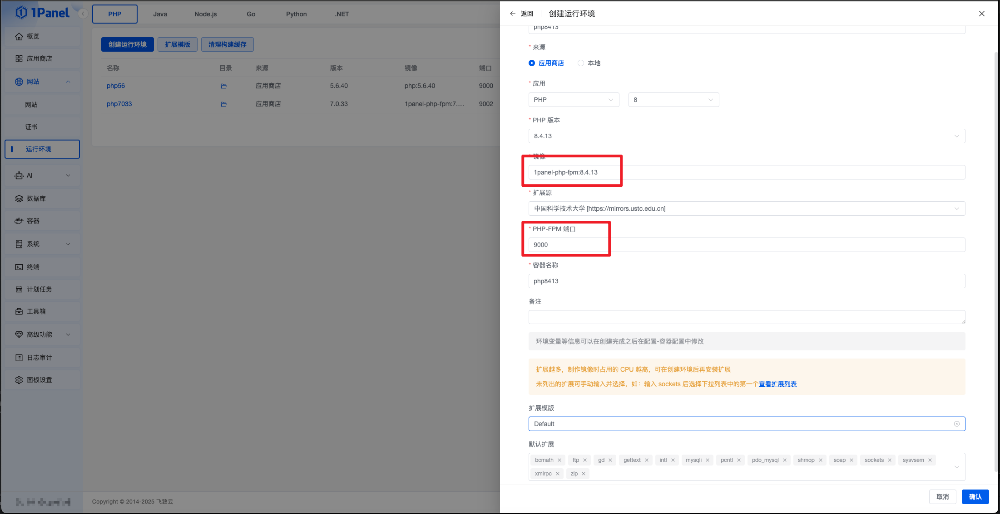
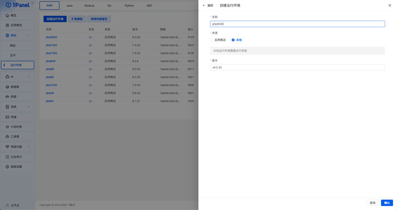
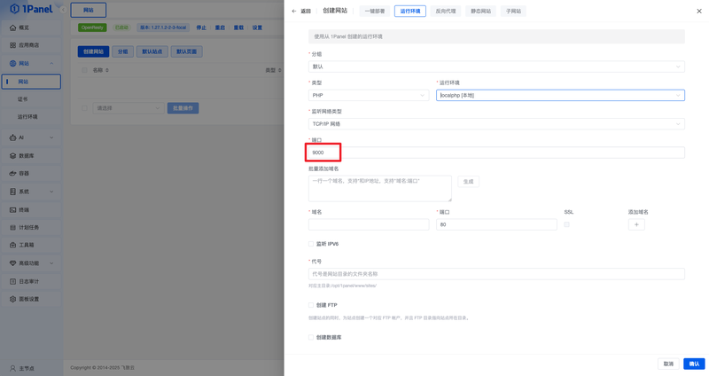

## 1. 特点

!!! note "完全独立运行"
    - 离线版不连接互联网，不发送任何网络请求。
    - 集成社区版的全部功能，可在无外网环境中独立运行。
    - 尤其适用于企业内网、离线机房及涉密环境的部署场景。

!!! note "应用商店支持"
    - 离线包中已预置常用应用的镜像，并会在安装完成后自动导入系统。
        - **OpenResty 版本**：`1.27.1.2-2-3-focal`
        - **MySQL 版本**：
            - **x86_64 包**：`8.4.6`、`8.0.43`、`5.7.44`、`5.6.51`
            - **arm64 包**：`8.4.6`、`8.0.43`
    - 除了内置镜像，用户还可以通过导入外部镜像的方式来安装其他应用。
        - 其他应用需要用户手动导入镜像后才能使用，导入教程参考 [导入应用镜像](#6)。
    - 镜像一旦导入成功，即可在 1Panel 应用商店中显示并安装，灵活性高。

!!! note "支持主流信创"
    - 支持主流信创环境（海光、鲲鹏，麒麟、欧拉），确保在多样化的国产软硬件体系下稳定运行。

!!! note "自动安装 Docker"
    - 安装过程中若检测到系统未安装 Docker，脚本将自动完成 Docker 的安装。

## 2. 环境要求

!!! note ""
    - **操作系统**：支持主流 Linux 发行版本（基于 Debian / RedHat，包括国产操作系统）
    - **服务器架构**：支持 `x86_64` 和 `arm64`
    - **内存要求**：建议可用内存在 **1GB 以上**
    - **浏览器要求**：请使用 **Chrome、Firefox** 等现代浏览器

## 3. 下载离线包

!!! note ""
    ⚠️ **重要提示：请勿从闲鱼等第三方平台购买或下载所谓的“1Panel 离线包”**  
    🚫 这些来源均为 **未经授权的盗版渠道**，我们无法保证其安全性，极有可能被篡改、植入木马或病毒，存在服务器被入侵或数据泄露风险。

    ✅ **官方购买渠道（安全可信）**

    - **产品价格**：离线版 ￥99 / 次下载，当前优惠价 ￥29 / 次下载
    - **购买链接**：https://jsj.top/f/sbCqY6

    > 付款成功后，我们将第一时间把 1Panel V2 离线包的专属下载链接发送至您填写的邮箱，请及时查收。如有问题，请联系邮箱：`wanghe@fit2cloud.com`

    > 1Panel 离线版暂不提供发票。

## 4. 安装部署

### 4.1 解压离线包

!!! note ""
    请下载最新的 1Panel 离线包，上传至服务器 `/tmp` 目录，并以 **root 用户** 执行以下命令进行安装准备：

    ```bash
    cd /tmp
    # 解压离线包（请将示例文件名替换为实际名称）
    tar zxvf 1panel-v2.0.11-offline-linux-amd64.tar.gz
    ```

### 4.2 执行安装脚本

!!! note ""
    ```bash
    # 进入解压目录（请根据实际目录名替换）
    cd 1panel-v2.0.11-offline-linux-amd64
    
    # 执行安装脚本
    /bin/bash install.sh
    ```

!!! note ""
    如需在离线环境中批量部署，也可以通过环境变量启用非交互安装。参数说明请参考 [在线安装 - 非交互安装](online_installation.md#22)。

    ```bash
    # 如目标服务器未安装 Docker，请显式开启
    PANEL_NON_INTERACTIVE=true \
    PANEL_LANG=zh \
    PANEL_INSTALL_DIR=/opt \
    PANEL_PORT=18080 \
    PANEL_ENTRANCE=panelEntrance \
    PANEL_USERNAME=panelAdmin \
    PANEL_PASSWORD='ChangeMe_123456' \
    PANEL_INSTALL_DOCKER=y \
    PANEL_DOCKER_MODE=auto \
    PANEL_CONFIGURE_ACCELERATOR=n \
    PANEL_REPLACE_DAEMON_JSON=n \
    /bin/bash install.sh
    ```

## 5. 升级版本

### 5.1 解压离线包

!!! note ""
    请下载最新的 1Panel 离线包，上传至服务器 `/tmp` 目录，并以 **root 用户** 执行以下命令进行升级准备：

    ```bash
    cd /tmp
    # 解压离线包（请将示例文件名替换为实际名称）
    tar zxvf 1panel-v2.0.12-offline-linux-amd64.tar.gz
    ```

### 5.2 执行升级脚本

!!! note ""
    ```bash
    # 进入解压目录（请根据实际目录名替换）
    cd 1panel-v2.0.12-offline-linux-amd64

    # 执行升级脚本
    /bin/bash upgrade.sh
    ```

## 6. 登录访问

!!! note ""
    安装成功后，控制台将显示面板访问信息。可通过浏览器访问：

    ```
    http://目标服务器IP地址:目标端口/安全入口
    ```

    - **如使用云服务器，请确保安全组已开放目标端口**
    - **执行 `1pctl user-info` 命令可查看安全入口（entrance）**

!!! note ""
    安装完成后，可使用 [1pctl 命令行工具](cli.md) 进行日常维护。

## 7. 应用商店

### 7.1 获取镜像

=== "应用镜像"
    !!! note ""
        点击应用 **「安装」** 按钮后，在 **「高级设置」** → **「编辑 Compose 文件」** 中查看 `image:` 字段，其后的内容即为目标镜像名称。

=== "Java 运行环境"
    !!! note ""
        - bitnamilegacy/java:1.8
        - 1panel/java:11
        - 1panel/java:17
        - 1panel/java:21
        - 1panel/java:22
        - 1panel/java:25

=== "Node.js 运行环境"
    !!! note ""
        - node:12.22.12
        - node:14.21.3
        - node:16.20.2
        - 1panel/node:18.20.8
        - 1panel/node:20.19.5
        - 1panel/node:21.7.3
        - 1panel/node:22.21.0
        - 1panel/node:24.10.0

=== "Go 运行环境"
    !!! note ""
        - golang:1.21
        - golang:1.22
        - golang:1.23
        - golang:1.24
        - golang:1.25

=== "Python 运行环境"
    !!! note ""
        - python:3.10.19
        - python:3.11.14
        - python:3.12.12
        - python:3.13.9
        - python:3.14.0

=== ".NET 运行环境"
    !!! note ""
        - mcr.microsoft.com/dotnet/aspnet:6.0
        - mcr.microsoft.com/dotnet/aspnet:7.0
        - mcr.microsoft.com/dotnet/aspnet:8.0
        - mcr.microsoft.com/dotnet/aspnet:9.0
        - mcr.microsoft.com/dotnet/aspnet:10.0

### 7.2 导入镜像

!!! note ""
    如需使用其他应用（如 WordPress）或运行环境，可手动导入镜像，具体步骤如下：

    1. **在可联网机器上拉取并导出镜像**：

        ```bash
        docker pull wordpress:6.8.2
        docker save -o /tmp/wordpress_6.8.2.tar wordpress:6.8.2
        ```

    2. **上传镜像文件**：将 `wordpress_6.8.2.tar` 上传至 1Panel 服务器的 `/tmp` 目录

        ```bash
        scp /tmp/wordpress_6.8.2.tar root@<1Panel 离线服务器 IP>:/tmp/
        ```

    3. **导入镜像**：在 1Panel 服务器上执行：

        ```bash
        docker load -i /tmp/wordpress_6.8.2.tar
        ```

    完成上述步骤后，即可在应用商店安装 WordPress 应用。
    如果导入的是运行环境镜像，完成上述步骤后即可安装并使用对应版本的运行环境。

### 7.3 更新应用 / 运行环境

!!! note ""
    离线应用商店更新功能需 **v2.0.13-offline 及以上版本** 才可使用；若当前版本低于此版本，请先完成升级。

!!! note ""
    如需在离线环境中同步最新的应用商店内容，可按以下步骤操作：

    1. **在可联网机器上下载最新应用商店代码：**

        ```bash
        cd /tmp
        git clone https://github.com/1Panel-dev/appstore
        ```

    2. **制作应用商店压缩包：**

        ```bash
        cd appstore
        tar -zcf appstore.tar.gz apps data.yaml
        ```

    3. **将压缩包上传至离线服务器：**

        ```bash
        scp appstore.tar.gz root@<1Panel 离线服务器 IP>:~
        ```

    4. **在离线服务器上覆盖原有应用商店文件（默认安装路径为 `/opt/1panel`）：**

        ```bash
        cd /opt/1panel/resource/offline
        mv appstore.tar.gz appstore.tar.gz.bak
        mv ~/appstore.tar.gz ./
        ```

    5. **进入应用商店页面，点击“同步自定义应用”按钮，系统将自动解压并加载最新的应用商店内容。**

    完成以上步骤后，即可让离线服务器加载最新的应用商店内容。

## 8. PHP 离线版

!!! note "准备环境"
    - 1Panel V2 离线服务器
    - 1Panel V2 外网服务器

    > 核心操作是：将外网服务器中编译好的 PHP 镜像导入到离线服务器上。

### 8.1 外网 1Panel

!!! note ""
    在 1Panel 外网环境创建 PHP 运行环境，并安装相应扩展（需要记录 **镜像名称** 和端口）



!!! note ""
    使用上一步的 **镜像名称** 打包 PHP 镜像，在 `/opt/1panel/runtime/php/<PHP 运行环境名称>` 下执行：

    ```bash
    docker save -o php-8.4.6.tar 1panel-php-fpm:8.4.6
    ```

!!! note ""
    压缩运行环境目录，在 `/opt/1panel/runtime/php/` 目录下执行：

    ```bash
    tar -czvf php846.tar.gz <PHP 运行环境名称>
    ```

### 8.2 离线 1Panel

!!! note ""
    拷贝压缩文件到 `/opt` 或其他目录并解压：
    ```bash
    tar -xzvf php846.tar.gz
    ```

!!! note ""
    进入解压后的目录，加载镜像并启动 PHP 运行环境：
    ```bash
    docker load -i php-8.4.6.tar
    docker compose up
    ```

    使用 cat .env 查看两个参数：

    - PANEL_APP_PORT_HTTP （PHP 运行环境端口）
    - PANEL_WEBSITE_DIR （网站目录）

    > 注意：PANEL_WEBSITE_DIR 需要和 OpenResty 安装时的网站目录保持一致，如不一致请修改 .env 文件。

!!! note ""
    创建本地 PHP 运行环境



!!! note ""
    创建 PHP 网站
    > 注意：端口填写你启动的 PHP 运行环境端口。



## 9. 应用安装方式说明

!!! note ""
    在离线版中，安装应用与通过「本地应用」安装应用存在一定差异，主要体现在以下几点：

### 9.1 对比结果

| 方式 | 应用来源 | 是否包含所有应用 | 是否自动集成功能菜单 |
|------|----------|------------------|----------------------|
| 离线版安装应用 | 离线包中已预置 | ✅ 是 | ✅ 是（如网站、数据库） |
| 本地应用方式安装 | 用户手动上传 | ❌ 否 | ❌ 否 |

### 9.2 推荐使用场景

!!! note ""
    - **离线版安装应用**：适合无网络环境下快速部署，所有功能完整，体验最佳。  
        - 例如：`OpenResty`、`MySQL` 等应用在安装完成后，会自动与 **网站管理**、**数据库管理** 等功能页面集成，用户可直接创建网站和数据库。  
    - **本地应用方式**：适合测试自定义应用包，或安装不在官方应用商店中的应用。  
