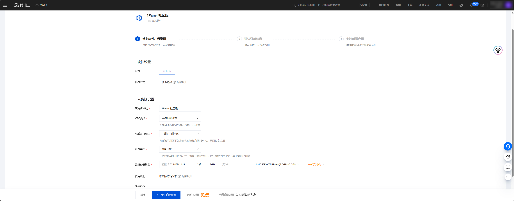
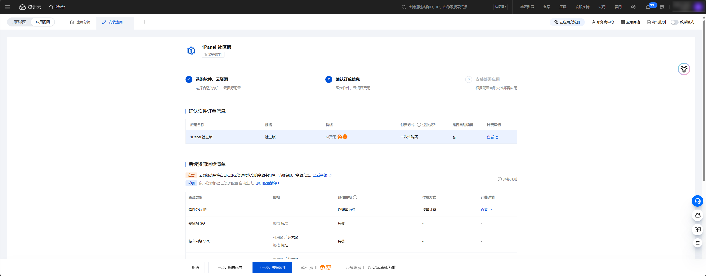
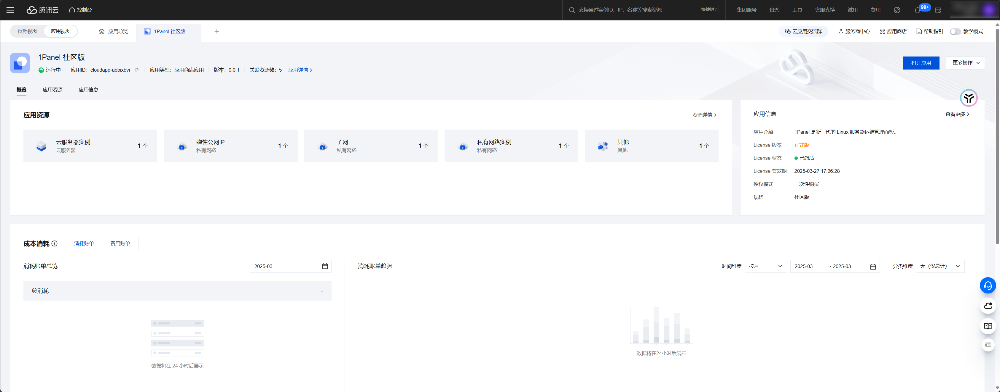
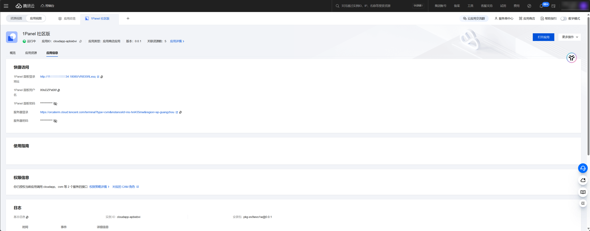

## 1 安装 1Panel 云应用

!!! Abstract ""
    1Panel 社区版已上架腾讯云云应用，可直接在腾讯云服务器中快速部署。通过云应用的部署方式，用户可以直接购买创建云服务器并自动完成 1Panel 的安装配置。

    第一步：关联我们的腾讯云合作伙伴账户，享受更多优惠福利：[点击链接进行关联](https://partner.cloud.tencent.com/invitation/10002820907763620ace838b1?inviteType=2)

    第二步：打开 [1Panel 社区版云应用](https://app.cloud.tencent.com/detail/SPU_BHDJDDBEBA6600)，进入云应用页面。

勾选同意用户协议后，点击安装应用即可进入 1Panel 社区版云应用安装页面。

根据页面提示，选择 VPC类型、地域、计费类型及云服务器类型等参数后，点击 `下一步：确定资源` 进入订单确认页面。

信息确认无误后，点击 `下一步：安装应用`，腾讯云将自动完成云服务器、安全组、公网 IP 等相关资源的创建及 1Panel 的安装配置。等待 1Panel 云应用部署完成后，页面将自动跳转到新部署的 1Panel 云应用详情页面。

## 2 查看应用信息

点击应用详情页面上方的 `应用信息`，即可查看到 1Panel 面板的登录地址，随机生成的用户名密码等信息。

## 3 登录 1Panel 面板

直接点击应用信息页面中的 1Panel 面板登录地址，或点击右上角的打开应用进入到 1Panel 面板登录页面，使用应用信息中的 `1Panel 面板用户名` 和 `1Panel 面板密码` 即可登录 1Panel 面板。
