# Quick Start

<iframe width="100%" height="500" src="https://www.youtube.com/embed/zM_3CIR-VeE?si=FXds9tnzoz23ZqXu" title="YouTube video player" frameborder="0" allow="accelerometer; autoplay; clipboard-write; encrypted-media; gyroscope; picture-in-picture; web-share" referrerpolicy="strict-origin-when-cross-origin" allowfullscreen></iframe>

## Installing 1Panel

Execute the script below and follow the prompts to install 1Panel:

```sh
curl -sSL https://resource.1panel.hk/quick_start.sh -o quick_start.sh && bash quick_start.sh
```

After installation, the console will print the access information for 1Panel:


!!! tips "Tips"
    - If you are using a cloud server, please open the service port of 1Panel in the security group.
    - You can use `1pctl user-info` command to get the access information again.

## Accessing the 1Panel Console

To access the 1Panel console, use a web browser to visit the access address returned by the installation script. Fill in the initial username and password to log in to the 1Panel console.

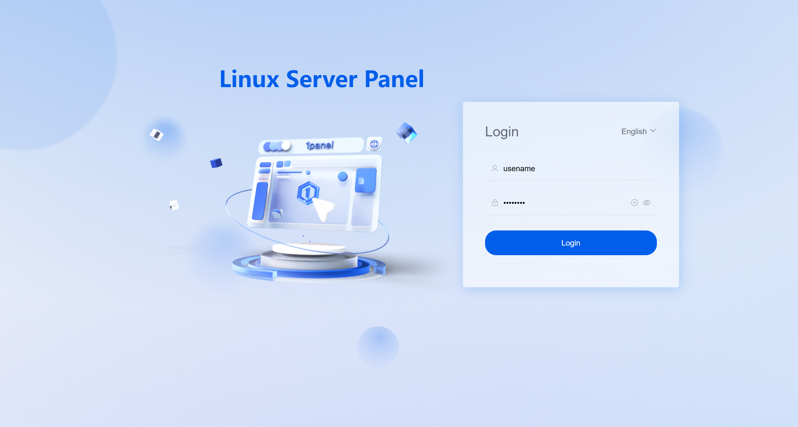
{: .browser-mockup .with-url }

!!! tip "Tips"
    Ensure you include the security entrance; otherwise, you will be redirected to the interception page and cannot access the login page normally.

## Installing OpenResty

[OpenResty](https://openresty.org/) is a full-fledged web platform that integrates an enhanced version of the Nginx core, enhanced version of LuaJIT, many carefully written Lua libraries, lots of high-quality 3rd-party Nginx modules, and most of their external dependencies. 1Panel leverages OpenResty as its web server for the website management feature.

After logging into the 1Panel console, click the `App Store` on the left. Find the OpenResty on the application list and install it.

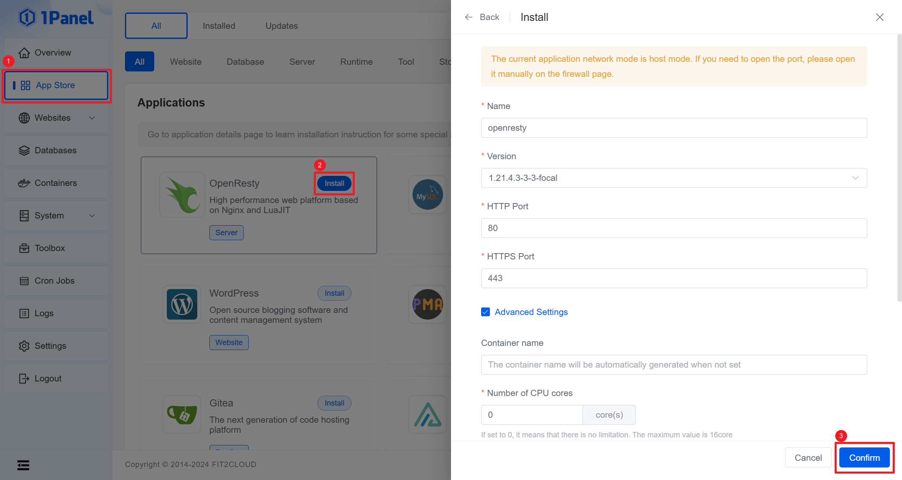
{: .browser-mockup .with-url }

## Installing MySQL

Similar to installation of the OpenResty application, the next step is to find MySQL in the application list and install it, which will provide database services for the WordPress sites to be created later.

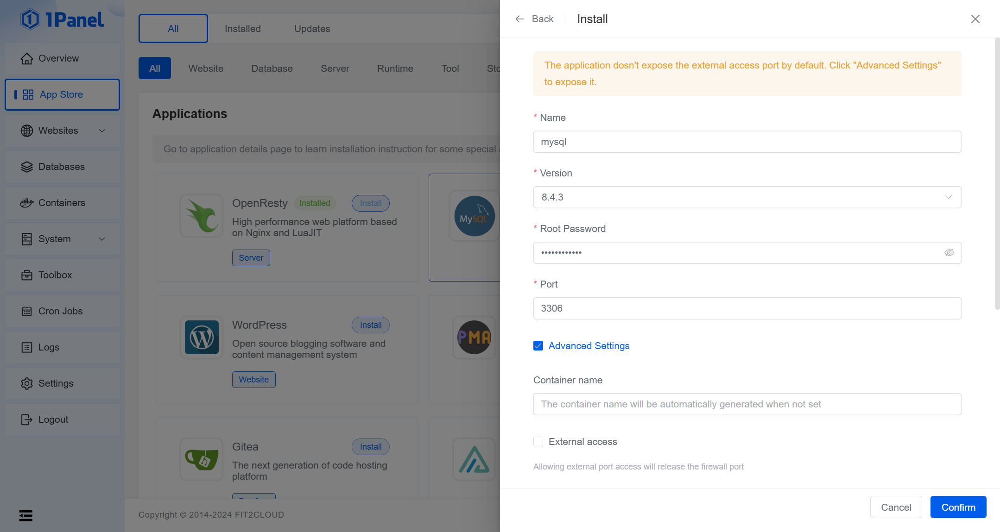
{: .browser-mockup .with-url }

## Creating a WordPress site

Navigate to the website management page by clicking `Websites` on the left, then create a website of the `Deployment` type. Select `New Application`, and enter the `Name`, `Primary domain`, and `Alias` information. You can leave other parameters as default.

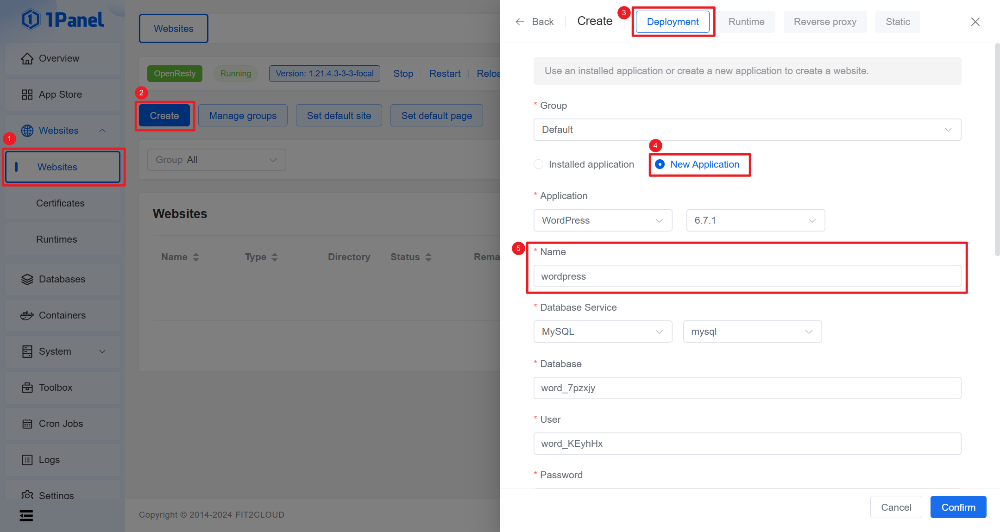
{: .browser-mockup .with-url }

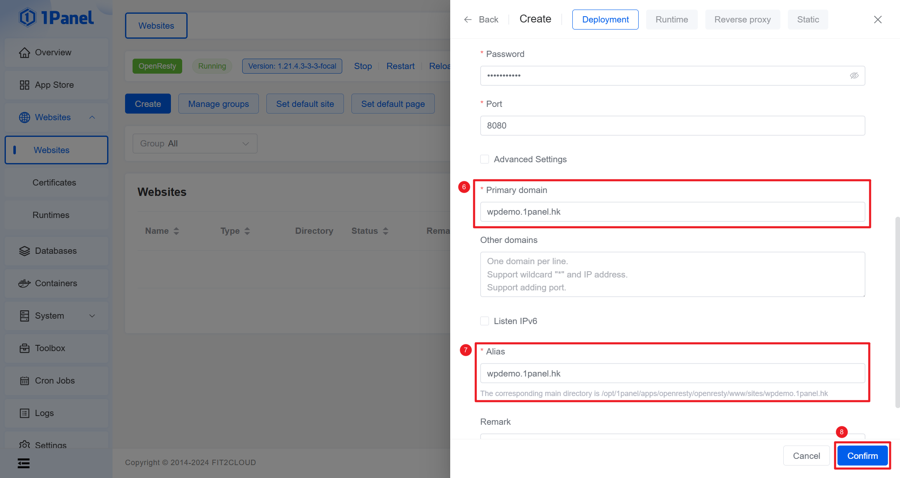
{: .browser-mockup .with-url }

After completing the website information and clicking confirm, 1Panel will automatically deploy a WordPress application from the app store and create a website record corresponding to the domain name, serving as a reverse proxy to forward requests to this application.

## Adding a DNS record

Log in to your DNS provider's management console, using Cloudflare as an example, and add an `A` type DNS record. Use the domain name you entered when creating the website in the previous step, and the address should be the public IP address of the 1Panel server.

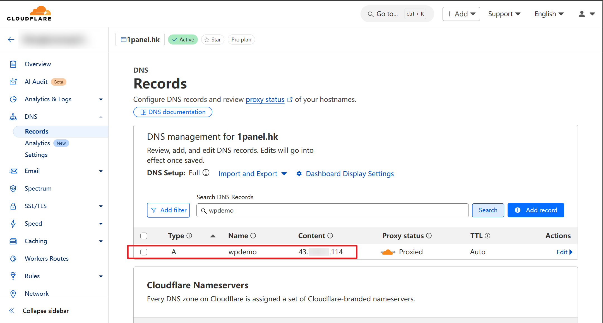
{: .browser-mockup .with-url }

If everything goes smoothly, you can now access the newly installed WordPress application using `https://wpdemo.1panel.hk`.

## Enabling HTTPS in 1Panel (optional)

To ensure normal access to the WordPress application, you need to adjust the SSL/TLS encryption mode in Cloudflare to a proper setting, or configure HTTPS for the website in 1Panel. Failure to do so will result in an error page displaying `SSL handshake failed. Error code 525`.

!!! tips "Tips"
    SSL/TLS encryption modes in Cloudflare which require HTTPS in 1Panel.

    - Strict mode
    - Full (Strict) mode
    - Full mode

Proceed to the certificate management page to request a free SSL certificate.

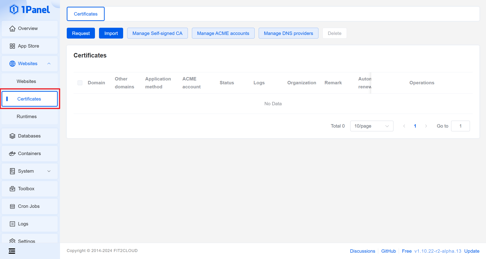
{: .browser-mockup .with-url }

### Creating an ACME account

Click the `Manage ACME accounts` button at the top of the list, enter your email, select the account type and encryption algorithm, to create an ACME account for applying for a free SSL certificate.

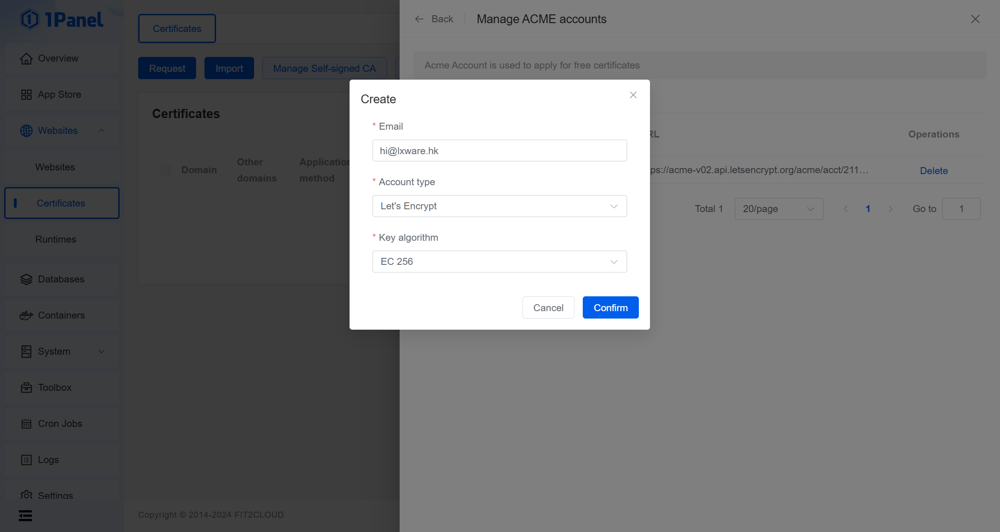
{: .browser-mockup .with-url }

### Creating a DNS provider

At the top of the list, click the `Manage DNS providers` button, select the Cloudflare type, enter your Cloudflare account email and `API Token`, to create a Cloudflare DNS provider.

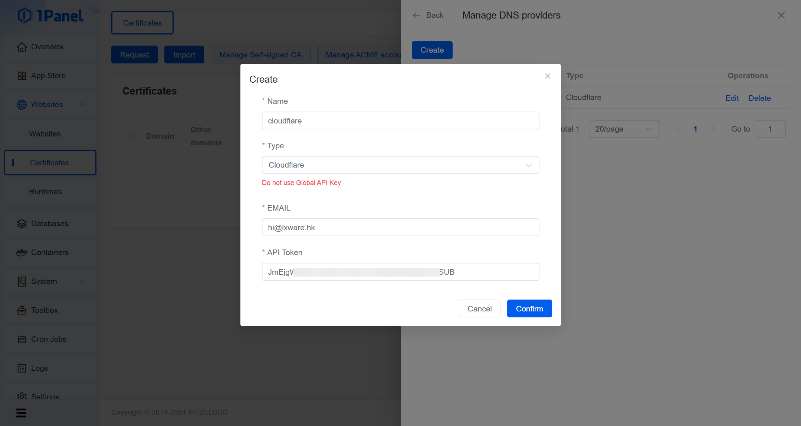
{: .browser-mockup .with-url }

!!! tips "Tips"
    You can generate your Cloudflare API token [here](https://dash.cloudflare.com/profile/api-tokens).

### Requesting a SSL certificate

To request a certificate, follow these steps:

1. Click the `Request` button in the top-left corner of the list, which will open the certificate request page.
2. Enter the primary domain name of the certificate, for example, `wpdemo.1panel.hk`.
3. Select the ACME account created earlier.
4. Choose `DNS account` as the verification method.
5. Select the Cloudflare DNS account created before.
6. Click the `Confirm` button.

With all other parameters set to default, 1Panel will automatically complete the free SSL certificate application and DNS verification process by calling the ACME and Cloudflare interfaces.

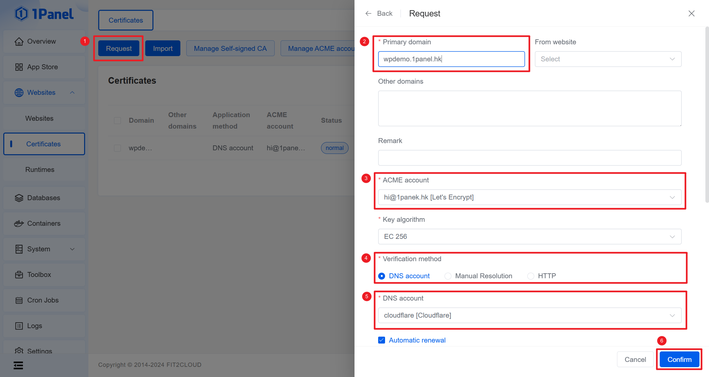
{: .browser-mockup .with-url }

### Enabling HTTPS for the WordPress site

After the certificate application is complete, re-enter the website management page. Click the website name created earlier to enter the website configuration page, where you can enable HTTPS and select the certificate applied for in the previous step.

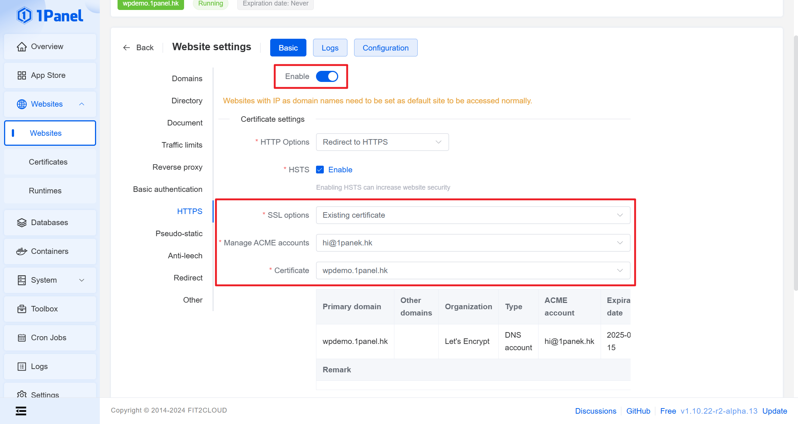
{: .browser-mockup .with-url }

## Accessing Your WordPress Site

After completing the above steps, you can now access your newly created WordPress site by visiting `https://wpdemo.1panel.hk` in your web browser.

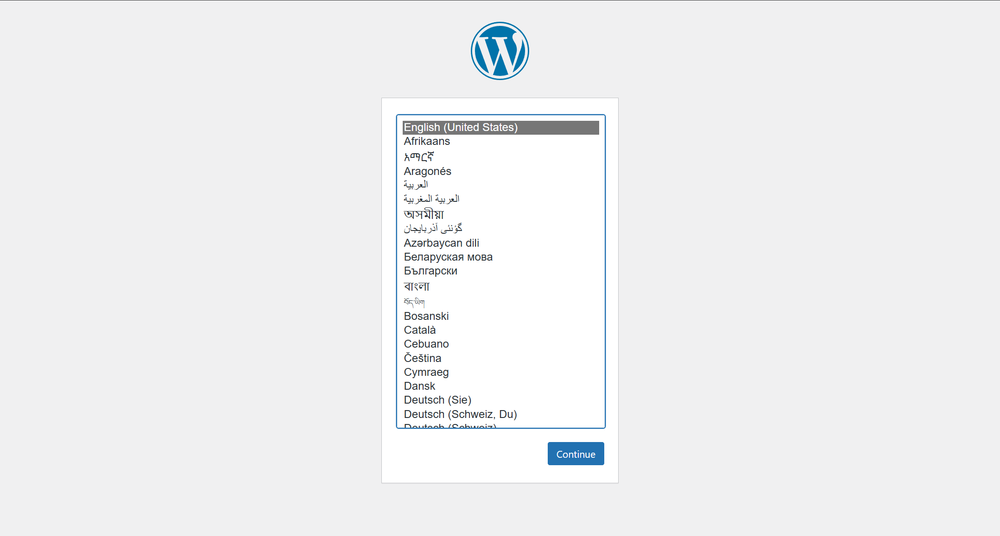
{: .browser-mockup .with-url }