# OpenClaw Installation and Deployment Guide

!!! note ""
    This document mainly introduces the installation and deployment process of OpenClaw on Linux clients or servers. We recommend using 1Panel, an open-source Linux operation and maintenance management panel, for installation and deployment, which makes the entire process simple and fast. After OpenClaw is installed, the Feishu channel docking configuration can also be quickly completed through the 1Panel operation and maintenance management panel, facilitating the rapid implementation of a Feishu-based personal AI assistant.

## 1. Resource and Environment Preparation

!!! note ""
    The following resource and environment preparations are required for the installation and deployment of OpenClaw:

### Client/Server Preparation

!!! note ""
    - Operating System: Supports mainstream Linux distributions (based on Debian/RedHat, including domestic operating systems)
    - Server Architecture: x86_64, aarch64
    - Memory Requirement: It is recommended to have more than 2GB of available memory
    - Browser Requirement: Use modern browsers such as Chrome, FireFox, IE10+, Edge, etc.
    - Network Requirement: Internet access is available

### Large Language Model API Key

!!! note ""
    - Public Models: API Keys of large language models such as DeepSeek, Kimi, OpenAI, etc.
    - Local Models

### 1Panel v2.1.0 Installation and Deployment

!!! note ""
    Refer to the official 1Panel documentation for installation and deployment details at the following link: https://1panel.cn/docs/v2/installation/online_installation/

!!! note ""
    Based on the above environment, the entire installation and deployment process can be completed in four parts: 1Panel installation and deployment, large language model API Key preparation, OpenClaw installation and deployment, and Feishu channel configuration. For detailed instructions, see the following documentation.

## 2. Large Language Model API Application

!!! note ""
    You can check the list of models supported on the OpenClaw official website and obtain the API Key of the large language model respectively. This document takes DeepSeek as an example. For other public models and local models, prepare the relevant API Keys by referring to the corresponding documents on your own.

### 2.1. Step 1: Register on the DeepSeek Developer Platform

!!! note ""
    Access the DeepSeek Developer Platform via the link: https://platform.deepseek.com/, first complete personal real-name authentication and registration, and then make a recharge, as shown in the figure below.

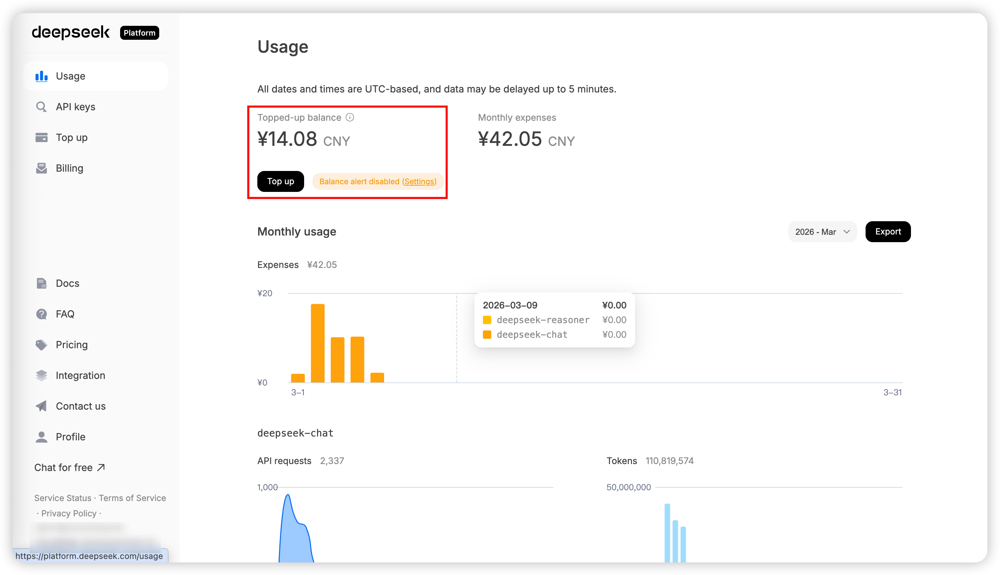
{: .browser-mockup}

### 2.2. Step 2: Obtain the DeepSeek API Key

!!! note ""
    As shown in the figure below, enter the API keys page, click "Create API key", and keep the generated API Key in a safe place for subsequent use after creation.


{: .browser-mockup}

## 3. OpenClaw Installation and Deployment

!!! note ""
    The installation of OpenClaw is deployed based on the agent management of 1Panel, and the DeepSeek large model API key obtained in the previous step needs to be used during the deployment process. In 1Panel, the deployment of OpenClaw and the management of large model API key accounts are divided into two separate parts and decoupled from each other, mainly to facilitate the adjustment of model configurations for your OpenClaw personal assistant.

### 3.1. Step 1: Add a Model Account

!!! note ""
    Enter the "Agent" management menu under "AI" management, click to enter and switch to "Model Account" management first, then click "Add model account". Select the model provider and enter the model account information as required to complete the model account creation.

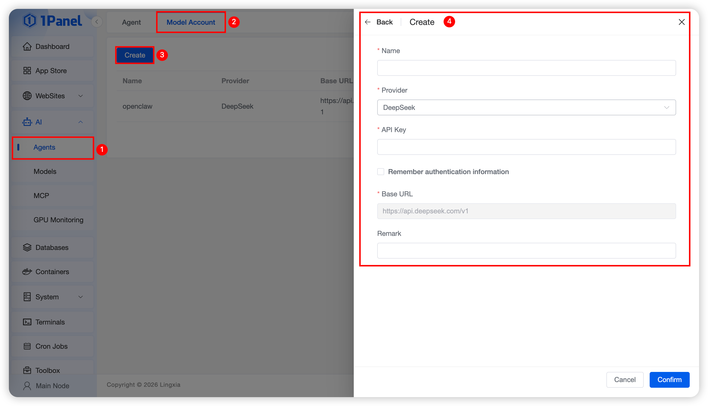
{: .browser-mockup}

### 3.2. Step 2: Create an Agent

!!! note ""
    After preparing the model account, switch to the "Agent" page and click "Create Agent", then enter the relevant parameters as required, as shown in the figure below：

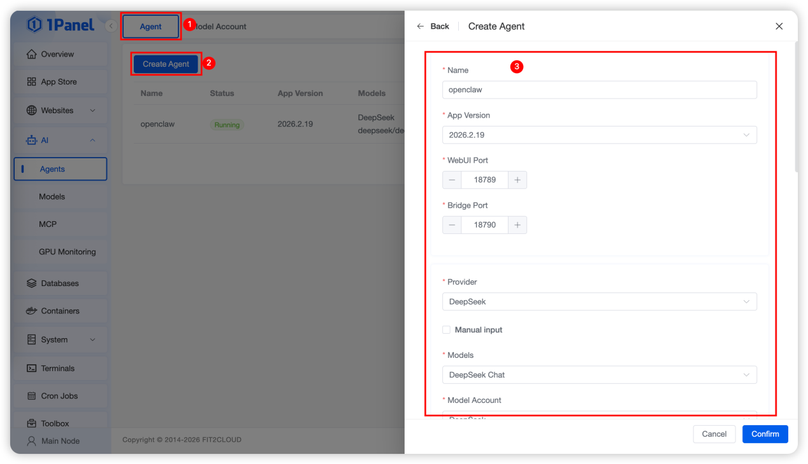
{: .browser-mockup}

!!! note ""
    The parameter definitions during agent creation are detailed as follows:

    - Name: The default is openclaw, which can be customized as the container name.
    - Application Version: Refers to the version of OpenClaw, e.g., the latest version 2026.2.9 as shown in the above figure by default.
    - WebUI Port: The default port of OpenClaw is 18789, which can be customized and must be open.
    - Bridge Port: The default port of OpenClaw is 18790, which can be customized and must be open.
    - Model Provider: The currently supported models are shown in the figure. Select the DeepSeek model provider added just now. If the model account for the corresponding model provider has been added, the number of model accounts will be prompted directly.

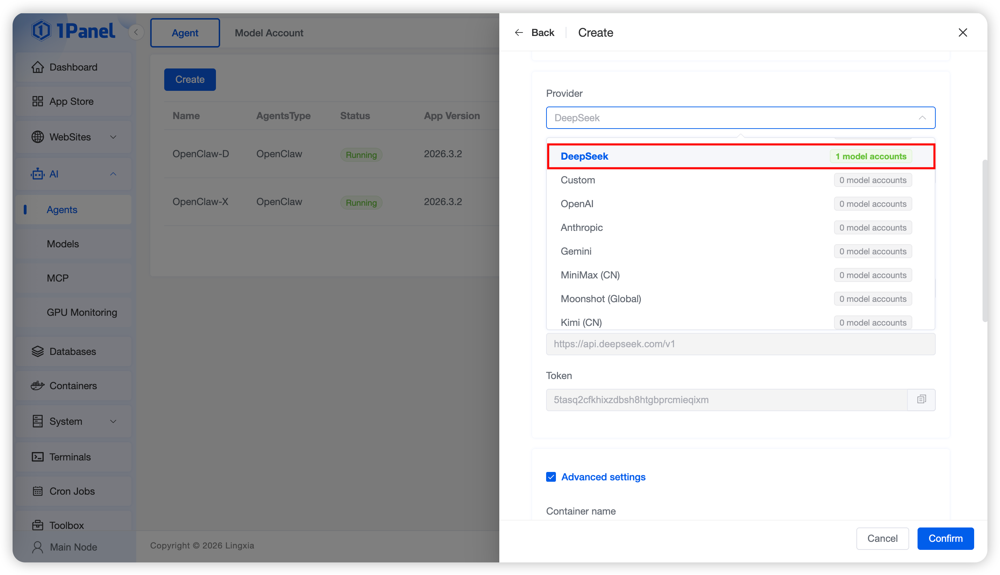
{: .browser-mockup}

!!! note ""
    - Other Model Parameters: After selecting the model provider, the system will automatically retrieve the maintained model accounts, as shown in the figure below. You can also check "Manual input" to enter the model information manually. If no model account has been created, click "Create model account" to complete the creation.

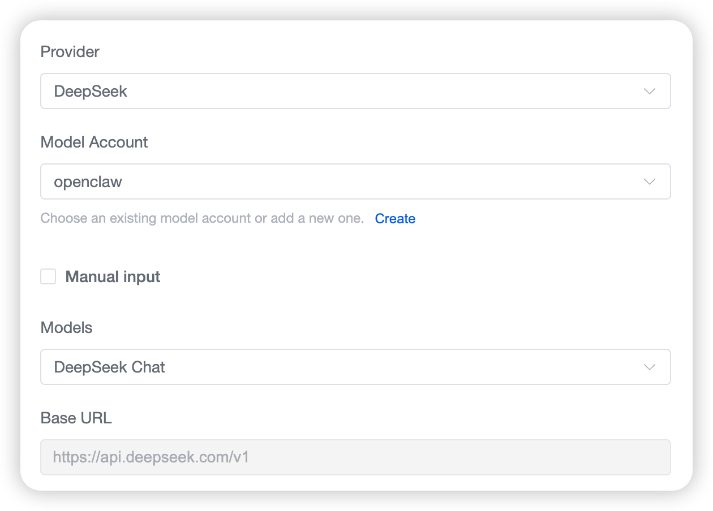
{: .browser-mockup}

!!! note ""
    - Token: A token for the OpenClaw Web UI access address, which is automatically generated by the system for direct access in the follow-up.
    - Other Parameters: Keep the default configurations for all other parameters.

!!! note ""
    After configuring all the above parameters, click "Confirm" directly to start the installation of OpenClaw. The installation is completed when the prompt as shown in the figure below appears.

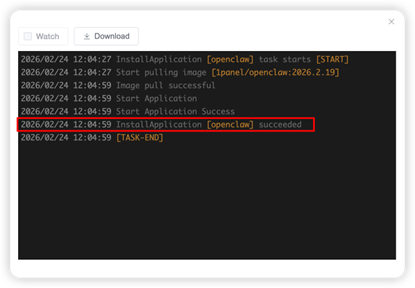
{: .browser-mockup}

### 3.3. Step 3: Verify the Successful Deployment of OpenClaw

!!! note ""
    After the installation and deployment of OpenClaw are completed, enter the agent list page and click "WebUI" to jump directly to the OpenClaw page, as shown in the figure below.

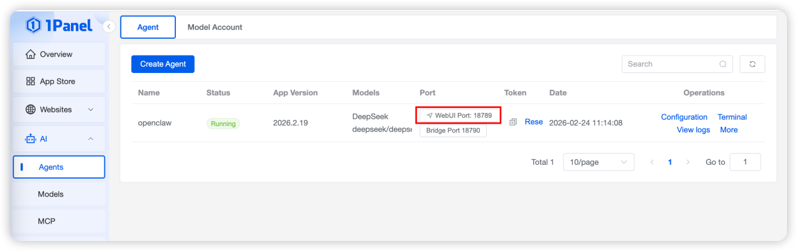
{: .browser-mockup}

!!! note ""
    After entering the OpenClaw page, send a message and check if the AI assistant responds. A normal response, as shown in the figure below, indicates that OpenClaw has been successfully deployed.

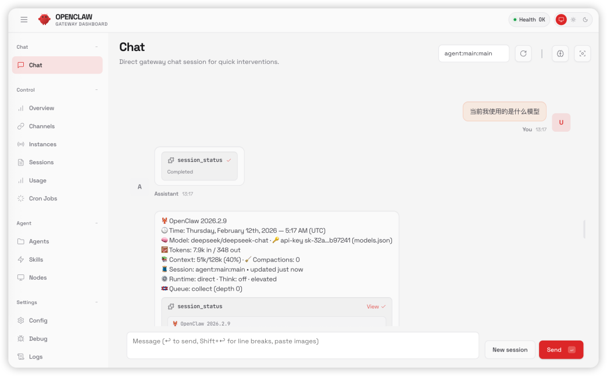
{: .browser-mockup}

## 4. Discord Channel Configuration

!!! note ""
    Up to this point, OpenClaw has been fully deployed. Next, we will configure the Discord channel. To configure the Discord channel, we first need to create an available bot in the Discord Developer Portal. Follow the steps below to complete the configuration step by step.

!!! note ""
    Note: This guide uses a personal Discord account. For server-level configurations involving enterprise or team servers, some permission settings may require server administrator approval, while other operation steps remain the same.

### 4.1. Step 1: Create a Discord Application and Bot User

!!! note ""
    First, log in to the Discord Developer Portal (link: https://discord.com/developers/applications), then click "New Application" in the upper right corner to create a new application.

!!! note ""
    Enter the application name (customizable, e.g., "OpenClaw Bot") and click "Create" to complete the application creation. Then, in the left navigation bar of the application page, select "Bot" and click "Add Bot" to create a bot user.

!!! note ""
    After creating the bot, click "Copy" under "Bot Token" to save the token (this token will be used in the subsequent OpenClaw configuration). Note: Keep the token confidential, as it is equivalent to the bot's access credential. If the token is leaked, click "Regenerate" to get a new one.

### 4.2. Step 2: Enable Required Privileged Gateway Intents

!!! note ""
    Discord blocks "Privileged Gateway Intents" by default; you need to explicitly enable the intents required by OpenClaw to ensure the bot can normally read and send messages. Under the "Bot" page, find the "Privileged Gateway Intents" section and enable the following two intents:

- Message Content Intent: Required to read message text in most servers; without it, the bot will connect but not respond to messages, and you may see the error "Used disallowed intents".

- Server Members Intent (Recommended): Required for member/user search and allowlist matching in servers.

!!! note ""
    You usually do not need to enable "Presence Intent".

### 4.3. Step 3: Generate Invite URL and Add Bot to Server

!!! note ""
    To make the bot work in your Discord server, you need to generate an invite URL and invite the bot to the target server. In the left navigation bar of the application page, select "OAuth2" → "URL Generator", then configure the scopes and bot permissions as follows:
    
!!! note ""
    #### Scopes

    - ✅ bot

    - ✅ applications.commands (Required for native slash commands)

    #### Bot Permissions (Minimum Baseline)

    - ✅ View Channels

    - ✅ Send Messages

    - ✅ Read Message History

    - ✅ Embed Links

    - ✅ Attach Files

    - ✅ Add Reactions (Optional but recommended)

    - ✅ Use External Emojis / Stickers (Optional, only if needed)

!!! note ""
    Note: Avoid enabling "Administrator" unless you are debugging and fully trust the bot..

!!! note ""
    After completing the configuration, copy the generated URL, open it in a browser, select the target server where you want to add the bot, and click "Authorize" to complete the invitation. You may need to complete the human-machine verification during the process.

### 4.4. Step 4: Enable Developer Mode and Obtain IDs (Optional)

!!! note ""
    Discord uses numeric IDs for servers, users, and channels, which are preferred in OpenClaw configurations. To obtain these IDs, you need to enable Developer Mode in Discord (desktop/web version):

    - 1. Open Discord, click the gear icon in the lower left corner to enter "User Settings".

    - 2. Select "Advanced" in the left navigation bar, then enable "Developer Mode".

!!! note ""
    After enabling, you can right-click to copy the corresponding IDs:

    - Server Name → Copy Server ID (Guild ID)

    - Channel (e.g., #help) → Copy Channel ID

    - Your User Avatar → Copy User ID
    
!!! note ""
    The operation page is shown in the figure below.

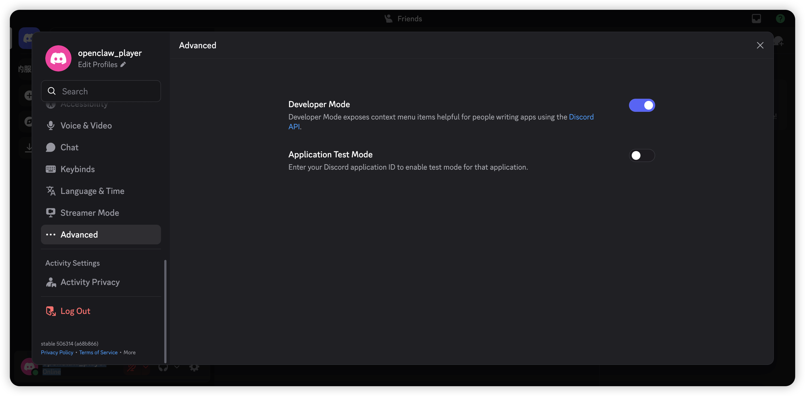

{: .browser-mockup}

### 4.5. Step 5: Configure OpenClaw for Discord Channel

!!! note ""
    After completing the Discord bot configuration, you need to set the bot token and related parameters in OpenClaw. There are two ways to configure it: using environment variables or modifying the configuration file. The configuration file method is recommended for more flexible settings.

#### 4.5.1. Configuration via Environment Variable (Recommended for Servers)

!!! note ""
    Set the environment variable with the bot token obtained in Step 1. The variable name is fixed as follows:

!!! note ""
    DISCORD_BOT_TOKEN=YOUR_BOT_TOKEN

!!! note ""
    Note: If both environment variables and configuration file settings are used, the configuration file settings take precedence (environment variables are only used as a fallback for the default account).

#### 4.5.2. Configuration via Configuration File

!!! note ""
    Modify the OpenClaw configuration file and add the Discord channel configuration. The minimum configuration is as follows:

    ```bash
    {
      "channels": {
        "discord": {
          "enabled": true,
          "token": "YOUR_BOT_TOKEN"
        }
      }
    }
    ```

!!! note ""
    For more advanced configurations (e.g., allowlist, server/channel restrictions, private message settings), you can use the full configuration template as follows. Adjust the parameters according to your actual needs:

    ```bash
    {
      "channels": {
        "discord": {
          "enabled": true,
          "token": "abc.123",
          "groupPolicy": "allowlist",
          "mediaMaxMb": 8,
          "actions": {
            "reactions": true,
            "stickers": true,
            "emojiUploads": true,
            "stickerUploads": true,
            "polls": true,
            "permissions": true,
            "messages": true,
            "threads": true,
            "pins": true,
            "search": true,
            "memberInfo": true,
            "roleInfo": true,
            "roles": false,
            "channelInfo": true,
            "channels": true,
            "voiceStatus": true,
            "events": true,
            "moderation": false
          },
          "replyToMode": "off",
          "dm": {
            "enabled": true,
            "policy": "pairing",
            "allowFrom": ["123456789012345678", "steipete"],
            "groupEnabled": false,
            "groupChannels": ["openclaw-dm"]
          },
          "guilds": {
            "*": { "requireMention": true },
            "123456789012345678": {
              "slug": "friends-of-openclaw",
              "requireMention": false,
              "reactionNotifications": "own",
              "users": ["987654321098765432", "steipete"],
              "channels": {
                "general": { "allow": true },
                "help": {
                  "allow": true,
                  "requireMention": true,
                  "users": ["987654321098765432"],
                  "skills": ["search", "docs"],
                  "systemPrompt": "Keep answers short."
                }
              }
            }
          }
        }
      }
    }
    ```   

!!! note ""
    After completing the configuration, enter the "Configuration" page of "Agent" in 1Panel, complete the Discord chat channel configuration, and click "Save", as shown in the figure below:

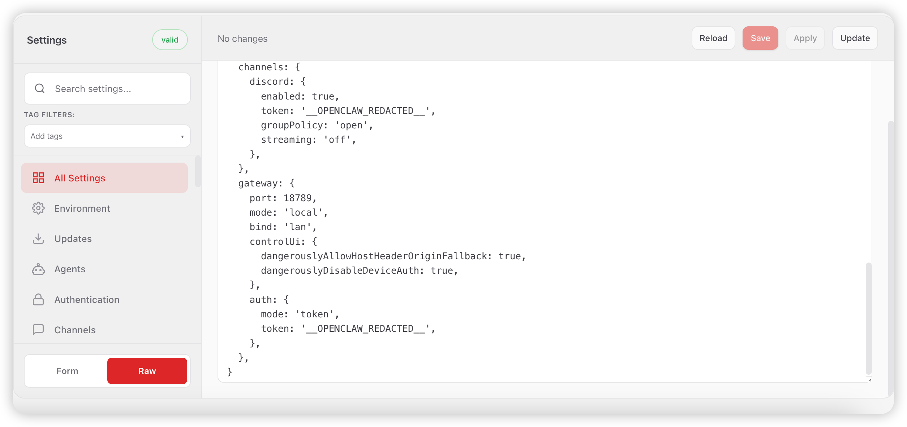

{: .browser-mockup}

### 4.6. Step 6: Start Gateway and Verify Configuration

!!! note ""
    Start the OpenClaw Gateway. When the bot token is available (configuration file takes precedence, environment variable as fallback) and "channels.discord.enabled" is not false, the Discord channel will start automatically. Run the following command to start the Gateway (if not started automatically):

'''
    openclaw gateway
'''

!!! note ""
    After starting the Gateway, verify whether the configuration is successful by following these steps:

- 1. Open the Discord client and enter the server where the bot was added.

- 2. In the target channel (e.g., #general), send a message mentioning the bot (e.g., @OpenClaw Bot hello).

- 3. If the bot replies normally, it indicates that the configuration is successful. The test effect is shown in the figure below.

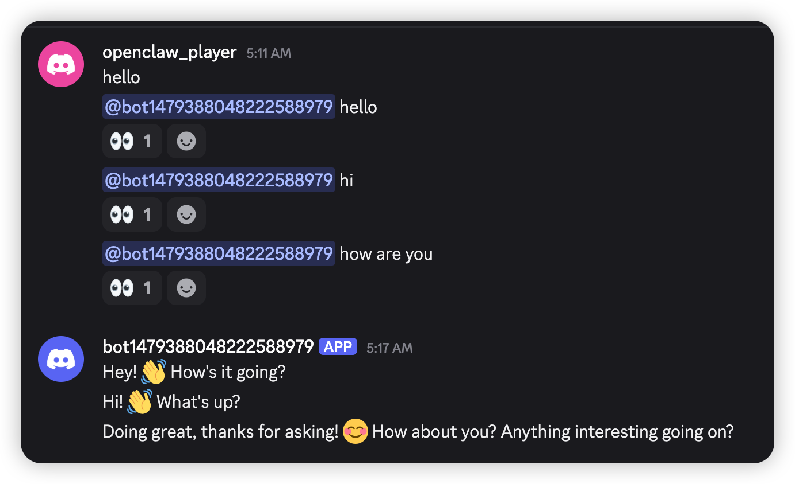

{: .browser-mockup}

### 4.7. Step 7: Troubleshooting (Common Issues)

!!! note ""
    If the bot fails to work normally, first run the following commands to perform a quick audit and view warnings:

'''
    openclaw doctor
    openclaw channels status --probe
'''

#### Common Issues and Solutions

- "Used disallowed intents": Enable "Message Content Intent" (and "Server Members Intent" if needed) in the Discord Developer Portal, then restart the Gateway.

- Bot connects but does not reply in server channels: Check if the bot has "View Channels", "Send Messages", and "Read Message History" permissions; ensure "Message Content Intent" is enabled; verify if the configuration requires mentioning the bot (requireMention: true) but you did not mention it; check if the server/channel allowlist rejects the current channel/user.

- Private messages not working: Check if "channels.discord.dm.enabled" is false or "dm.policy" is "disabled"; if "dm.policy" is "pairing", you need to approve the pairing code first (run "openclaw pairing approve discord <code>").

- requireMention: false but no reply: The default "groupPolicy" is "allowlist"; set "channels.discord.groupPolicy" to "open" or add a server entry under "channels.discord.guilds".

# 5. Model Configuration Modification

!!! note ""
    If you need to switch the model when using the OpenClaw personal AI assistant, also enter the "Agent" list, click "Configuration", enter the model switching menu, complete the model configuration modification and click "Save", as shown in the figure below：
    
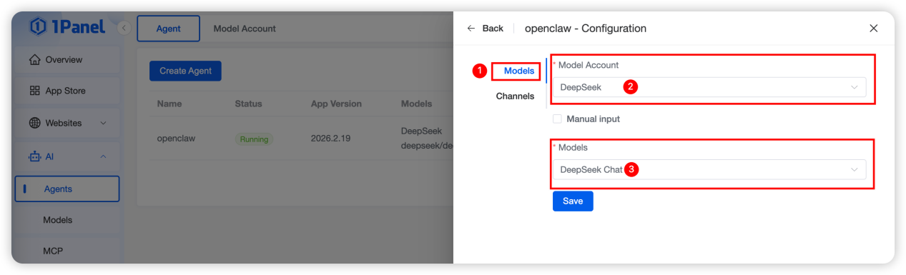
{: .browser-mockup}

