# OpenClaw Installation and Deployment Guide
!!! note ""
This document mainly introduces the installation and deployment process of OpenClaw on Linux clients or servers. We recommend using 1Panel, an open-source Linux operation and maintenance management panel, for installation and deployment, which makes the entire process simple and fast. After OpenClaw is installed, the Feishu channel docking configuration can also be quickly completed through the 1Panel operation and maintenance management panel, facilitating the rapid implementation of a Feishu-based personal AI assistant.

## 1. Resource and Environment Preparation
!!! note ""
The following resource and environment preparations are required for the installation and deployment of OpenClaw:

### Client/Server Preparation
- Operating System: Supports mainstream Linux distributions (based on Debian/RedHat, including domestic operating systems)
- Server Architecture: x86_64, aarch64
- Memory Requirement: It is recommended to have more than 2GB of available memory
- Browser Requirement: Use modern browsers such as Chrome, FireFox, IE10+, Edge, etc.
- Network Requirement: Internet access is available

### Large Language Model API Key
- Public Models: API Keys of large language models such as DeepSeek, Kimi, OpenAI, etc.
- Local Models

### 1Panel v2.1.0 Installation and Deployment
!!! note ""
Refer to the official 1Panel documentation for installation and deployment details at the following link: https://1panel.cn/docs/v2/installation/online_installation/

Based on the above environment, the entire installation and deployment process can be completed in four parts: 1Panel installation and deployment, large language model API Key preparation, OpenClaw installation and deployment, and Feishu channel configuration. For detailed instructions, see the following documentation.

## 2. Large Language Model API Application
You can check the list of models supported on the OpenClaw official website and obtain the API Key of the large language model respectively. This document takes DeepSeek as an example. For other public models and local models, prepare the relevant API Keys by referring to the corresponding documents on your own.

### 2.1. Step 1: Register on the DeepSeek Developer Platform
Access the DeepSeek Developer Platform via the link: https://platform.deepseek.com/, first complete personal real-name authentication and registration, and then make a recharge, as shown in the figure below.


### 2.2. Step 2: Obtain the DeepSeek API Key
As shown in the figure below, enter the API keys page, click "Create API key", and keep the generated API Key in a safe place for subsequent use after creation.


## 3. OpenClaw Installation and Deployment
The installation of OpenClaw is deployed based on the agent management of 1Panel, and the DeepSeek large model API key obtained in the previous step needs to be used during the deployment process. In 1Panel, the deployment of OpenClaw and the management of large model API key accounts are divided into two separate parts and decoupled from each other, mainly to facilitate the adjustment of model configurations for your OpenClaw personal assistant.

### 3.1. Step 1: Add a Model Account
Enter the "Agent" management menu under "AI" management, click to enter and switch to "Model Account" management first, then click "Add model account". Select the model provider and enter the model account information as required to complete the model account creation.


### 3.2. Step 2: Create an Agent
After preparing the model account, switch to the "Agent" page and click "Create Agent", then enter the relevant parameters as required, as shown in the figure below：


The parameter definitions during agent creation are detailed as follows:

- Name: The default is openclaw, which can be customized as the container name.
- Application Version: Refers to the version of OpenClaw, e.g., the latest version 2026.2.9 as shown in the above figure by default.
- WebUI Port: The default port of OpenClaw is 18789, which can be customized and must be open.
- Bridge Port: The default port of OpenClaw is 18790, which can be customized and must be open.
- Model Provider: The currently supported models are shown in the figure. Select the DeepSeek model provider added just now. If the model account for the corresponding model provider has been added, the number of model accounts will be prompted directly.


- Other Model Parameters: After selecting the model provider, the system will automatically retrieve the maintained model accounts, as shown in the figure below. You can also check "Manual input" to enter the model information manually. If no model account has been created, click "Create model account" to complete the creation.


- Token: A token for the OpenClaw Web UI access address, which is automatically generated by the system for direct access in the follow-up.
- Other Parameters: Keep the default configurations for all other parameters.

After configuring all the above parameters, click "Confirm" directly to start the installation of OpenClaw. The installation is completed when the prompt as shown in the figure below appears.


### 3.3. Step 3: Verify the Successful Deployment of OpenClaw
After the installation and deployment of OpenClaw are completed, enter the agent list page and click "WebUI" to jump directly to the OpenClaw page, as shown in the figure below.


After entering the OpenClaw page, send a message and check if the AI assistant responds. A normal response, as shown in the figure below, indicates that OpenClaw has been successfully deployed.


## 4. Feishu Channel Configuration
Up to this point, OpenClaw has been fully deployed. Next, we will configure the Feishu channel. To configure the Feishu channel, we first need to create an available robot in Feishu. Follow the steps below to complete the configuration step by step.

Note: A personal Feishu account is used in this guide. For enterprise accounts, version release and permission authorization require administrator approval, while other operation steps remain the same.

### 4.1. Step 1: Create a Custom Enterprise App
First, log in to Feishu and enter the Feishu Open Platform (link: https://open.feishu.cn/app), then access the "Developer Console" and select "Custom Apps", click "Create Custom App", as shown in the figure below.

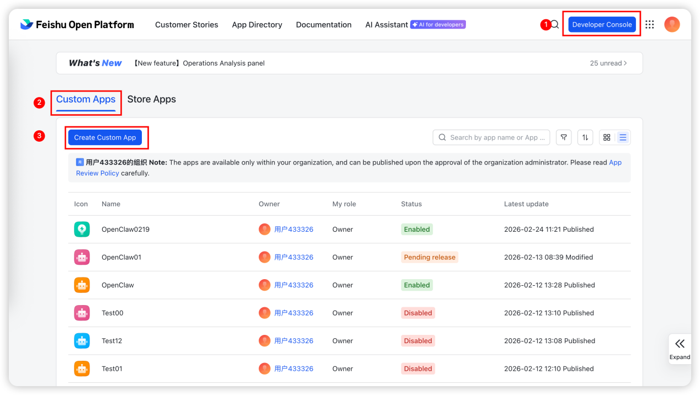

As shown in the figure below, enter the relevant app name and basic information as required and click "Create".

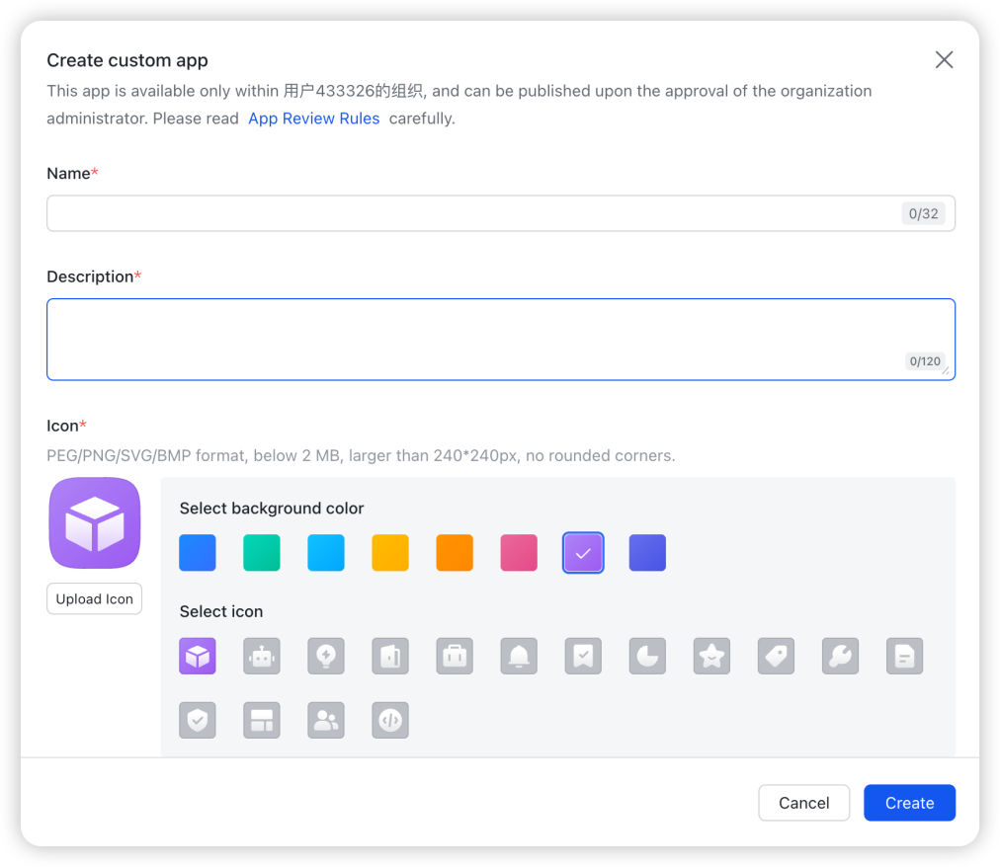

### 4.2. Step 2: Create a Bot
As shown in the figure below, click to create a bot to complete the bot creation process.

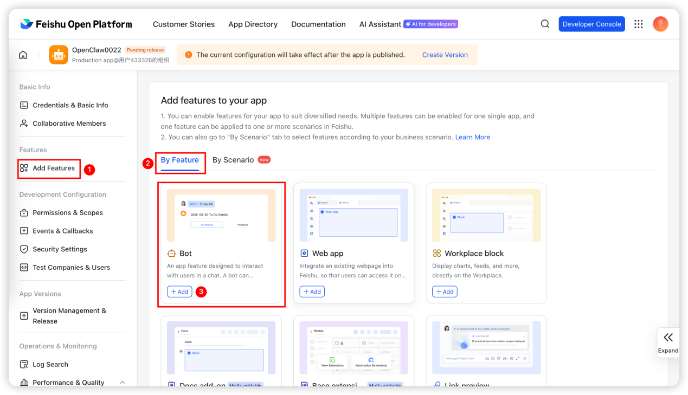

After entering the bot page, click the edit button after bot configuration to define the bot name, as shown in the figure below：

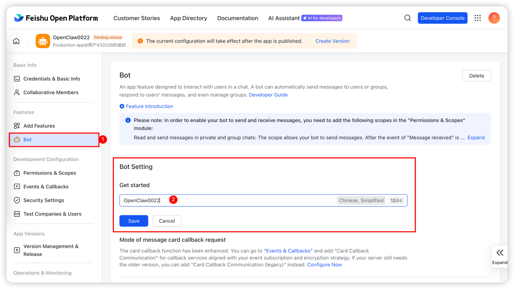

### 4.3. Step 3: Permission Configuration
After creating the bot, click to enter "Permissions & Scopes" and then click "Batch import/export scopes".

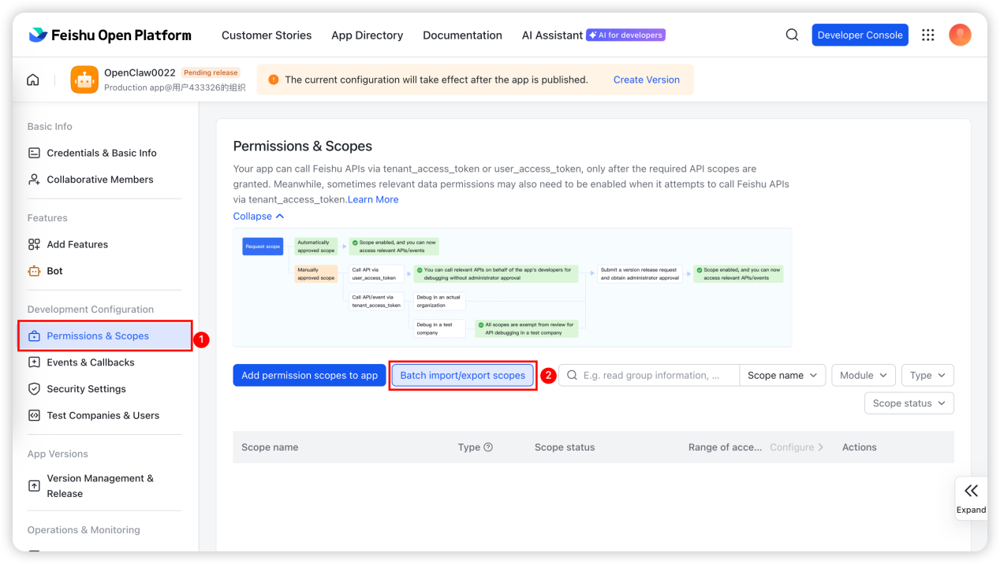

Click "Batch import/export scopes", clear the default permission configuration information, copy and paste the permission authorization script as shown below, and click "Save".

```json
{
  "scopes": {
    "tenant": [
      "aily:file:read",
      "aily:file:write",
      "application:application.app_message_stats.overview:readonly",
      "application:application.self_manage",
      "application:bot.menu:write",
      "cardkit:card:write",
      "contact:contact.base:readonly",
      "contact:user.employee_id:readonly",
      "corehr:file:download",
      "docs:document.content:read",
      "event:ip_list",
      "im:chat",
      "im:chat.access_event.bot_p2p_chat:read",
      "im:chat.members:bot_access",
      "im:message",
      "im:message.group_at_msg:readonly",
      "im:message.group_msg",
      "im:message.p2p_msg:readonly",
      "im:message:readonly",
      "im:message:send_as_bot",
      "im:resource",
      "sheets:spreadsheet",
      "wiki:wiki:readonly"
    ],
    "user": [
      "aily:file:read",
      "aily:file:write",
      "contact:contact.base:readonly",
      "im:chat.access_event.bot_p2p_chat:read"
    ]
  }
}
```

The effect after pasting is shown in the figure below：

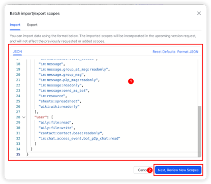

Click "Next, Review New Scopes" and finally ensure that all permissions are enabled. For personal accounts, confirm the permissions by yourself; for enterprise accounts, administrator review is required. Ensure all permissions are enabled as shown in the figure below：

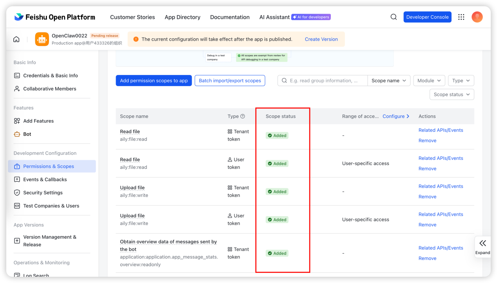

### 4.4. Step 4: Obtain Credentials and Configure in 1Panel
Enter the Feishu platform and obtain the app credentials in "Credentials & Basic Info", as shown in the figure below：

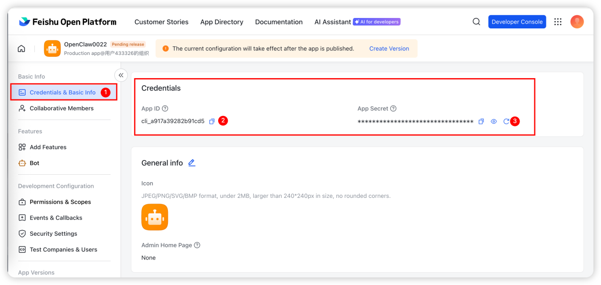

After obtaining the credentials, enter the "Configuration" page of "Agent" in 1Panel, complete the Feishu chat channel configuration, and click "Save", as shown in the figure below：

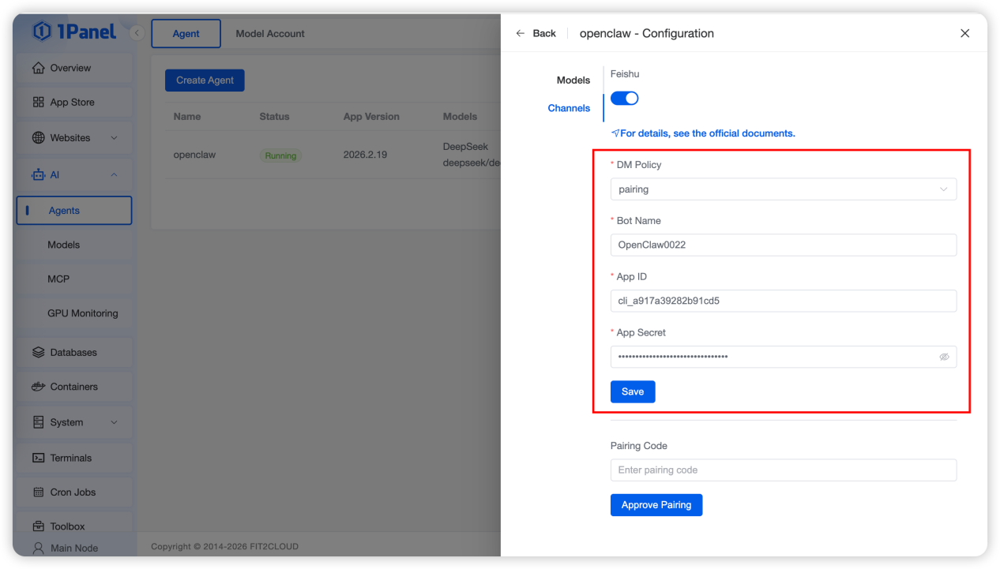

### 4.5. Step 5: Create Events and Callbacks
As shown in the figure below, enter the "Events & Callbacks" menu and complete the subscription method setting and event addition respectively.

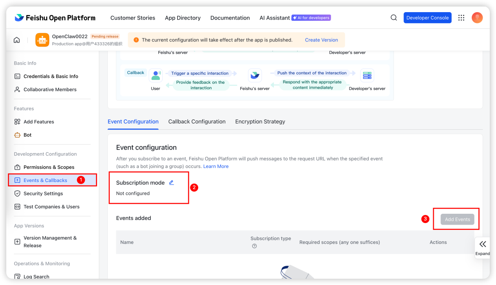

#### Subscription Method Setting
Select the persistent connection subscription method as shown in the figure below：

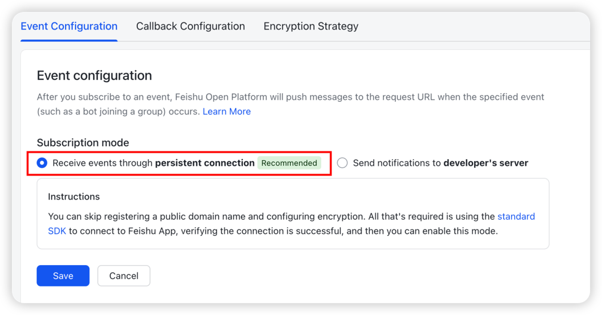

#### Add Events:
Enter "im.message.receive_v1" to search, check "Receive messages" based on "App-based Subscription", and finally confirm the addition.

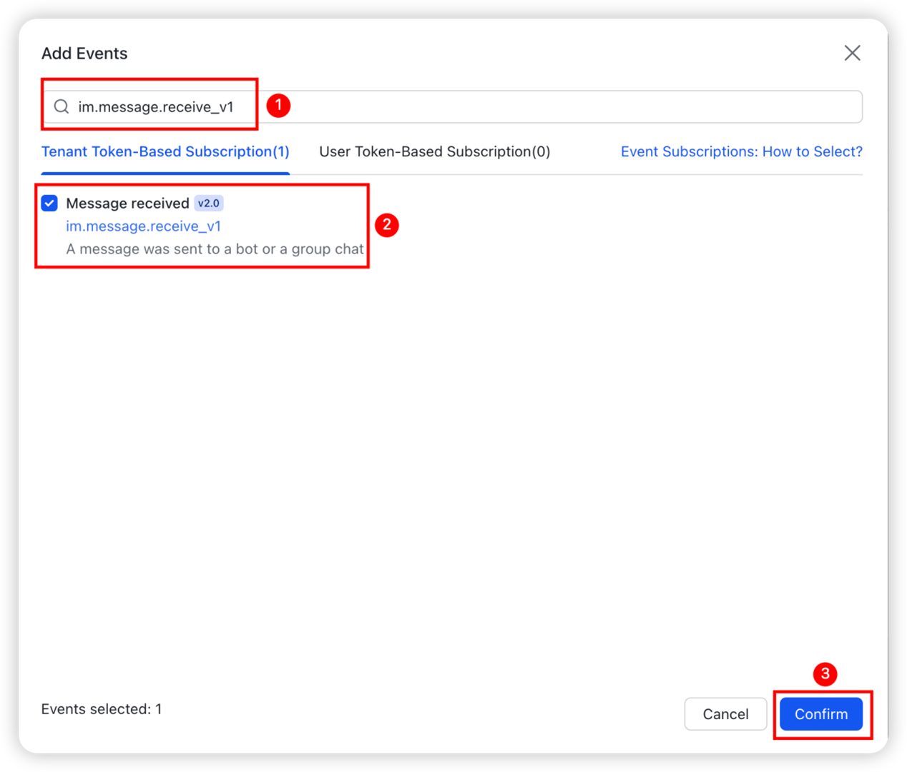

### 4.6. Step 6: Create and Release a Version
After confirmation, click "Create Version", then enter the relevant version information as required and release it. No approval is required for personal accounts, while enterprise accounts need enterprise approval.

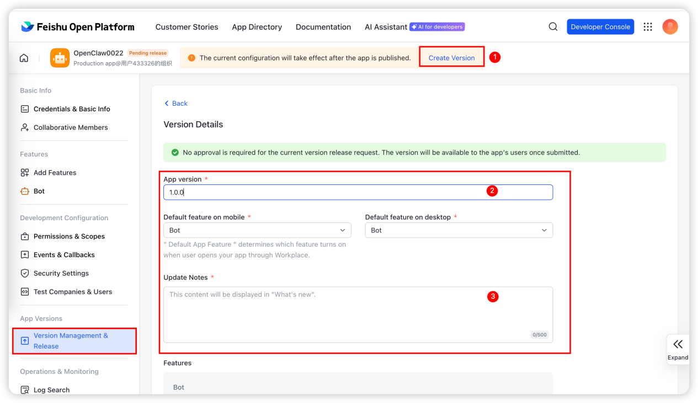

### 4.7. Step 7: Verify the Feishu Channel Configuration
After completing all the above configurations, open the app in the Feishu client as shown in the figure below：

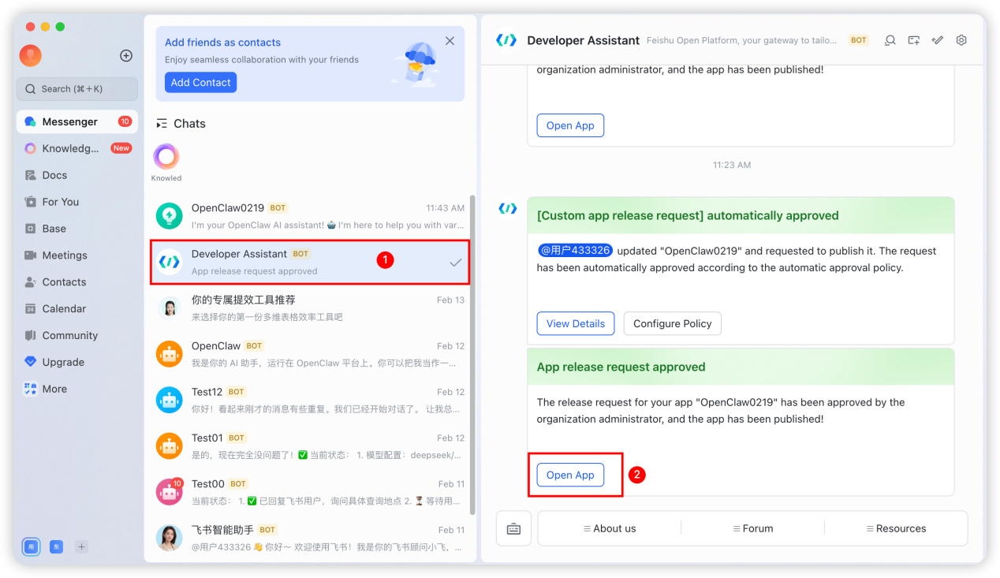

Finally, perform a simple test. The prompt as shown in the figure below indicates that the configuration is successful.

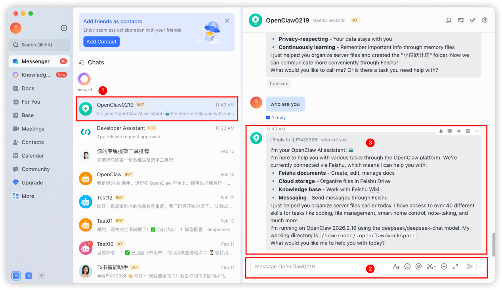

# 6. Model Configuration Modification
If you need to switch the model when using the OpenClaw personal AI assistant, also enter the "Agent" list, click "Configuration", enter the model switching menu, complete the model configuration modification and click "Save", as shown in the figure below：


