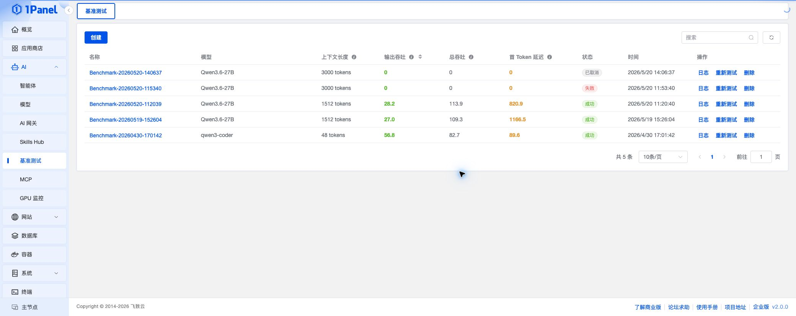
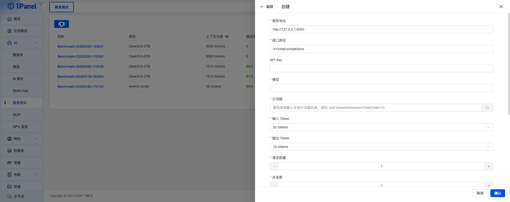
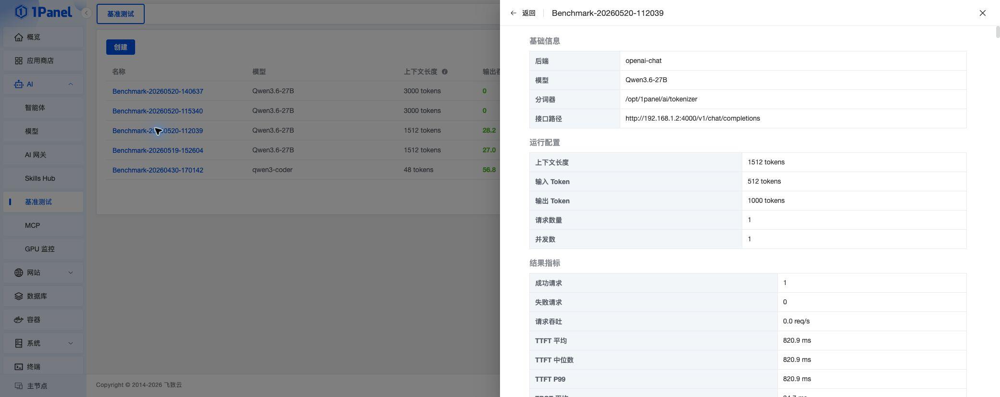

## 基准测试

!!! note ""
    基准测试用于对 OpenAI 兼容的大模型服务进行性能压测，帮助评估模型在指定上下文长度、并发数和请求速率下的吞吐与延迟表现。

    进入 1Panel 面板后，打开 **AI -> 基准测试** 页面即可进行管理。

    该功能属于 [1Panel 企业版](https://1panel.cn/enterprise.html)。

{: .browser-mockup}

## 1 前置条件

!!! note ""
    创建基准测试前，请先确认以下条件：

    - 已准备可访问的 OpenAI 兼容接口，例如 AI 网关、vLLM、Ollama 或其他兼容服务
    - 已准备可用的 API Key，若目标服务不需要认证可按页面要求留空或填写占位值
    - 已确认需要测试的模型名称
    - 已准备本地分词器目录，用于按目标 Token 数生成测试数据
    - 服务器可以正常拉取或使用页面中配置的 vLLM 镜像

> 如果需要测试 AI 网关，请先在 **AI -> AI 网关** 中创建 API Key，并将外部访问地址作为基准测试的服务地址。

## 2 创建测试任务

!!! note ""
    点击 **创建**，填写服务地址、接口路径、API Key、模型、分词器目录、输入/输出 Token、请求数量、并发数等参数后，点击 **确认** 即可创建任务。

    创建成功后，系统会启动后台任务执行基准测试，并可通过任务日志查看执行过程。

{: .browser-mockup}

!!! info "基础参数"
    - **服务地址**：目标模型服务地址，例如 `http://127.0.0.1:4000`
    - **接口路径**：OpenAI 兼容接口路径，默认为 `/v1/chat/completions`
    - **API Key**：目标服务的访问凭证
    - **模型**：需要测试的模型名称
    - **分词器**：服务器本地分词器目录，例如 `/opt/1panel/tokenizers/DeepSeek-V3`

!!! info "压测参数"
    - **输入 Token**：单次请求的输入 Token 数
    - **输出 Token**：单次请求的输出 Token 上限
    - **请求数量**：本次测试发送的请求总数
    - **并发数**：同时发起的请求数量
    - **请求速率**：限制每秒请求数；选择不限速时会尽量压满目标服务吞吐
    - **超时时间**：单个任务允许执行的最长时间
    - **vLLM 镜像**：执行基准测试时使用的镜像
    - **忽略 EOS**：开启后会尽量生成到配置的输出 Token 数，便于稳定对比吞吐
    - **额外请求头**：以 JSON 形式追加请求头，例如 `{"X-Request-Source":"1Panel"}`

## 3 查看测试结果

!!! note ""
    测试任务完成后，可以在列表中查看模型、上下文长度、输出吞吐、总吞吐、首 Token 延迟、状态和创建时间。

    点击任务名称可打开详情抽屉，查看基础信息、运行配置、结果指标、启动命令和原始结果。

{: .browser-mockup}

!!! info "核心指标"
    - **上下文长度**：输入 Token 与输出 Token 上限之和
    - **输出吞吐**：模型每秒生成的输出 Token 数，数值越高代表生成速度越快
    - **总吞吐**：每秒处理的输入 Token 与输出 Token 总数
    - **首 Token 延迟（TTFT）**：从请求发出到收到第一个 Token 的时间，数值越低代表响应越快
    - **请求吞吐**：每秒完成的请求数量
    - **TPOT**：每个输出 Token 的平均生成耗时
    - **ITL**：输出 Token 之间的平均间隔
    - **成功请求 / 失败请求**：本次测试中成功和失败的请求数量

> 不同测试任务的输入/输出 Token、并发数、请求速率、网络环境和后端模型不同，指标不应直接混用比较。建议固定测试参数后再对比不同模型或不同部署方式。

## 4 任务操作

!!! note ""
    在任务列表中，可以对测试任务进行日志查看、重新测试、取消和删除等操作。

    - **日志**：查看任务执行日志，适合排查镜像拉取、连接失败或参数错误
    - **重新测试**：使用已有任务参数重新创建测试任务
    - **取消**：任务运行中或等待中时，可以取消执行
    - **删除**：删除不再需要的测试记录

## 5 常见建议

!!! note ""
    为了获得更稳定的测试结果，建议：

    - 在服务器负载较低时执行测试
    - 使用相同的输入/输出 Token、并发数和请求速率进行横向对比
    - 对同一模型执行多轮测试，关注平均表现而不是单次结果
    - 如果测试 AI 网关，结合 AI 网关的用量统计和调用日志一起分析
    - 如果测试本地 GPU 推理服务，结合 GPU 监控观察显存、利用率和温度变化
