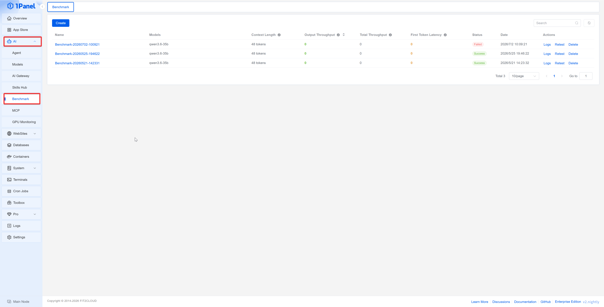
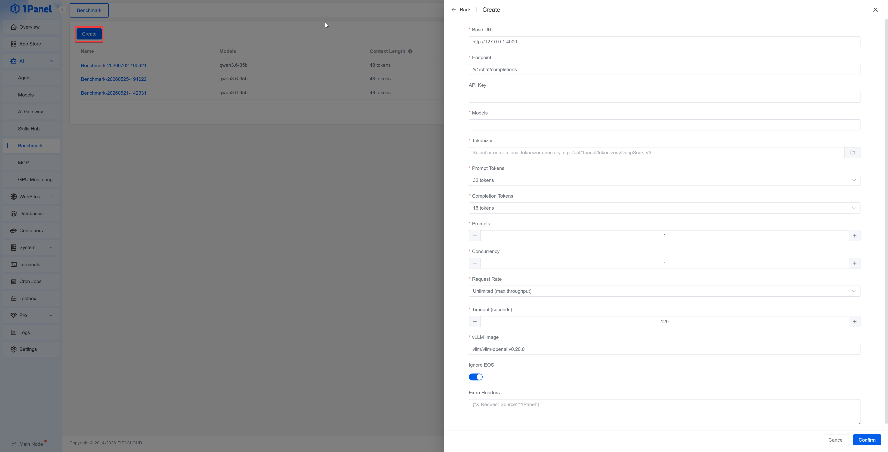
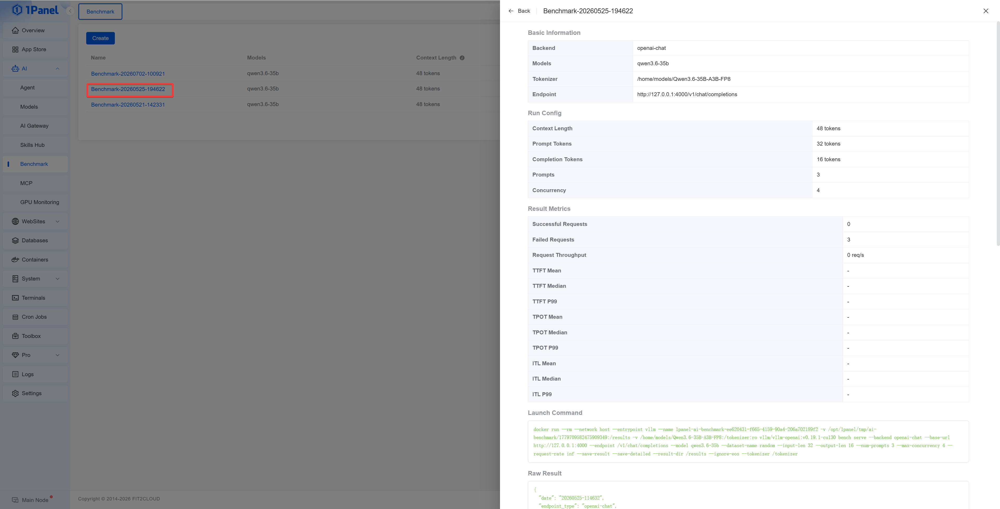
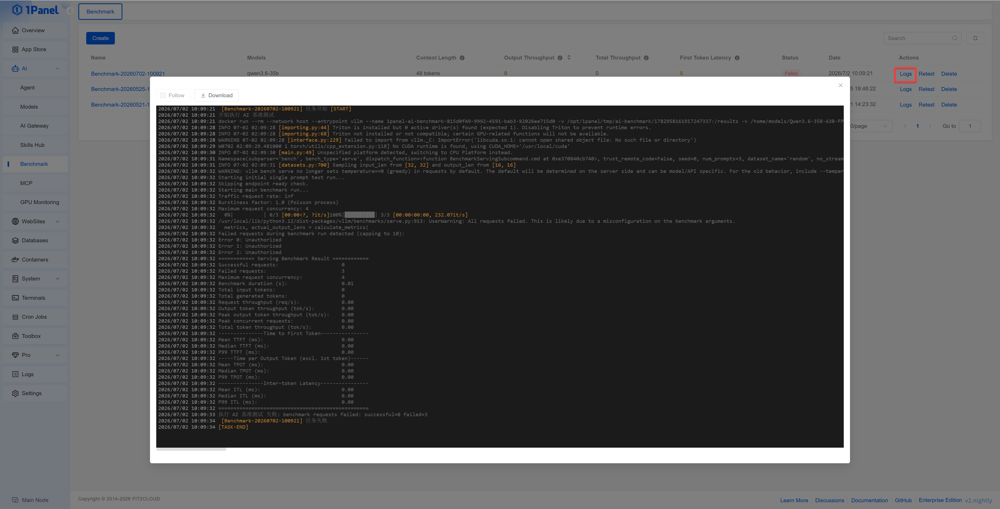

# Benchmark Testing

!!! note ""
    Benchmark testing is used to perform stress testing on OpenAI-compatible large language model services, helping to evaluate the model's throughput and latency performance under a specified context length, concurrency level, and request rate.

    After entering the 1Panel dashboard, open the **AI -> Benchmark Testing** page to manage it.

    This feature belongs to [1Panel Enterprise Edition](https://1panel.cn/enterprise.html).

{: .browser-mockup}

## 1 Prerequisites

!!! note ""
    Before creating a benchmark test, please confirm the following conditions:

    - An accessible OpenAI-compatible endpoint has been prepared, such as an AI Gateway, vLLM, Ollama, or other compatible service
    - A valid API Key has been prepared. If the target service does not require authentication, leave it blank or fill in a placeholder value as required by the page
    - The name of the model to be tested has been confirmed
    - A local tokenizer directory has been prepared for generating test data based on the target number of tokens
    - The server can normally pull or use the vLLM image configured on the page

> If you need to test an AI Gateway, first create an API Key under **AI -> AI Gateway**, and use the external access address as the service address of the benchmark test.

## 2 Creating a Test Task

!!! note ""
    Click **Create**, fill in parameters such as the service address, endpoint path, API Key, model, tokenizer directory, input/output tokens, request count, and concurrency, then click **Confirm** to create the task.

    After the task is successfully created, the system will start a background task to execute the benchmark test, and the execution process can be viewed through the task log.

{: .browser-mockup}

!!! info "Basic Parameters"
    - **Service Address**: The address of the target model service, e.g., `http://127.0.0.1:4000`
    - **Endpoint Path**: The OpenAI-compatible endpoint path, defaulting to `/v1/chat/completions`
    - **API Key**: The access credential of the target service
    - **Model**: The name of the model to be tested
    - **Tokenizer**: The local tokenizer directory on the server, e.g., `/opt/1panel/tokenizers/DeepSeek-V3`

!!! info "Stress Testing Parameters"
    - **Input Tokens**: The number of input tokens per request
    - **Output Tokens**: The upper limit of output tokens per request
    - **Request Count**: The total number of requests sent in this test
    - **Concurrency**: The number of requests initiated simultaneously
    - **Request Rate**: Limits the number of requests per second; when no rate limit is selected, the throughput of the target service will be saturated as much as possible
    - **Timeout**: The maximum time allowed for a single task to execute
    - **vLLM Image**: The image used when executing the benchmark test
    - **Ignore EOS**: When enabled, the model will generate up to the configured number of output tokens, facilitating stable throughput comparison
    - **Extra Request Headers**: Appends request headers in JSON format, e.g., `{"X-Request-Source":"1Panel"}`

## 3 Viewing Test Results

!!! note ""
    After a test task is completed, you can view the model, context length, output throughput, total throughput, time to first token, status, and creation time in the list.

    Click the task name to open the details drawer and view the basic information, runtime configuration, result metrics, startup command, and raw results.

{: .browser-mockup}

!!! info "Core Metrics"
    - **Context Length**: The sum of the input token upper limit and the output token upper limit
    - **Output Throughput**: The number of output tokens generated by the model per second; a higher value indicates faster generation speed
    - **Total Throughput**: The total number of input and output tokens processed per second
    - **Time to First Token (TTFT)**: The time from when a request is sent to when the first token is received; a lower value indicates a faster response
    - **Request Throughput**: The number of requests completed per second
    - **TPOT**: The average generation time of each output token
    - **ITL**: The average interval between output tokens
    - **Successful / Failed Requests**: The number of successful and failed requests in this test

> Because different test tasks use different input/output tokens, concurrency, request rates, network environments, and backend models, metrics should not be directly mixed for comparison. It is recommended to fix the test parameters before comparing different models or different deployment methods.

## 4 Task Operations

!!! note ""
    In the task list, you can perform operations such as viewing logs, re-testing, canceling, and deleting test tasks.

    - **Log**: Views the task execution log, suitable for troubleshooting image pulls, connection failures, or parameter errors
    - **Re-test**: Creates a new test task using the parameters of an existing task
    - **Cancel**: When a task is running or waiting, you can cancel its execution
    - **Delete**: Deletes test records that are no longer needed

{: .browser-mockup}

## 5 General Recommendations

!!! note ""
    To obtain more stable test results, it is recommended to:

    - Execute tests when the server load is low
    - Use the same input/output tokens, concurrency, and request rate for horizontal comparison
    - Run multiple rounds of tests for the same model and focus on the average performance rather than a single result
    - When testing an AI Gateway, analyze it together with the AI Gateway's usage statistics and call logs
    - When testing a local GPU inference service, observe changes in VRAM usage, utilization, and temperature in conjunction with GPU monitoring
