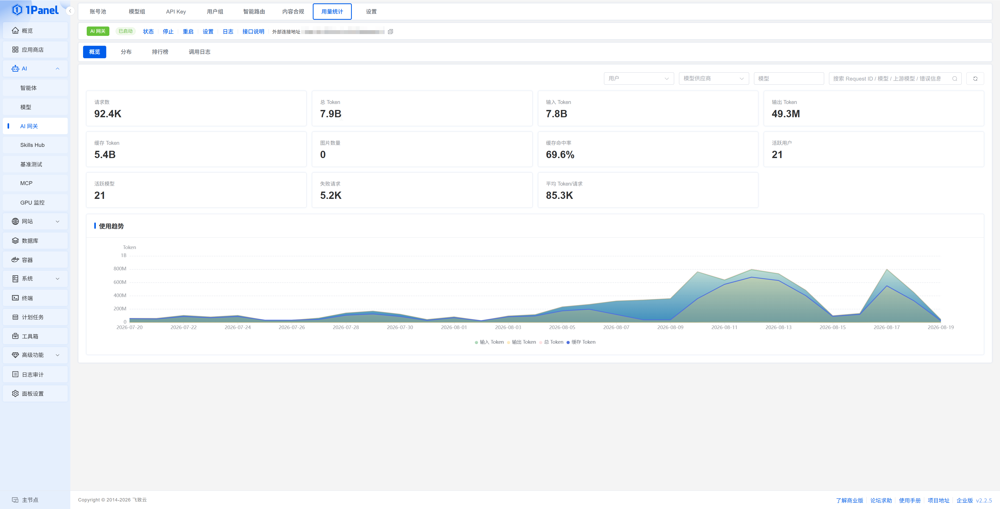
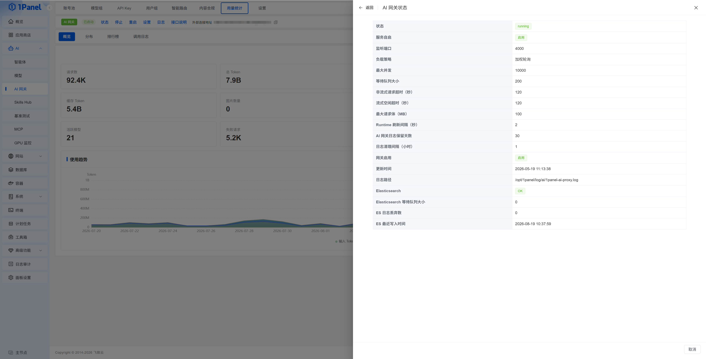
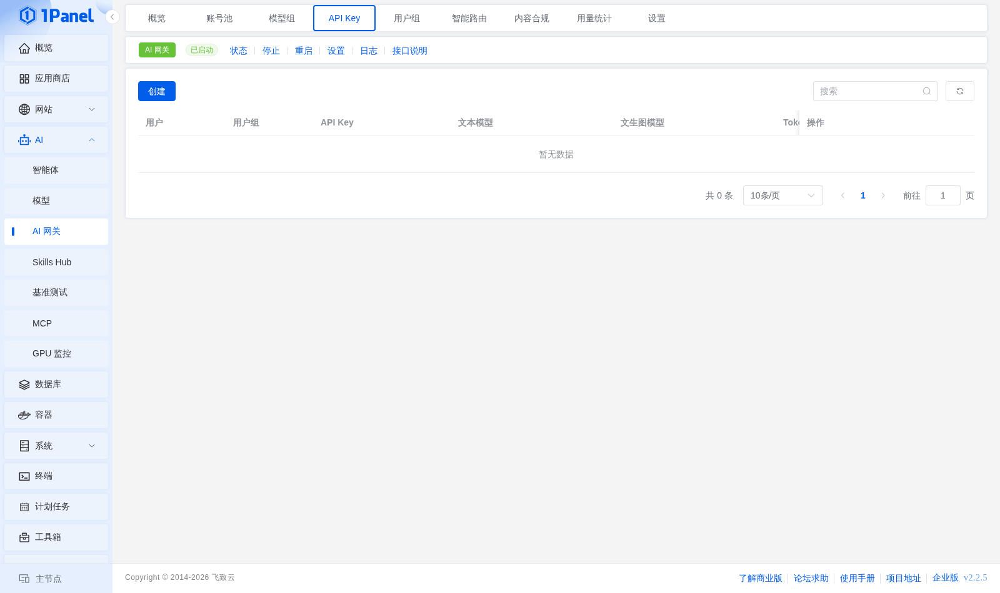
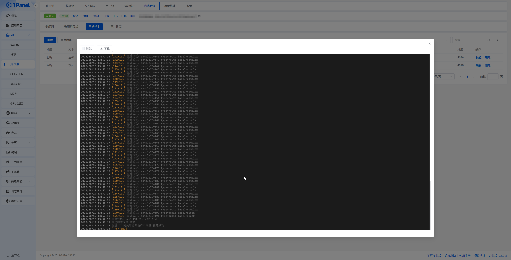
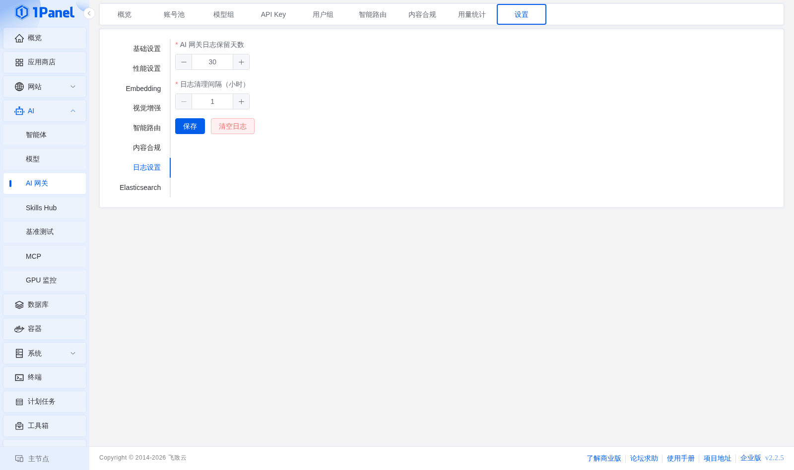

## AI 网关

!!! note ""
    AI 网关用于统一管理模型账号、调用凭证、访问配额和请求转发。客户端只需配置网关的外部连接地址和 API Key，即可通过统一入口调用不同供应商或本地部署的模型。

    进入 1Panel 面板后，打开 **AI -> AI 网关** 页面即可进行管理。

    该功能属于 [1Panel 企业版](https://1panel.cn/enterprise.html)。

!!! note ""
    新版 AI 网关包含 **账号池、模型组、API Key、用户组、智能路由、内容合规、用量统计、设置** 8 个功能入口。建议按照以下顺序完成首次配置：

    1. 在 **账号池** 中导入模型账号并配置模型映射。
    2. 按需创建 **模型组**，用于限制用户组可用模型或配置智能路由。
    3. 创建 **用户组**，设置 QPS、Token 配额和模型范围。
    4. 创建 **API Key**，交付给客户端使用。
    5. 按需启用智能路由、内容合规、用量统计和 Elasticsearch。

## 1 运行状态与基础操作

!!! note ""
    AI 网关页面顶部展示服务状态和外部连接地址，并提供以下操作：

    - **状态**：查看运行状态、服务自启、监听端口、负载策略、并发限制、超时参数、日志路径和 Elasticsearch 写入状态
    - **启动 / 停止 / 重启**：控制 AI 网关服务
    - **设置**：进入网关设置页面
    - **日志**：查看 AI 网关运行日志
    - **外部连接地址**：客户端配置的 Base URL，可直接复制

<div class="browser-mockup" markdown>



</div>


!!! note "状态详情"
    点击 **状态** 可查看网关运行详情，包括运行状态、服务自启、监听端口、最大并发、等待队列大小、请求超时、最大请求体、日志保留天数、日志路径、更新时间以及 Elasticsearch 写入状态等。

<div class="browser-mockup" markdown>



</div>

## 2 账号池

!!! note ""
    你可以把 **账号池** 理解成一个"模型账号的总登记处"。当 1Panel 里接入了多个 AI 模型服务（不同厂商、不同密钥的账号）时，网关需要知道"该把请求发给谁"——账号池就是集中登记这些上游账号的地方。

    点击 **导入模型账号**，选择已在 **AI -> 模型** 中创建的账号即可加入池中，并为它配置 **并发**、**优先级** 和 **模型映射**：并发限制该账号同时处理的请求数，优先级决定账号的选择顺序，模型映射负责把客户端填写的模型名"翻译"成该账号真实使用的上游模型名。

    列表会展示模型供应商、API 类型、上游 API 地址、模型映射、并发、优先级、健康状态、启用、失败次数和最近错误，便于检查账号是否可以正常参与转发。当前页面可同时管理 `openai-completions`、`openai-responses`、`anthropic-messages` 等不同 API 类型的模型账号。

<div class="browser-mockup" markdown>


</div>

!!! info "导入参数"
    - **模型账号**：选择已有模型账号
    - **并发**：限制该账号同时处理的最大请求数，`0` 表示不限制
    - **优先级**：数值用于确定账号选择顺序
    - **模型映射**：将客户端请求模型映射到该账号的真实上游模型
    - **启用**：控制该账号是否参与网关转发

<div class="browser-mockup" markdown>


</div>

> 模型映射左侧填写客户端请求中的 `model`，右侧填写真实上游模型。客户端只需要感知映射后的请求模型名。

## 3 模型组

!!! note ""
    **模型组** 就是把几个真实模型"打包成一组"。比如你可以把便宜、响应快的模型放进「简单模型组」，把能力强、成本高的模型放进「复杂模型组」，之后用户组授权和智能路由就能直接按"组"来选，而不必一个个指定模型。

    创建模型组时填写名称、请求模型和备注；模型在组内的顺序表示智能路由的选择优先级，组内不做模型间负载均衡。

    `auto` 是客户端触发智能路由时使用的虚拟模型名，不需要添加到模型组中。

<div class="browser-mockup" markdown>


</div>

## 4 用户组

!!! note ""
    **用户组** 用于统一管理一组 API Key 的调用配额和模型范围。创建用户组后，再将 API Key 绑定到该用户组。

<div class="browser-mockup" markdown>


</div>

!!! info "用户组参数"
    - **用户组**：用户组名称
    - **QPS 限制**：限制每秒请求数，`0` 表示不限制
    - **Token 限制**：限制该组可使用的 Token 配额，`0` 表示不限制
    - **模型组**：限制该组可以调用的模型；不选择时表示不限制
    - **状态**：禁用后，该组下的 API Key 无法继续调用
    - **备注**：记录部门、项目或使用场景

!!! warn "注意"
    默认用户组不可删除。API Key 绑定用户组后，会继承用户组的 QPS、Token 配额和模型范围。

## 5 API Key

!!! note ""
    **API Key** 是客户端访问 AI 网关时使用的"门禁钥匙"——第三方程序（或你自己写的脚本）只有带上这把钥匙，网关才会把请求转发给上游模型。

    在 **API Key** 页面点击 **创建**，选择用户和用户组，确认系统生成的 API Key 后保存。列表会展示用户、用户组、API Key、文本模型、文生图模型、Token 用量、到期时间、状态、备注、最近使用时间和创建时间等信息，并支持编辑、删除和重置 Token。

    API Key 只会在创建时完整展示，请妥善保存。重置 Token 后，原 Token 将无法继续使用，需要同步更新客户端配置。

<div class="browser-mockup" markdown>



</div>

!!! note "创建 API Key"
    点击 **创建**，选择用户和用户组，确认系统生成的 API Key 后保存。可设置有效期、状态和备注。

<div class="browser-mockup" markdown>


</div>

!!! info "客户端调用示例"
    ```bash
    curl http://<服务器 IP>:4000/v1/chat/completions \
      -H "Authorization: Bearer <API Key>" \
      -H "Content-Type: application/json" \
      -d '{
        "model": "deepseek-v4-flash",
        "messages": [
          {
            "role": "user",
            "content": "Hello"
          }
        ],
        "stream": true
      }'
    ```
!!! warn "注意"
    客户端应将页面顶部的 **外部连接地址** 作为 Base URL。`model` 可以填写账号池中的请求模型名；启用智能路由后，也可以填写 `auto`。

## 6 智能路由

!!! note ""
    **智能路由** 就像一个"自动调度员"：它先判断你的问题难不难——简单问题（比如闲聊、翻译）自动交给便宜、响应快的「简单模型组」，复杂问题（比如写代码、分析架构）则交给能力更强的「复杂模型组」，从而在效果和成本之间取得平衡。

    只有客户端请求使用 `model=auto` 时才会触发智能路由；请求其他具体模型名时，仍按普通 AI 网关流程转发。

### 6.1 配置流程

!!! note ""
    1. 在 **模型组** 中分别创建简单模型组和复杂模型组，并配置真实上游模型。
    2. 在 **设置 -> Embedding** 中配置 Embedding 服务、路由阈值和 TopK。
    3. 在 **设置 -> 智能路由** 中启用功能，并选择简单模型组和复杂模型组。
    4. 在 **智能路由 -> 样本** 中维护简单、复杂请求样本，并生成或重建向量。
    5. 客户端使用 `model=auto` 发起请求。


### 6.2 功能说明

!!! info "样本"
    样本用于描述简单或复杂问题。列表展示标签、样本文本、向量模型和向量维度，新增或调整 Embedding 配置后可以点击 **重建向量**。

<div class="browser-mockup" markdown>


</div>

!!! info "预览"
    输入一段请求文本，查看它会被判定为简单还是复杂，并显示判定来源。预览只执行路由判断，不会真实调用上游模型。

<div class="browser-mockup" markdown>


</div>

!!! info "决策日志"
    记录请求 ID、判定标签、最终模型、判定来源、置信度、耗时和创建时间。判定来源包括样本匹配和规则判断，并可跳转到对应调用日志。

<div class="browser-mockup" markdown>


</div>

!!! info "统计信息"
    展示简单/复杂请求占比、样本匹配占比、总 Token、平均 Token、失败请求，以及按标签、来源、模型和 Token 的分布。

<div class="browser-mockup" markdown>


</div>

## 7 内容合规

!!! note ""
    **内容合规** 相当于在 AI 的请求和回复之间加一道"内容过滤器"，用来拦截不合规的内容。它有两种识别方式：

    - **敏感词匹配**：直接查找用户设定的关键词，命中即处理，简单直接；
    - **语义审核样本**：基于 Embedding 判断"意思相近"的内容——即使换个说法、没出现原词，也能被识别出来。

    启用前，需要先在 **设置 -> 内容合规** 中打开总开关；使用审核样本时，还需要完成 **设置 -> Embedding** 配置。


!!! info "敏感词"
    支持创建和批量导入敏感词，并设置敏感词分组、归一化词、状态和备注。归一化词用于将不同写法统一为同一个匹配词。

<div class="browser-mockup" markdown>


</div>

!!! info "敏感词分组"
    为一组敏感词设置处理动作、风险等级、状态和描述。处理动作包括 **阻断** 和 **仅记录**。

<div class="browser-mockup" markdown>


</div>

!!! info "审核样本"
    维护用于语义匹配的审核文本，并设置标签。列表展示向量模型和维度，样本变更或 Embedding 配置调整后可以重建向量。

<div class="browser-mockup" markdown>


</div>

<div class="browser-mockup" markdown>





</div>
!!! info "审计日志"
    记录 Request ID、请求模型、命中词、命中分组、处理动作、状态码和创建时间，用于追踪被记录或阻断的请求。

## 8 用量统计

!!! note ""
    **用量统计** 提供概览、分布、排行榜和调用日志 4 个视图，并支持按用户、模型供应商、模型和关键字筛选。

!!! info "概览"
    展示请求数、总 Token、输入 Token、输出 Token、缓存 Token、缓存命中率、活跃用户、活跃模型、失败请求、平均 Token/请求和使用趋势。

<div class="browser-mockup" markdown>


</div>

!!! info "分布"
    按模型供应商、模型、模型账号、用户组和用户统计请求数、Token 用量、缓存 Token 和占比。

<div class="browser-mockup" markdown>


</div>

!!! info "排行榜"
    按用户展示请求数、输入 Token、输出 Token、Token 总量和缓存 Token，并支持按指标排序。

<div class="browser-mockup" markdown>


</div>

!!! info "调用日志"
    展示 Request ID、模型供应商、请求模型、上游模型、用户、用户组、输入/输出/总 Token、缓存 Token、状态码、响应时间和请求时间。点击 **详情** 可以查看单次调用信息。

<div class="browser-mockup" markdown>


</div>
## 9 网关设置

### 9.1 基础设置

!!! note ""
    **基础设置** 用于控制网关开关、监听端口、外部连接地址和负载策略。外部连接地址应填写客户端实际可访问的地址，并包含 `/v1` 路径。

<div class="browser-mockup" markdown>


</div>

### 9.2 性能设置

!!! info "参数说明"
    - **最大并发**：同时处理的最大请求数
    - **等待队列大小**：超过并发限制后允许排队的请求数
    - **队列等待超时**：请求在队列中的最长等待时间
    - **非流式请求超时**：普通请求的最长执行时间
    - **流式空闲超时**：流式响应无数据返回时的最长等待时间
    - **最大请求体**：单次请求体大小限制
    - **Runtime 刷新间隔**：运行时配置刷新间隔

<div class="browser-mockup" markdown>


</div>

### 9.3 Embedding 设置

!!! note ""
    **Embedding** 可以理解为"把文字转换成机器能比较的数字坐标"——两段文字意思越接近，它们的坐标就越靠近。智能路由用它来判断请求更像"简单样本"还是"复杂样本"，内容合规用它来判断内容是否接近"审核样本"。

    Embedding 服务同时用于智能路由样本和内容合规审核样本的语义匹配。页面支持配置服务地址、模型、API Key，并提供连接测试。

#### 9.3.1 部署 Embedding 模型

!!! note ""
    以下以 `Qwen3-Embedding-0.6B` 为例，介绍通过 `llama.cpp` 部署 Embedding 服务的完整流程；模型名称、下载目录和启动参数均可按实际选择调整。

    1. 进入 **AI -> 模型 -> 下载器**，下载 `Qwen3-Embedding-0.6B-GGUF` 模型，并确认模型文件中包含 `qwen3-embedding-0.6b-q8_0.gguf`。
    2. 进入 **应用商店**，搜索并安装 `llama.cpp`。
    3. 在安装参数中配置 **模型目录**，指向模型下载所在的宿主机目录，例如：

    ```text
    /opt/1panel/ai/models
    ```

<div class="browser-mockup" markdown>


</div>
!!! note ""
    1. 配置 **启动参数**，加载 Embedding 模型并开启 Embedding 服务，例如：
    2. 进入 **应用商店**，搜索并安装 `llama.cpp`。
    3. 在安装参数中配置 **模型目录**，指向模型下载所在的宿主机目录，例如：

        ```text
        /opt/1panel/ai/models
        ```

    4. 配置 **启动参数**，加载 Embedding 模型并开启 Embedding 服务，例如：
    5. 完成安装，并确认 `llama.cpp` 应用处于运行状态。

    ```text
    -m /models/Qwen3-Embedding-0.6B-GGUF/qwen3-embedding-0.6b-q8_0.gguf --host 0.0.0.0 --port 8080 --embedding --pooling last -c 32768
    ```

<div class="browser-mockup" markdown>


</div>


> **模型目录** 是宿主机上的目录，在 `llama.cpp` 容器内会挂载为 `/models`，因此启动参数中的模型路径需要以 `/models` 开头。

#### 9.3.2 连接 AI 网关

进入 **AI -> AI 网关 -> 设置 -> Embedding**，填写以下参数：

!!! info "连接参数"
    - **地址**：Embedding 服务地址。若按上文在本机部署 `llama.cpp`，默认端口为 `8080`，即 `http://127.0.0.1:8080`
    - **模型**：Embedding 模型名称，需与实际部署的模型一致（上文示例为 `Qwen3-Embedding-0.6B`）
    - **API Key**：Embedding 服务开启认证时填写；本地 `llama.cpp` 未配置认证时留空

<div class="browser-mockup" markdown>


</div>

点击 **连接测试**。测试成功后保存配置，再到智能路由样本或内容审核样本页面生成或重建向量。

!!! info "判定参数"
    - **路由阈值**：请求与智能路由样本的相似度达到该值后，才采用样本匹配结果
    - **审核阈值**：请求与内容审核样本的相似度达到该值后，才认为命中审核样本
    - **TopK**：每次参与判定的最相似样本数量

> 修改 Embedding 地址、模型或判定参数后，应回到智能路由样本和内容审核样本页面重建向量。

### 9.4 视觉增强

!!! note ""
    视觉增强用于让不支持图片的模型也能"看懂"图片：请求中的图片会先发送给视觉模型组的模型，转换为文本描述后再交给目标模型处理。

    配置时需要选择 **视觉模型组**（提供图片理解能力的模型组）和 **目标模型组**（启用视觉增强的文本生成模型组）。同一请求中的图片共用视觉模型，且不会改变最终请求的模型。

> 图片会先转换为文本证据，可能丢失细节，并增加延迟和模型费用。网关不会检测目标模型是否原生支持图片；保存后会重启网关，请权衡之后使用。

### 9.5 智能路由与内容合规设置

!!! note ""
    在 **智能路由** 标签页中打开开关，并选择简单模型组和复杂模型组。简单模型组适合低成本任务，复杂模型组适合代码分析、架构设计和故障排查等任务。

<div class="browser-mockup" markdown>


</div>

在 **内容合规** 标签页中可以统一启用或停用内容合规检查。

### 9.6 日志设置

!!! info "参数说明"
    - **AI 网关日志保留天数**：控制本地网关日志的保留周期
    - **日志清理间隔**：控制后台日志清理任务的执行间隔
    - **清空日志**：立即清理已有 AI 网关日志，请谨慎操作

<div class="browser-mockup" markdown>



</div>

### 9.7 Elasticsearch 设置

!!! note ""
    Elasticsearch 用于保存 AI 网关请求和响应内容，便于检索、审计和问题排查。页面支持连接测试，确认连接可用后再保存配置。

<div class="browser-mockup" markdown>


</div>

!!! info "参数说明"
    - **启用**：控制是否向 Elasticsearch 写入请求和响应内容
    - **地址**：Elasticsearch 服务地址，例如 `http://127.0.0.1:9200`
    - **认证方式**：选择 Elasticsearch 使用的认证方式
    - **用户名 / 密码**：使用 Basic Auth 时填写
    - **索引前缀**：写入数据使用的索引前缀
    - **单请求体最大保存大小**：限制单次写入的请求体大小，超过限制时会截断

> 请求和响应内容可能包含提示词、用户输入或业务上下文。请根据合规要求限制 Elasticsearch 的网络访问范围、账号权限和数据保留周期。
