# AI Gateway

!!! note ""
    The AI Gateway is used to centrally manage model accounts, access credentials, access quotas, and request forwarding. Clients only need to configure the gateway's external connection address and API Key to call models from different providers or models deployed locally through a unified entry point.

    After entering the 1Panel dashboard, open the **AI -> AI Gateway** page to manage it.

    This feature belongs to [1Panel Enterprise Edition](https://1panel.cn/enterprise.html).

!!! note ""
    The new version of the AI Gateway includes 8 functional entry points: **Account Pool, Model Group, API Key, User Group, Smart Routing, Content Compliance, Usage Statistics, and Settings**. It is recommended to complete the initial configuration in the following order:

    1. Import model accounts in the **Account Pool** and configure model mappings.
    2. Create **Model Groups** as needed to restrict the models available to user groups or configure smart routing.
    3. Create **User Groups**, and set the QPS, token quota, and model scope.
    4. Create an **API Key** to deliver to clients for use.
    5. Enable smart routing, content compliance, usage statistics, and Elasticsearch as needed.

## 1 Runtime Status and Basic Operations

!!! note ""
    The top of the AI Gateway page displays the service status and external connection address, and provides the following operations:

    - **Status**: Displays the runtime status, service auto-start, listening port, load balancing policy, concurrency limit, timeout parameters, log path, and Elasticsearch write status
    - **Start / Stop / Restart**: Controls the AI Gateway service
    - **Settings**: Opens the gateway settings page
    - **Log**: Views the AI Gateway runtime logs
    - **External Connection Address**: The Base URL configured on the client side, which can be copied directly

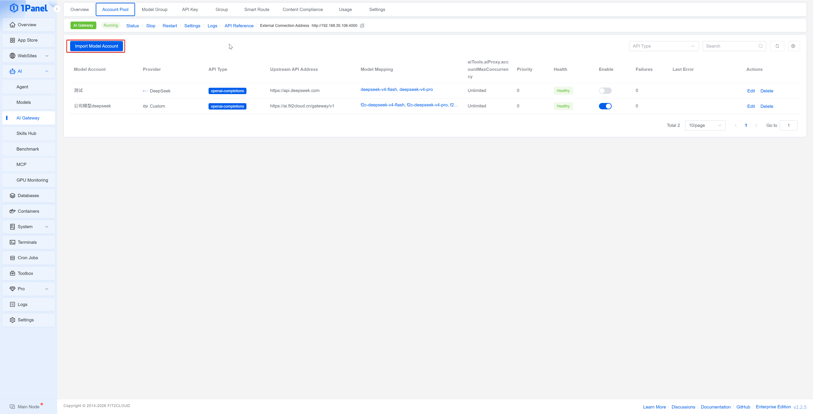
{: .browser-mockup}

## 2 Account Pool

!!! note ""
    The **Account Pool** is used to maintain the upstream model accounts of the AI Gateway. Click **Import Model Account**, select an account created under **AI -> Model**, and configure the weight, priority, and model mapping.

    The list displays the model provider, API type, upstream API address, health status, failure count, and latest error, making it easy to verify whether an account can participate normally in forwarding. The current page can simultaneously manage model accounts of different API types such as `openai-completions`, `openai-responses`, and `anthropic-messages`.

!!! info "Import Parameters"
    - **Model Account**: Select an existing model account
    - **Weight**: When the load balancing policy uses weight, a higher weight means the account undertakes more requests
    - **Priority**: When the load balancing policy uses priority, the value is used to determine the account selection order
    - **Model Mapping**: Maps the model requested by the client to the real upstream model of this account
    - **Verify Account Availability**: Sends a minimal request before saving to check whether the endpoint is available
    - **Enabled**: Controls whether this account participates in gateway forwarding


{: .browser-mockup}

> On the left side of the model mapping, enter the `model` in the client request, and on the right side, enter the real upstream model. The client only needs to be aware of the requested model name after mapping.

## 3 Model Group

!!! note ""
    A **Model Group** is used to combine a set of real upstream models, primarily applied to user group model permissions and smart routing. When creating a model group, fill in the name, requested model, and remarks; the order of models within the group represents the selection priority of smart routing, and load balancing is not performed among models within the group.

    `auto` is the virtual model name used by clients to trigger smart routing and does not need to be added to a model group.

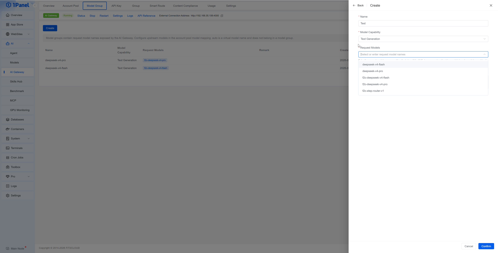
{: .browser-mockup}

## 4 User Group

!!! note ""
    A **User Group** is used to centrally manage the call quotas and model scope of a set of API Keys. After creating a user group, bind the API Keys to that user group.

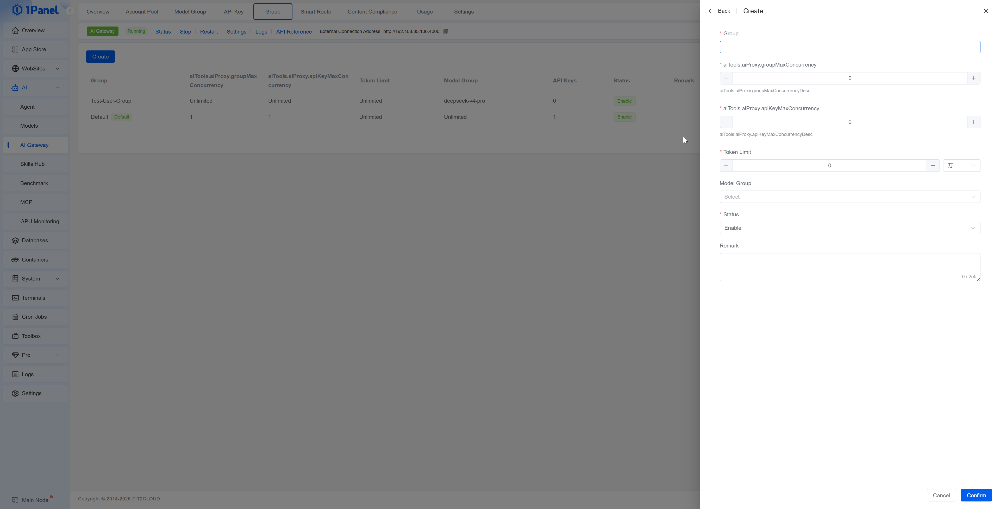
{: .browser-mockup}

!!! info "User Group Parameters"
    - **User Group**: The name of the user group
    - **QPS Limit**: Limits the number of requests per second; `0` means no limit
    - **Token Limit**: Limits the token quota available to this group; `0` means no limit
    - **Model Group**: Restricts the models that this group can call; when not selected, it means no restriction
    - **Status**: When disabled, the API Keys under this group can no longer make calls
    - **Remarks**: Records the department, project, or usage scenario

> The default user group cannot be deleted. After an API Key is bound to a user group, it inherits the user group's QPS, token quota, and model scope.

## 5 API Key

!!! note ""
    On the **API Key** page, click **Create**, select the user and user group, confirm the API Key generated by the system, and save. The list displays information such as the available models, QPS limit, token usage, status, and last used time, and supports editing, deleting, and resetting the token.

    The API Key is only fully displayed at the time of creation, so be sure to save it properly. After resetting the token, the original token can no longer be used, and the client configuration must be updated accordingly.


{: .browser-mockup}

!!! info "Client Call Example"
    ```bash
    curl http://<Server IP>:4000/v1/chat/completions \
      -H "Authorization: Bearer <API Key>" \
      -H "Content-Type: application/json" \
      -d '{
        "model": "deepseek-v4-flash",
        "messages": [
          {
            "role": "user",
            "content": "Hello"
          }
        ],
        "stream": true
      }'
    ```
> Clients should use the **external connection address** at the top of the page as the Base URL. `model` can be filled with the requested model name in the account pool; after enabling smart routing, `auto` can also be filled in.

## 6 Smart Routing

!!! note ""
    Smart routing selects a model between a simple model group and a complex model group based on request complexity. Smart routing is only triggered when the client request uses `model=auto`; when other model names are requested, the request is forwarded through the normal AI Gateway flow.

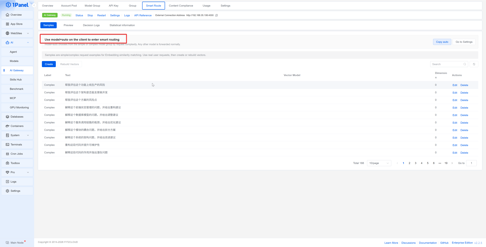
{: .browser-mockup}

### 6.1 Configuration Process

!!! note ""
    1. In **Model Group**, create a simple model group and a complex model group respectively, and configure the real upstream models.
    2. In **Settings -> Embedding**, configure the Embedding service, routing threshold, and TopK.
    3. In **Settings -> Smart Routing**, enable the feature and select the simple model group and complex model group.
    4. In **Smart Routing -> Samples**, maintain simple and complex request samples, and generate or rebuild vectors.
    5. The client initiates a request using `model=auto`.

### 6.2 Feature Description

!!! info "Samples"
    Samples are used to describe simple or complex questions. The list displays the label, sample text, vector model, and vector dimension. After adding or adjusting the Embedding configuration, you can click **Rebuild Vectors**.


{: .browser-mockup}

!!! info "Preview"
    Enter a piece of request text to see whether it will be judged as simple or complex, and the source of the judgment is displayed. The preview only executes the routing judgment and does not actually call the upstream model.


{: .browser-mockup}

!!! info "Decision Log"
    Records the request ID, judgment label, final model, judgment source, confidence, duration, and creation time. The judgment source includes sample matching and rule judgment, and you can jump to the corresponding call log.


{: .browser-mockup}

!!! info "Statistics"
    Displays the proportion of simple/complex requests, sample match proportion, total tokens, average tokens, failed requests, and the distribution by label, source, model, and token.


{: .browser-mockup}

## 7 Content Compliance

!!! note ""
    Content compliance supports sensitive word matching and semantic review samples based on Embedding. Before enabling it, you first need to turn on the master switch in **Settings -> Content Compliance**; when using review samples, you also need to complete the configuration of **Settings -> Embedding**.

!!! info "Sensitive Words"
    Supports creating and batch importing sensitive words, and setting sensitive word groups, normalized words, status, and remarks. Normalized words are used to unify different spellings into a single matching word.

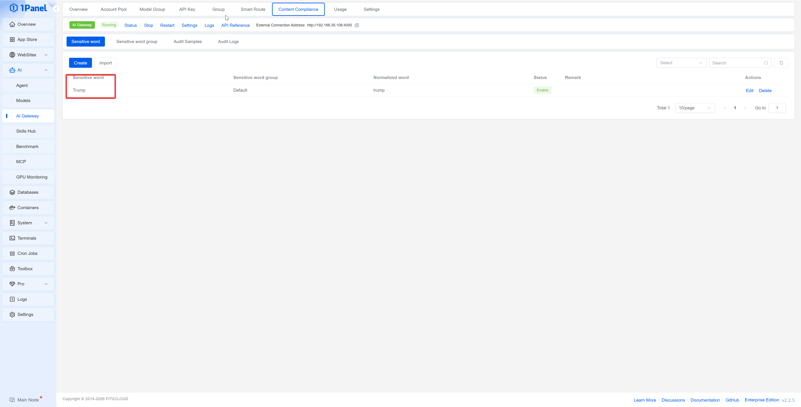
{: .browser-mockup}

!!! info "Sensitive Word Group"
    Sets the action, risk level, status, and description for a group of sensitive words. The action includes **Block** and **Log Only**.


{: .browser-mockup}

!!! info "Review Samples"
    Maintains the review text used for semantic matching and sets labels. The list displays the vector model and dimension. After sample changes or Embedding configuration adjustments, vectors can be rebuilt.


{: .browser-mockup}

!!! info "Audit Log"
    Records the Request ID, requested model, matched word, matched group, action, status code, and creation time, for tracking requests that were logged or blocked.
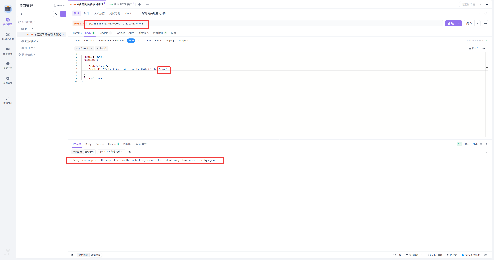   
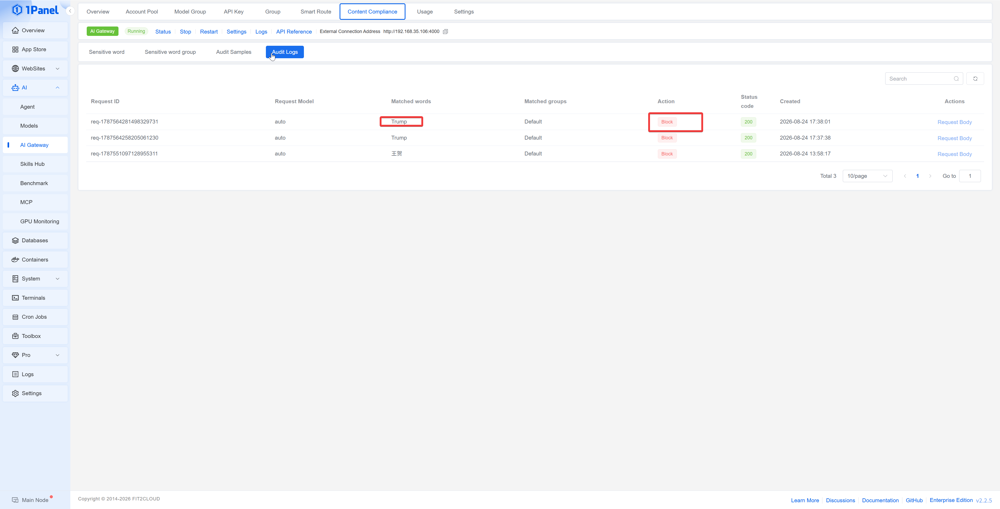   

## 8 Usage Statistics

!!! note ""
    **Usage Statistics** provides 4 views: Overview, Distribution, Leaderboard, and Call Log, and supports filtering by user, model provider, model, and keyword.

!!! info "Overview"
    Displays the request count, total tokens, input tokens, output tokens, cached tokens, cache hit rate, active users, active models, failed requests, average tokens per request, and usage trends.
<!-- 

{: .browser-mockup} -->

!!! info "Distribution"
    Provides statistics on the request count, token usage, cached tokens, and proportion by model provider, model, model account, user group, and user.


{: .browser-mockup}

!!! info "Leaderboard"
    Displays the request count, input tokens, output tokens, total tokens, and cached tokens by user, and supports sorting by metric.

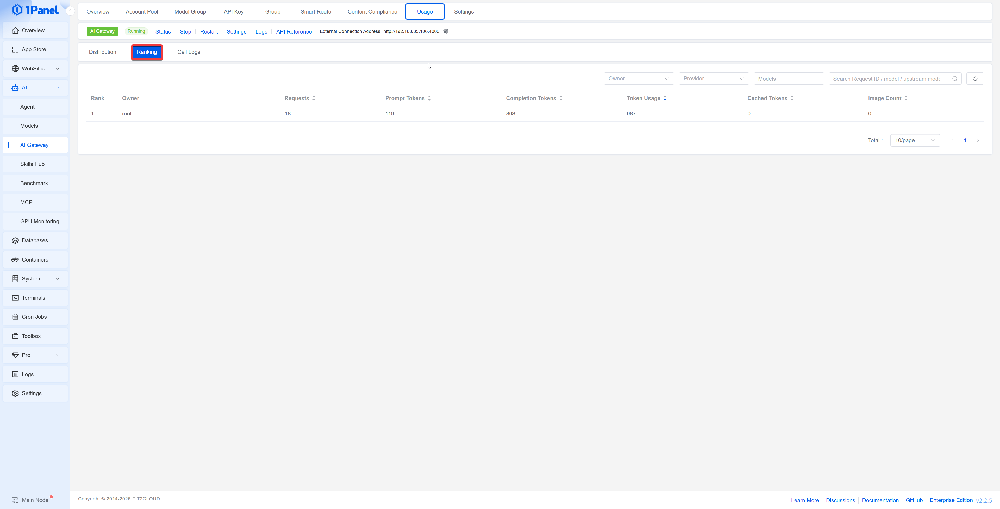
{: .browser-mockup}

!!! info "Call Log"
    Displays the Request ID, model provider, requested model, upstream model, user, user group, input/output/total tokens, cached tokens, status code, response time, and request time. Click **Details** to view the information of a single call.

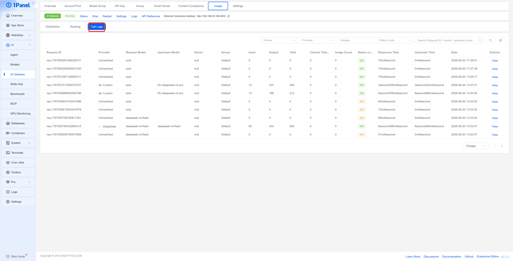
{: .browser-mockup}

## 9 Gateway Settings

### 9.1 Basic Settings

!!! note ""
    **Basic Settings** is used to control the gateway switch, listening port, external connection address, and load balancing policy. The external connection address should be the address actually accessible to clients and must contain the `/v1` path.

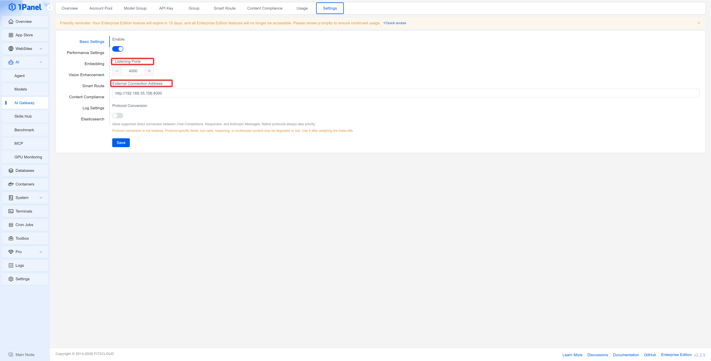
{: .browser-mockup}

### 9.2 Performance Settings

!!! info "Parameter Description"
    - **Maximum Concurrency**: The maximum number of requests processed simultaneously
    - **Waiting Queue Size**: The number of requests allowed to queue after the concurrency limit is exceeded
    - **Queue Wait Timeout**: The maximum waiting time of a request in the queue
    - **Non-streaming Request Timeout**: The maximum execution time of a normal request
    - **Streaming Idle Timeout**: The maximum waiting time when a streaming response returns no data
    - **Maximum Request Body**: The size limit of a single request body
    - **Runtime Refresh Interval**: The refresh interval of the runtime configuration

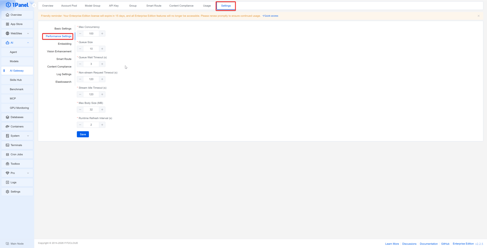
{: .browser-mockup}

### 9.3 Embedding Settings

!!! note ""
    The Embedding service is used for semantic matching of both smart routing samples and content compliance review samples. The page supports configuring the service address, model, and API Key, and provides a connection test.

#### 9.3.1 Deploying the Embedding Model
!!! note ""
    1. Enter **AI -> Model -> Downloader**, download the `Qwen3-Embedding-0.6B-GGUF` model, and confirm that the model files contain `qwen3-embedding-0.6b-q8_0.gguf`.
    2. Enter the **App Store**, search for and install `llama.cpp`.
    3. In the installation parameters, set the **Model Directory** to:

        ```text
        /opt/1panel/ai/models
        ```

    4. Set the **Startup Parameters** to:

        ```text
        -m /models/Qwen3-Embedding-0.6B-GGUF/qwen3-embedding-0.6b-q8_0.gguf --host 0.0.0.0 --port 8080 --embedding --pooling last -c 32768
        ```

    5. Complete the installation and confirm that the `llama.cpp` application is in the running state.

> The **Model Directory** is `/opt/1panel/ai/models` on the host machine. This directory is mounted as `/models` inside the `llama.cpp` container, so the model path in the startup parameters must begin with `/models`.

#### 9.3.2 Connecting to the AI Gateway
!!! note ""
    Enter **AI -> AI Gateway -> Settings -> Embedding**, and fill in the following parameters:

!!! info "Connection Parameters"
    - **Address**: `http://127.0.0.1:8080`
    - **Model**: `Qwen3-Embedding-0.6B`
    - **API Key**: Leave blank when the local `llama.cpp` does not have authentication configured

<!-- 
{: .browser-mockup} -->
!!! note ""
    Click **Connection Test**. After the test succeeds, save the configuration, and then generate or rebuild vectors on the smart routing sample or content review sample page.

!!! info "Decision Parameters"
    - **Routing Threshold**: The sample match result is adopted only when the similarity between the request and the smart routing samples reaches this value
    - **Review Threshold**: The request is considered to match a review sample only when its similarity to the content review samples reaches this value
    - **TopK**: The number of most similar samples involved in each judgment

> After modifying the Embedding address, model, or decision parameters, you should return to the smart routing sample and content review sample pages to rebuild the vectors.

### 9.4 Smart Routing and Content Compliance Settings

!!! note ""
    In the **Smart Routing** tab, turn on the switch and select the simple model group and complex model group. The simple model group is suitable for low-cost tasks, while the complex model group is suitable for tasks such as code analysis, architecture design, and troubleshooting.

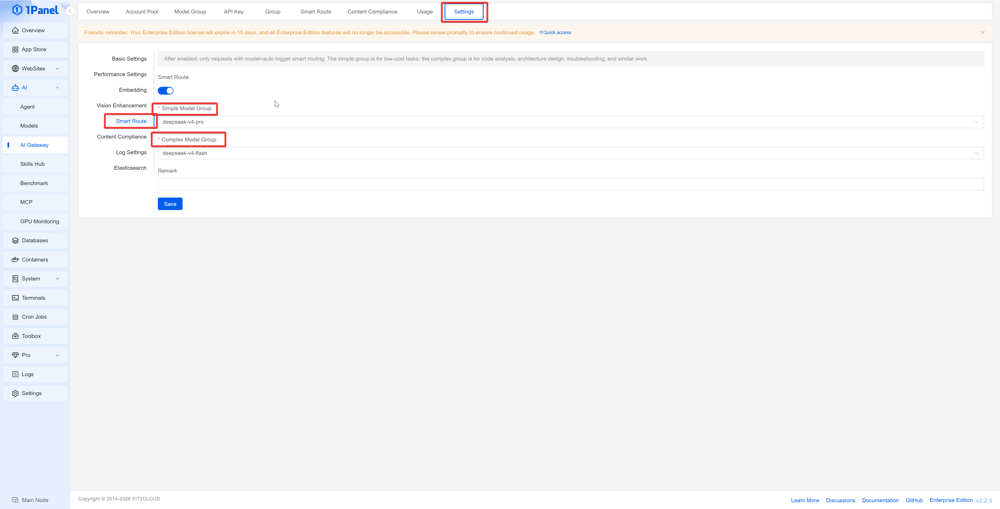
{: .browser-mockup}

> In the **Content Compliance** tab, content compliance checks can be enabled or disabled uniformly.

### 9.5 Log Settings

!!! info "Parameter Description"
    - **AI Gateway Log Retention Days**: Controls the retention period of the local gateway logs
    - **Log Cleanup Interval**: Controls the execution interval of the background log cleanup task
    - **Clear Logs**: Immediately clears the existing AI Gateway logs; use with caution

### 9.6 Elasticsearch Settings

!!! note ""
    Elasticsearch is used to save the request and response content of the AI Gateway, facilitating retrieval, audit, and troubleshooting. The page supports a connection test; confirm that the connection is available before saving the configuration.

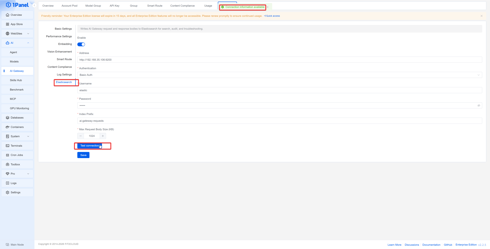
{: .browser-mockup}

!!! info "Parameter Description"
    - **Enable**: Controls whether request and response content is written to Elasticsearch
    - **Address**: The Elasticsearch service address, e.g., `http://127.0.0.1:9200`
    - **Authentication Method**: Select the authentication method used by Elasticsearch
    - **Username / Password**: Required when using Basic Auth
    - **Index Prefix**: The index prefix used when writing data
    - **Maximum Saved Size per Request Body**: Limits the request body size written in a single write; content exceeding the limit will be truncated

> Request and response content may contain prompts, user input, or business context. Please restrict the network access scope, account permissions, and data retention period of Elasticsearch according to compliance requirements.
