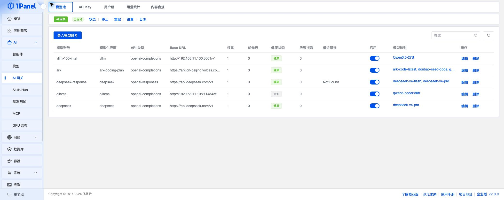
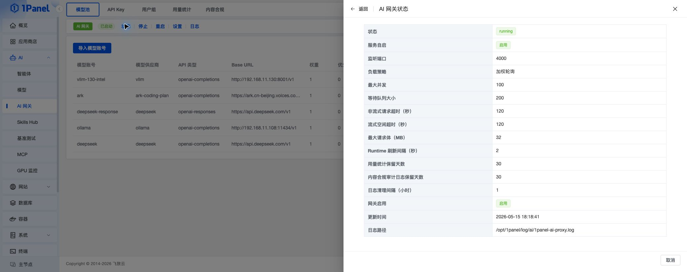
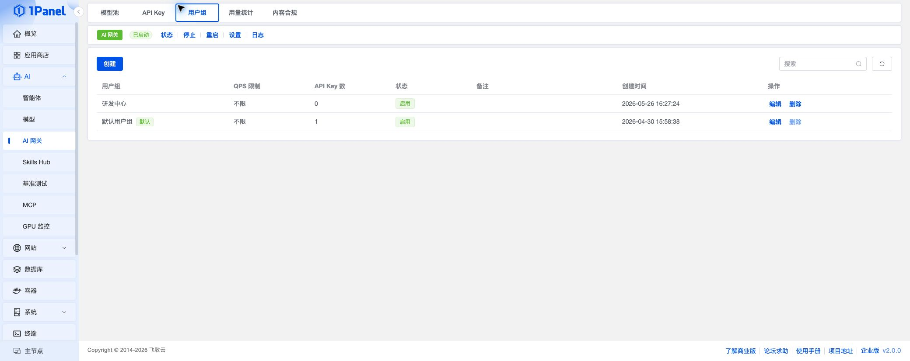
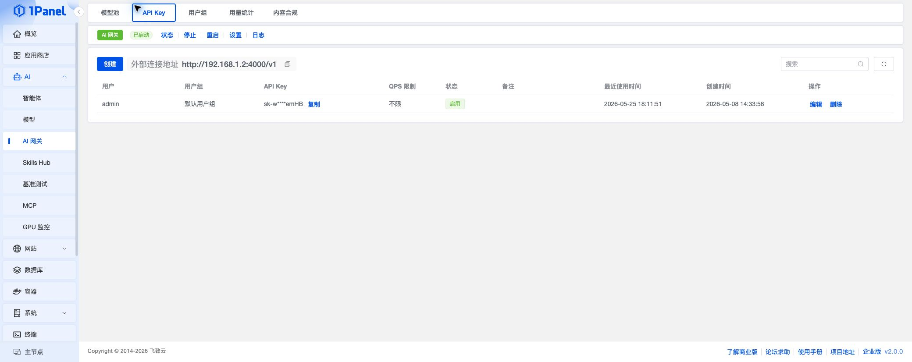
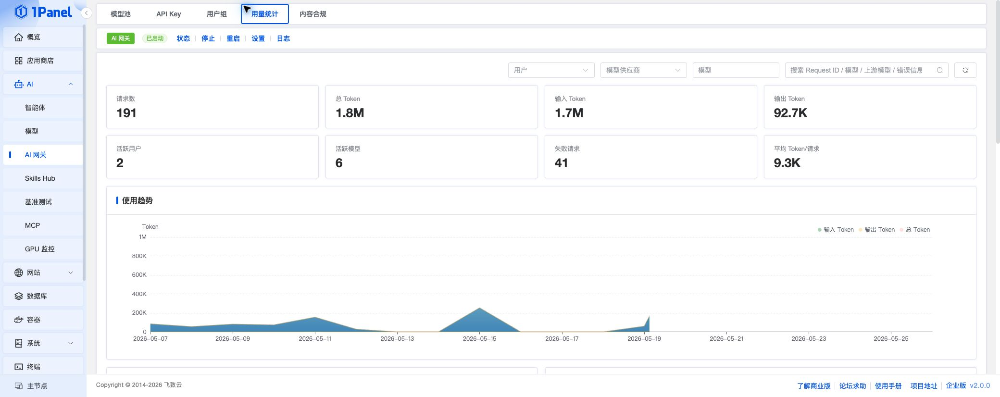
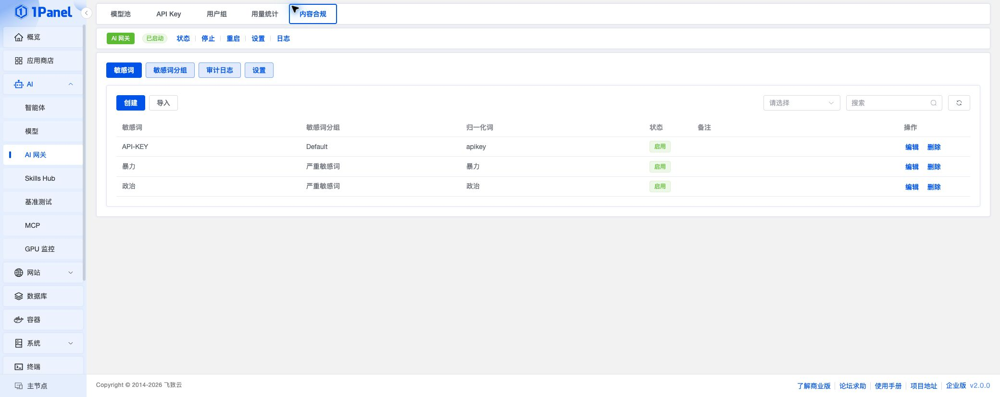
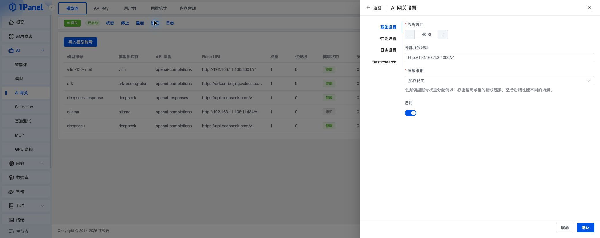
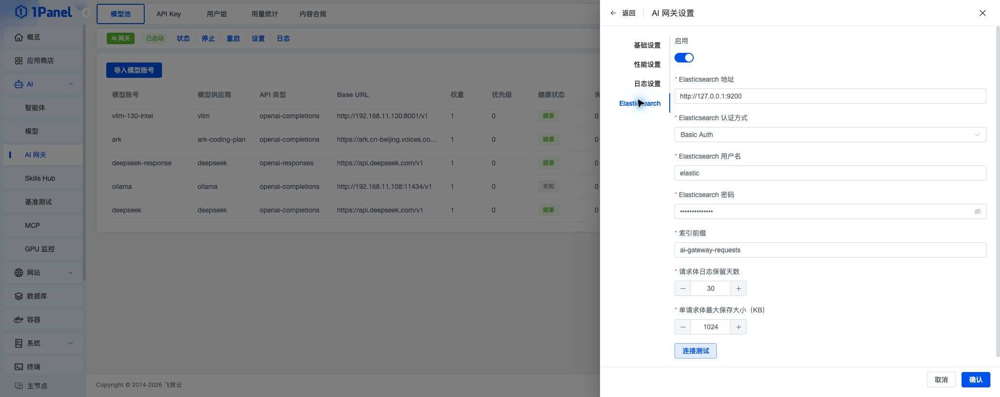

## AI 网关

!!! note ""
    AI 网关用于统一接入和管理大模型调用入口。用户可以将已有模型账号导入模型池，通过统一的 OpenAI 兼容接口对外提供服务，并按 API Key、用户组、模型映射、负载策略和内容合规规则控制调用行为。

    进入 1Panel 面板后，打开 **AI -> AI 网关** 页面即可进行管理。

    该功能属于 **1Panel 企业版**。


{: .original}

## 1 网关状态与基础操作

!!! note ""
    页面顶部展示 AI 网关服务状态，并提供状态查看、启动、停止、重启、设置和日志入口。

    - **状态**：查看网关服务状态、监听端口、负载策略、并发限制、日志路径等运行信息
    - **启动 / 停止 / 重启**：控制 AI 网关服务运行状态
    - **设置**：配置监听端口、外部访问地址、负载策略、性能参数和日志保留策略
    - **日志**：查看 AI 网关服务日志，便于排查启动或调用异常


{: .original}

## 2 模型池

!!! note ""
    在 **模型池** 页面，点击 **导入模型账号**，选择已在 1Panel 中维护的模型账号，并配置权重、优先级和模型映射。

    模型映射用于定义客户端请求模型与上游模型之间的对应关系。例如客户端请求 `qwen3-coder`，网关可以将请求转发到上游账号中的实际模型名称。


{: .original}

!!! info "参数说明"
    - **模型账号**：选择已有模型账号，导入后作为 AI 网关后端
    - **权重**：在加权轮询策略下，权重越高承担的请求越多
    - **优先级**：在故障转移策略下，优先级越高的模型账号会优先被使用
    - **模型映射**：左侧为客户端请求模型，右侧为真实上游模型
    - **启用**：控制该模型账号是否参与网关转发

## 3 用户组

!!! note ""
    在 **用户组** 页面，可以创建不同调用分组，并为每个用户组设置 QPS 限制。API Key 需要绑定到某个用户组，调用时将继承该用户组的限流规则。


{: .original}

!!! info "参数说明"
    - **用户组**：用于对 API Key 进行分组管理
    - **QPS 限制**：限制该用户组每秒可发起的请求数量，`0` 表示不限制
    - **状态**：禁用用户组后，该组下的 API Key 将无法继续调用网关

## 4 API Key

!!! note ""
    在 **API Key** 页面，点击 **创建**，选择用户和用户组后保存。创建完成后，客户端即可使用该 API Key 调用 AI 网关。

    页面上方会展示外部访问地址，客户端调用时需要将该地址作为 OpenAI 兼容接口的 Base URL。


{: .original}

!!! info "调用示例"
    ```bash
    curl http://<服务器 IP>:4000/v1/chat/completions \
      -H "Authorization: Bearer <API Key>" \
      -H "Content-Type: application/json" \
      -d '{
        "model": "qwen3-coder",
        "messages": [
          {
            "role": "user",
            "content": "Hello"
          }
        ],
        "stream": true
      }'
    ```

> `model` 参数应填写模型映射中的请求模型名称，不一定等同于上游模型的真实名称。

## 5 用量统计

!!! note ""
    在 **用量统计** 页面，可以查看请求数、Token 用量、活跃用户、活跃模型、失败请求等统计指标。

    页面还提供按用户、模型供应商、模型名称和关键字的筛选能力，并支持查看调用日志、请求体和调用链路，便于分析成本、排查失败请求和追踪故障转移过程。


{: .original}

## 6 内容合规

!!! note ""
    在 **内容合规** 页面，可以维护敏感词、敏感词分组、审计日志和开关设置。

    启用内容合规后，AI 网关会在请求链路中根据敏感词规则进行审计或阻断，帮助降低不合规内容调用风险。


{: .original}

!!! info "处理动作"
    - **阻断**：命中规则后直接拒绝请求
    - **仅记录**：命中规则后记录审计日志，但不阻断请求

## 7 网关设置

!!! note ""
    点击页面顶部的 **设置**，可以调整 AI 网关的基础参数、性能参数和日志策略。


{: .original}

!!! info "基础设置"
    - **监听端口**：AI 网关对外提供服务的端口
    - **外部访问地址**：客户端使用的 Base URL，通常格式为 `http://<服务器 IP>:<端口>/v1`
    - **负载策略**：支持轮询、加权轮询和故障转移
    - **启用**：控制网关转发能力是否开启

!!! info "性能设置"
    - **最大并发**：限制同时处理的请求数量
    - **等待队列大小**：超过并发限制后允许进入队列等待的请求数量
    - **队列等待超时**：请求在队列中的最长等待时间
    - **非流式请求超时**：普通请求的最长响应时间
    - **流式空闲超时**：流式请求无数据返回时的最长等待时间
    - **最大请求体**：限制单次请求体大小
    - **Runtime 刷新间隔**：网关运行时配置刷新间隔

!!! info "日志设置"
    - **用量统计保留天数**：控制用量统计数据保留周期
    - **内容合规审计日志保留天数**：控制内容合规审计数据保留周期
    - **日志清理间隔**：控制后台清理任务执行间隔

## 8 Elasticsearch 设置

!!! note ""
    在 **设置 -> Elasticsearch** 标签页中，可以开启请求体日志，将 AI 网关收到的请求体写入 Elasticsearch，便于后续审计、问题定位和调用内容回溯。


{: .original}

!!! info "参数说明"
    - **启用**：开启后，AI 网关会将请求体日志写入 Elasticsearch
    - **Elasticsearch 地址**：填写 Elasticsearch 服务地址，例如 `http://127.0.0.1:9200`
    - **Elasticsearch 认证方式**：支持 `Basic Auth` 和 `API Key`
    - **Elasticsearch 用户名 / 密码**：选择 `Basic Auth` 时填写
    - **Elasticsearch API Key**：选择 `API Key` 时填写
    - **索引前缀**：请求体日志写入的索引前缀，默认可使用 `ai-gateway-requests`
    - **请求体日志保留天数**：控制请求体日志的保留周期
    - **单请求体最大保存大小**：限制单次请求体写入 Elasticsearch 的最大体积，超过限制时会进行截断

> 开启请求体日志后，日志中可能包含用户输入内容、提示词或业务上下文，请根据实际合规要求配置 Elasticsearch 的访问控制、保留周期和网络访问范围。
