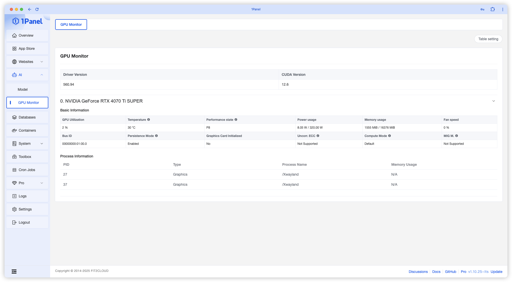
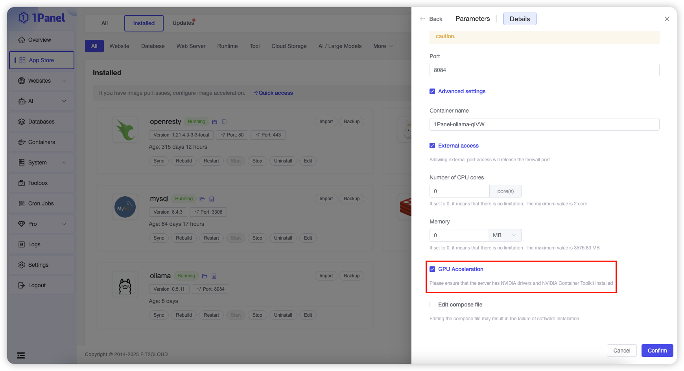

## 1 Install Drivers

!!! Abstract ""
    For NVIDIA graphics cards, users can visit the [Website](https://www.nvidia.com/en-us/drivers/) to find the driver version supported by their specific graphics card model and download it for installation.

    For example, if the downloaded file is `NVIDIA-Linux-x86_64-570.86.15.run`, after uploading the file to the 1Panel server, you can execute the following commands in the terminal to install it:

    ```bash
    chmod +x NVIDIA-Linux-x86_64-570.86.15.run
    ./NVIDIA-Linux-x86_64-570.86.15.run
    ```

    > After executing the commands, follow the prompts in the pop-up dialog box to complete the installation.
    The `nvidia-smi` command will be installed along with the NVIDIA driver, and 1Panel will use the `nvidia-smi` command to obtain information about the graphics card.

## 2 View Graphics Card Information

!!! Abstract ""
    On the GPU monitoring page, you can view the driver version, graphics card model, and basic metrics such as usage rate, temperature, and power consumption of the graphics card. You can also see information about processes currently using the graphics card.



## 3 Configure App Store Applications (Containers) to Use GPU

!!! Abstract ""
    After installing the graphics card driver, you also need to install container support tools according to the [NVIDIA official guide](https://docs.nvidia.com/datacenter/cloud-native/container-toolkit/latest/install-guide.html) to enable GPU capabilities in App Store applications or other containers.

> When installing an application from the App Store, check the GPU Acceleration option in the advanced settings to enable GPU support for that application.


