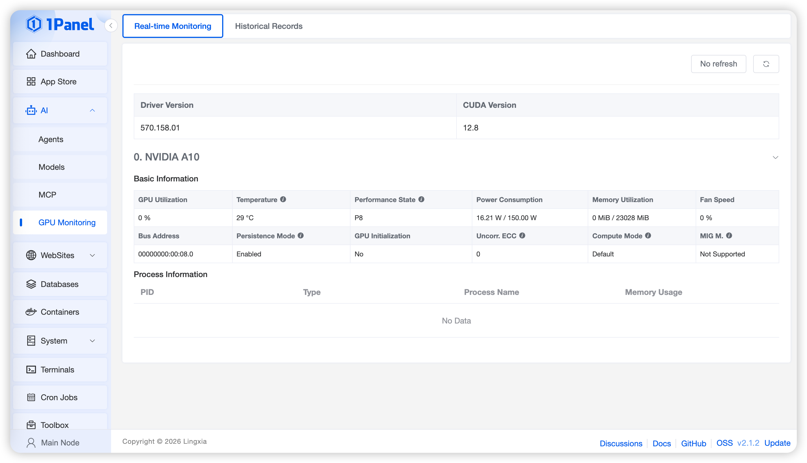
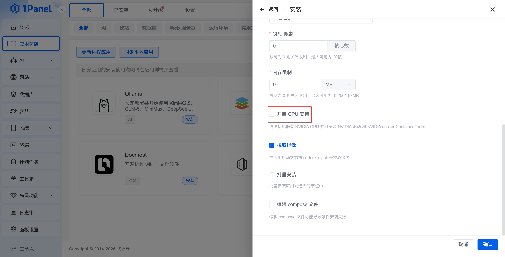

## 1 Install Driver

!!! note ""
For NVIDIA graphics cards, users can visit https://www.nvidia.com/en-us/drivers/ to find and download the driver version compatible with their GPU model.

For example, if the downloaded file is `NVIDIA-Linux-x86_64-570.86.15.run`, upload it to your 1Panel server, then run the following commands in the command line to install:

```bash
chmod +x NVIDIA-Linux-x86_64-570.86.15.run
./NVIDIA-Linux-x86_64-570.86.15.run
```

> Follow the on‑screen prompts to complete the installation.
The `nvidia-smi` command is installed automatically with the NVIDIA driver. 1Panel uses `nvidia-smi` to retrieve GPU information.

## 2 View GPU Information

!!! note ""
On the GPU monitoring page, you can view the driver version, GPU model, utilization, temperature, power consumption, and other basic metrics, as well as processes currently using the GPU.


{: .original}

## 3 Use GPU

!!! note ""
After installing the GPU driver, you must also install the NVIDIA Container Toolkit by following the [NVIDIA official guide](https://docs.nvidia.com/datacenter/cloud-native/container-toolkit/latest/install-guide.html) to enable GPU access in apps from the App Store or other containers.

> When installing an app from the App Store, enable `GPU Acceleration` in Advanced Settings to grant the app GPU support.


{: .original}
