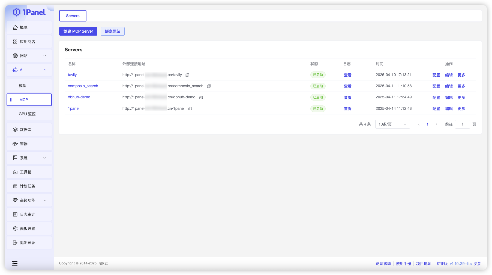
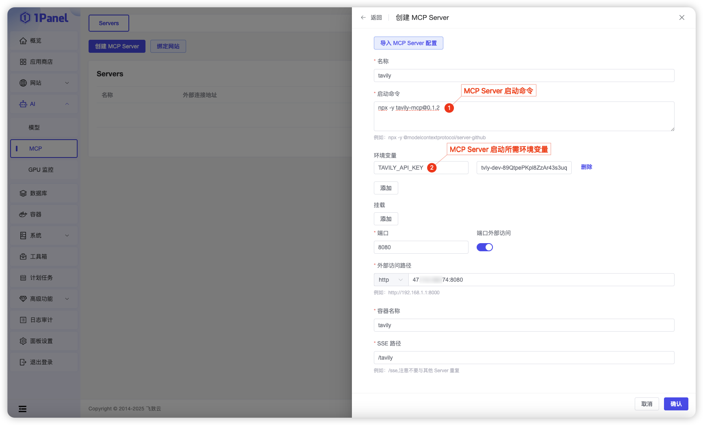
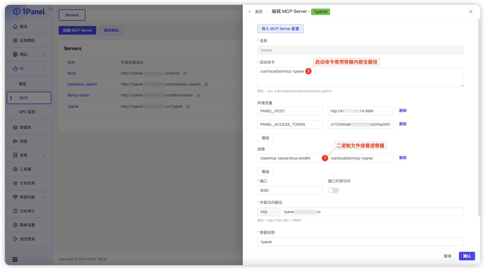
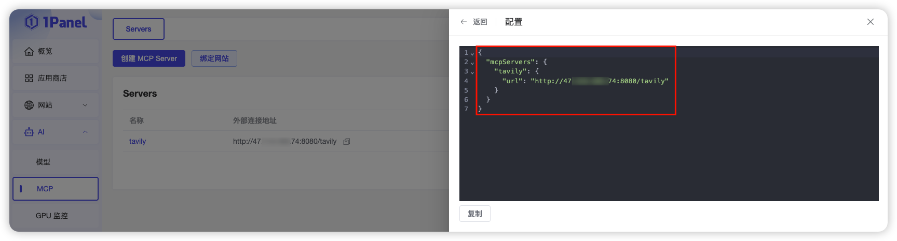
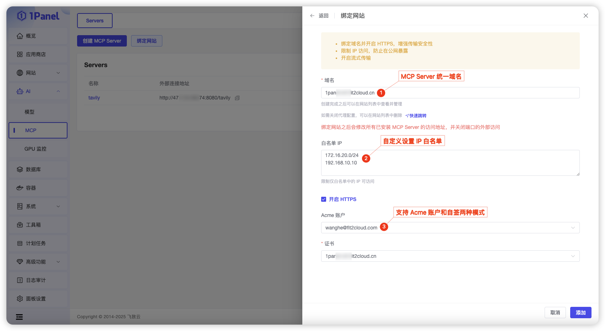

## 1 MCP Server 管理

!!! Abstract ""
    MCP（Model Context Protocol，模型上下文协议） 是由人工智能企业 Anthropic 推出的开放标准，旨在为大语言模型和 AI 助手提供统一、标准化的接口，让AI可以轻松操作外部工具，完成更加复杂的任务，从而发挥真正的“工具调用”能力。
    
    然而在实际操作过程中，搭建 MCP Server 需要手动配置大量依赖，部署门槛较高，许多用户难以上手。为了解决这个问题，1Panel v1.10.29 LTS 版本推出了原生的 MCP Server 管理功能，该功能通过容器化方式实现一键部署 MCP Server，能够极大简化搭建流程。

## 2 创建 MCP Server

!!! Abstract ""
    当前已支持两种方式运行的 MCP Server 的 stdio 模式发布为 SSE 模式，供 MCP 客户端调用：
    - 支持通过 npx 命令启动 MCP Server
	- 支持以二进制方式运行 MCP Server（需将二进制文件挂载至容器中）

### 2.1 npx 命令启动

### 2.2 二进制方式运行

## 3 获取配置信息

!!! Abstract ""
    MCP Server部署成功后，1Panel会为每个MCP Server实例自动生成客户端配置信息，包括端口、地址、SSE路径等。点击“配置”按钮，即可快速获取该MCP Server的客户端配置信息。
    用户只需要复制客户端配置信息并粘贴至MCP客户端，即可开始使用拥有MCP加成的AI助手。这种方式无需手动查找或配置环境变量，实现了从部署到使用的无缝衔接。

## 4 统一域名与SSE路径

!!! Abstract ""
    1Panel 支持将多个 MCP Server 实例统一绑定至同一个网站域名，每个实例仅需设置不同的SSE路径进行区分。这意味着用户无需为每个 MCP Server 单独开放端口，所有服务都可以通过同一个端口对外提供服务。

    这种方式不仅简化了公网访问的配置逻辑，也让运维操作更加集中统一。尤其是在大规模部署和企业内部网络的场景下，统一绑定网站域名能够避免暴露过多端口，减少安全风险，进一步提升部署的灵活性、安全性和可维护性。

## 5 白名单访问限制

!!! Abstract ""
    1Panel 支持为每个 MCP Server 网站配置IP访问白名单，以此有效保障 MCP Server 的数据安全。用户可以根据实际需求将 IP 地址或 IP 段添加至白名单，从而保证只有白名单中的 IP 能够访问 MCP Server 网站。与此同时，系统将自动拒绝所有不在白名单中的 IP 的访问请求。

    通过为 MCP Server 网站配置 IP 访问白名单，可以有效隔离外部非授权访问，在网络入口层面建立起第一道安全防线。同时配合 1Panel 的防火墙策略和容器隔离机制，可以显著提升整体系统的安全性与稳定性。

## 6 HTTPS数据加密

!!! Abstract ""
    1Panel 还支持为 MCP Server 网站启用HTTPS协议，用户只需要上传证书即可开启加密访问，全面保障上下文交互数据的安全性。
