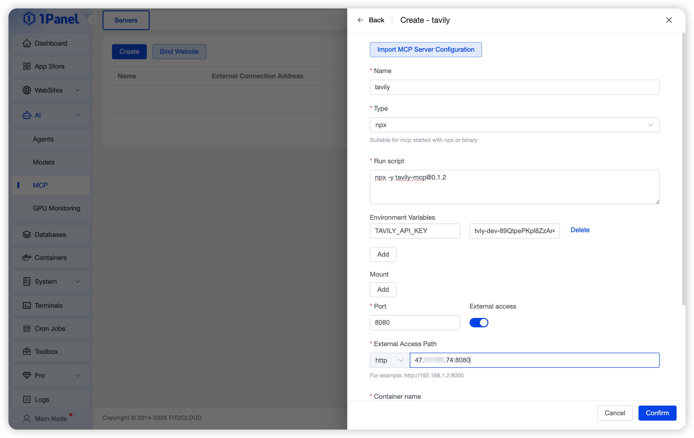
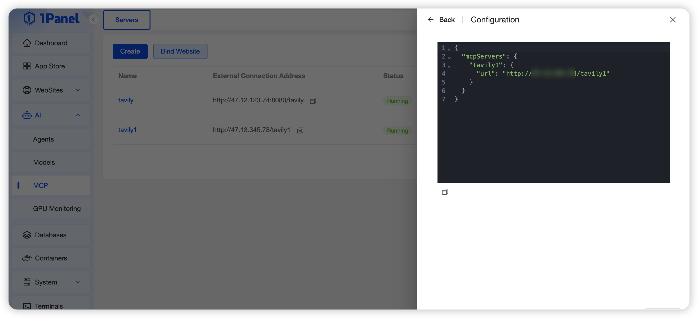
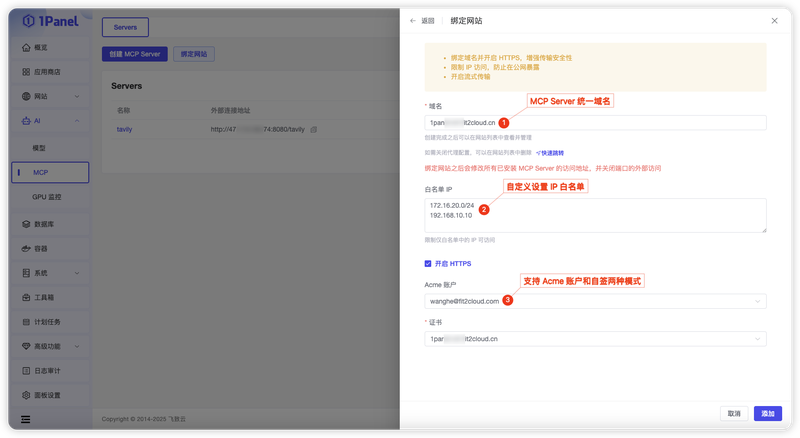

# MCP

!!! note "功能说明"
    MCP（Model Context Protocol，模型上下文协议）用于让 AI 客户端以标准方式调用外部工具。1Panel 将通过 `npx` 或 `uvx` 启动的 stdio MCP Server 封装在容器中，并转换为 SSE 或 Streamable HTTP 服务。

    入口为左侧菜单 **AI -> MCP**。社区版、专业版和企业版均可使用；创建、编辑、删除和绑定网站需要具有对应资源操作权限。

## 1 创建 MCP Server
!!! note ""
    点击 **创建**，也可以先点击 **导入 MCP Server 配置**，从包含 `mcpServers` 的 JSON 配置中导入命令和环境变量。

!!! info "参数说明"
    - **名称**：MCP Server 名称，创建后不可修改，同时用于生成默认容器名称和访问路径。
    - **类型**：`npx` 适用于 npx 命令或二进制启动命令；`uvx` 适用于 uvx 命令。
    - **运行命令**：实际启动 stdio MCP Server 的命令，例如 `npx -y @modelcontextprotocol/server-github` 或 `uvx mcp-server-fetch`。
    - **外部访问路径**：客户端访问时使用的协议、主机名或 IP。
    - **输出类型**：支持 `sse` 和 `streamableHttp`。
    - **SSE 路径 / 流式传输路径**：当前实例的访问路径，同一地址下不能重复。
    - **协议版本**：仅在 Streamable HTTP 模式中使用，用于无状态初始化下游 stdio MCP Server。
    - **参数**：追加到 Supergateway 启动命令的自定义参数，不能覆盖由 1Panel 管理的传输、端口、路径和协议参数。
    - **镜像**：运行网关的容器镜像。修改默认镜像前，应确认其与所选启动类型兼容。
    - **容器名称**：创建的容器名称，在当前 Docker 环境中必须唯一。
    - **端口 / 端口外部访问**：配置映射端口，并决定绑定到 `0.0.0.0` 或仅绑定到 `127.0.0.1`。
    - **环境变量 / 挂载**：向 MCP Server 传入凭证、配置或主机目录。

!!! warning "命令与挂载安全"
    1Panel 会在服务器上运行所填写的命令。导入第三方配置前，应检查命令、镜像、环境变量和挂载目录，不要运行来源不明或权限范围过大的 MCP Server。

## 2 管理和连接

!!! note ""
    创建任务完成后，可在列表中查看运行状态和连接信息，并执行编辑、启动、停止、重启、删除、查看日志和测试连接等操作。客户端连接地址由外部访问路径、端口和当前输出类型的路径共同组成，应直接使用页面提供的配置。

>如果实例无法连接，依次检查容器状态及日志、运行命令、访问路径、端口监听、防火墙和反向代理配置。

## 3 绑定网站

!!! note ""
    点击 **绑定网站**，可以把所有已安装的 MCP Server 统一接入一个已有网站。绑定后，1Panel 会更新各实例的外部访问地址，并关闭端口外部访问；不同实例通过各自的 SSE 或 Streamable HTTP 路径区分。

>网站侧可以继续配置 HTTPS 和访问限制。修改域名、证书或反向代理规则后，应重新测试每个 MCP Server 的连接。

!!! note "取消直接暴露端口"
    已通过网站提供服务时，建议保持实例端口仅监听本机，避免网站入口和直接端口同时暴露。
