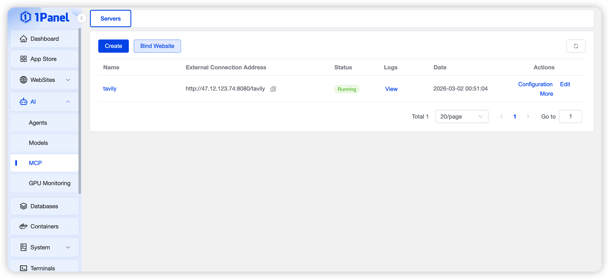
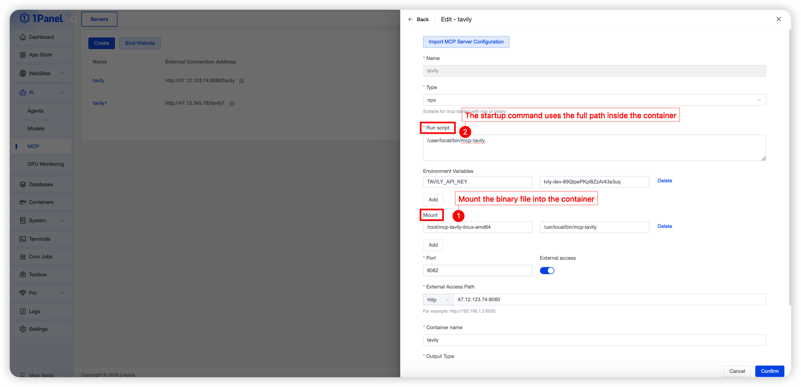

## 1 MCP Server Management

!!! note ""
    MCP (Model Context Protocol) is an open standard introduced by AI company **Anthropic**. It provides a unified, standardized interface for large language models and AI assistants, enabling them to easily interact with external tools and complete more complex tasks, thereby unleashing their true **tool-calling capabilities**.

    However, in practice, manually setting up an MCP Server requires configuring numerous dependencies, resulting in a high deployment barrier for many users. To solve this problem, 1Panel v1.10.29 LTS has introduced a native **MCP Server Management** feature. This feature supports one-click deployment of MCP Server via containerization, greatly simplifying the setup process.

{: .browser-mockup}

## 2 Create MCP Server

!!! note ""
    The system currently supports publishing MCP Servers running in **stdio mode** as **SSE mode** for MCP clients, using two methods:
    
    - Starting the MCP Server via the `npx` command
    - Running the MCP Server as a binary (the binary file must be mounted into the container)

### 2.1 Start via npx Command

{: .browser-mockup}

### 2.2 Run as Binary

{: .browser-mockup}

## 3 Obtain Configuration Information

!!! note ""
    After an MCP Server is successfully deployed, 1Panel automatically generates client configuration for each instance, including port, address, SSE path, etc. Click the **Config** button to quickly view the client configuration.

    Users only need to copy and paste the configuration into their MCP client to use the AI assistant enhanced with MCP. This eliminates the need to manually look up or set environment variables, enabling a seamless experience from deployment to usage.

{: .browser-mockup}

## 4 Unified Domain and SSE Path

!!! note ""
    1Panel allows binding multiple MCP Server instances to the **same website domain**, with each instance distinguished only by a unique SSE path. This means users do not need to open separate ports for each MCP Server — all services can be exposed through a single port.

    This approach simplifies public network configuration and centralizes operation and maintenance. Especially in large‑scale deployments and enterprise internal networks, using a unified domain avoids exposing too many ports, reduces security risks, and improves deployment flexibility, security, and maintainability.

{: .browser-mockup}

## 5 Whitelist Access Restriction

!!! note ""
    1Panel supports configuring an **IP access whitelist** for each MCP Server website, effectively securing MCP Server data. Users can add IP addresses or IP ranges to the whitelist, ensuring only whitelisted IPs can access the MCP Server. All requests from non‑whitelisted IPs are automatically rejected.

    Configuring an IP whitelist creates the first security layer at the network entry point, isolating unauthorized external access. Combined with 1Panel’s firewall policies and container isolation, this significantly improves overall system security and stability.

## 6 HTTPS Data Encryption

!!! note ""
    1Panel also supports enabling **HTTPS** for MCP Server websites. Users only need to upload a certificate to activate encrypted access, fully protecting the security of context interaction data.
