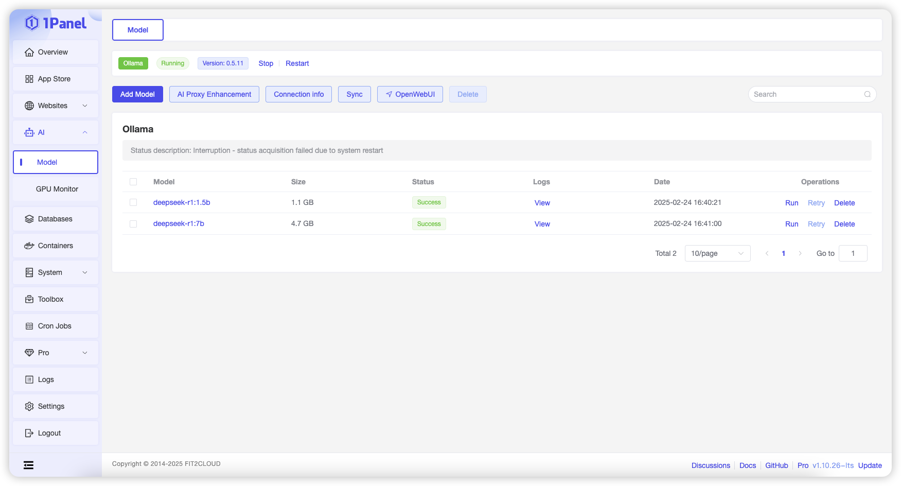
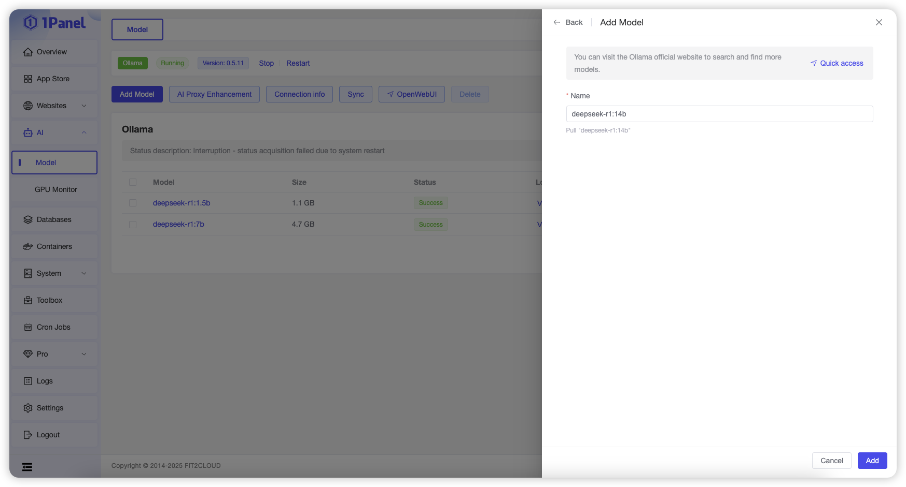
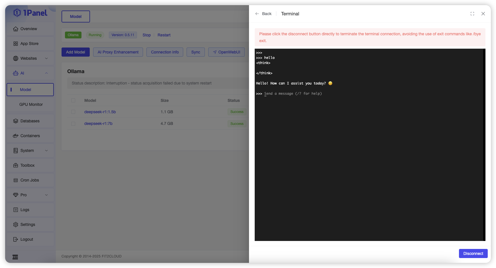
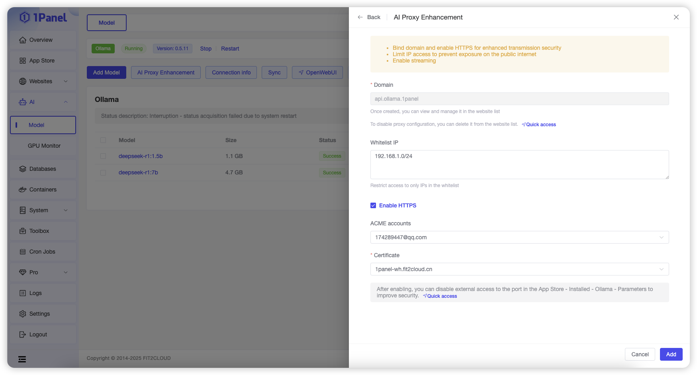
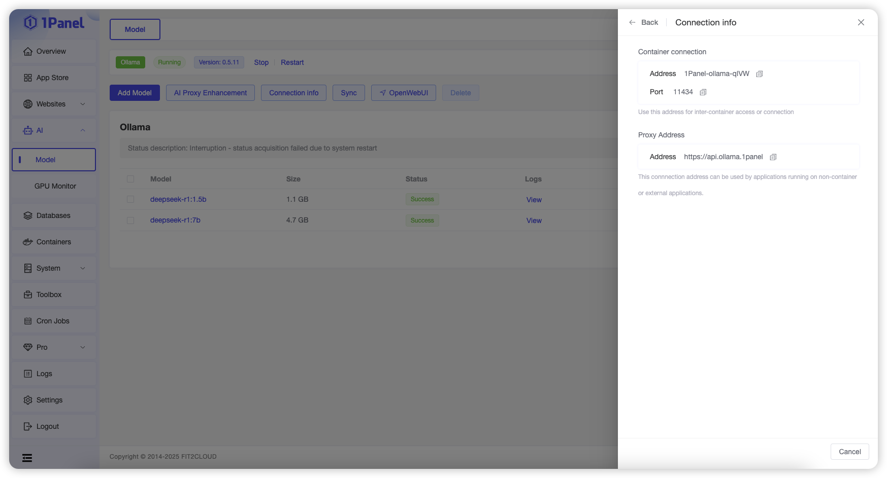

## 1 管理 Ollama 应用

1.1 应用商店安装 Ollama

!!! Abstract ""
    要使用模型管理功能，需要先在应用商店中安装 Ollama 应用。Ollama 安装完成后可以在该页面查看 Ollama 应用状态，并进行启动、停止及重启等操作。

## 2 添加模型

!!! Abstract ""
    点击添加模型，输入模型名称点击添加按钮即可从 [Ollama 官方仓库](https://ollama.com/search)拉取对应模型。

## 3 运行模型

!!! Abstract ""
    点击某个模型所在行的【运行】操作，即可在当前页面打开在线终端与该模型进行对话。

## 4 AI 代理增强

!!! Abstract ""
    通过该功能可以为 Ollama 应用配置反向代理，从而支持域名、HTTPS、IP 白名单等配置，增强使用大模型时的安全性。

## 5 查看连接信息

!!! Abstract ""
    点击列表上方的【连接信息】按钮，即可查看 Ollama 应用的连接信息。

> 应用商店部署的 Ollama 采用容器化方式运行，不同的场景需要根据页面提示选择对应的连接信息。

## 6 从服务器同步

!!! Abstract ""
    当使用了其他工具或应用程序添加了模型，模型列表信息与实际不一致时，可以点击列表上方的【从服务器同步】按钮，主动从 Ollama 查询当前模型列表。

## 7 WEB 管理工具

!!! Abstract ""
    如果需要使用 WEB 图形化界面管理并使用 Ollama 时，可以列表上方的【OpenWebUI】按钮，跳转到对应工具页面。

    目前支持的管理工具有：
    
    - [OpenWebUI](https://github.com/open-webui/open-webui)
