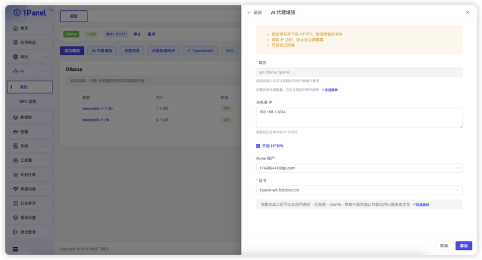
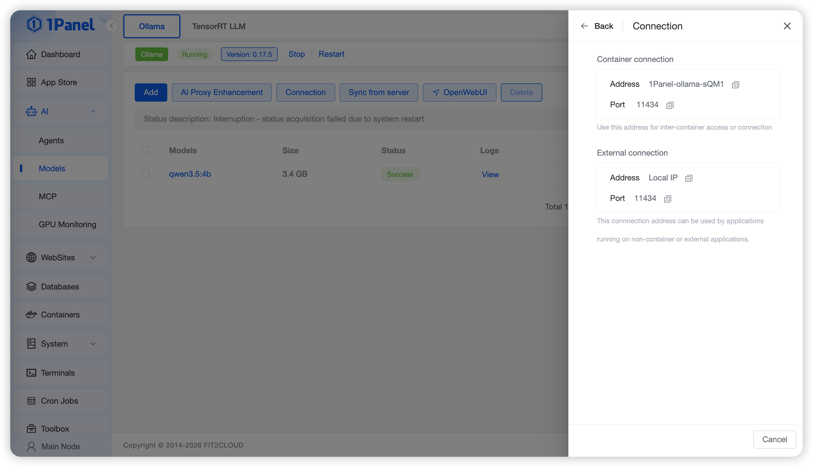
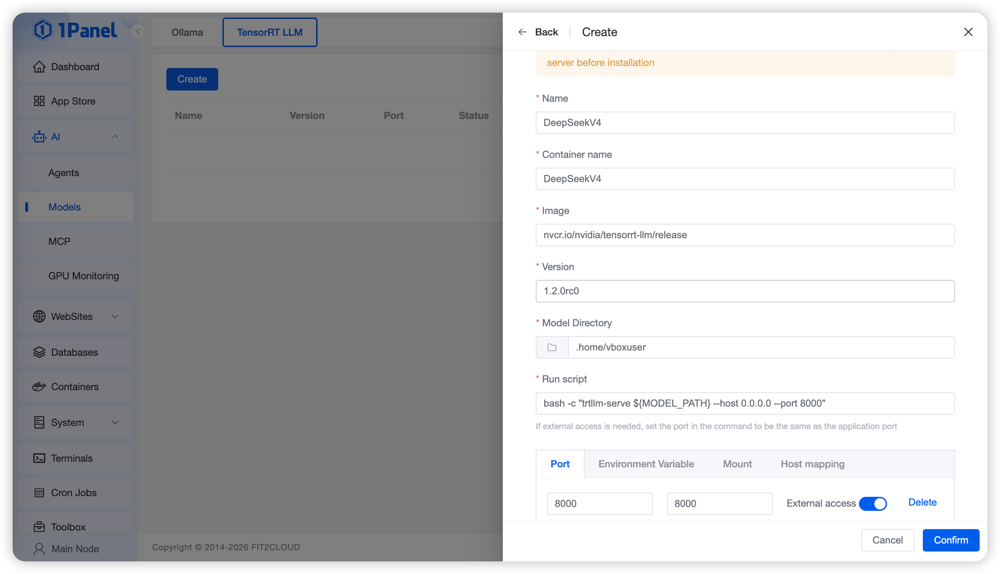

## 1 Managing Ollama Application

1.1 Installing Ollama from the App Store

!!! Abstract ""
    To use the model management feature, you need to first install the Ollama application from the App Store. After installation, you can view the status of the Ollama application on this page and perform operations such as starting, stopping, and restarting.

{: .browser-mockup}

## 2 Adding Models

!!! Abstract ""
    Click "Add Model," enter the model name, and click the "Add" button to pull the corresponding model from the [Ollama Official Repository](https://ollama.com/search).

{: .browser-mockup}

## 3 Running Models

!!! Abstract ""
    Click the "Run" button in the row of a specific model to open an online terminal on the current page and interact with the model.

{: .browser-mockup}

## 4 AI Proxy Enhancement

!!! Abstract ""
    This feature allows you to configure a reverse proxy for the Ollama application, supporting domain names, HTTPS, IP whitelists, and other configurations to enhance security when using large models.

{: .browser-mockup}

## 5 Viewing Connection Information

!!! Abstract ""
    Click the "Connection Information" button at the top of the list to view the connection information for the Ollama application.

{: .browser-mockup}

> The Ollama application deployed from the App Store runs in a containerized manner. Different scenarios require selecting the corresponding connection information based on the prompts on the page.

## 6 Syncing from the Server

!!! Abstract ""
    When models are added using other tools or applications, and the model list information does not match the actual state, you can click the "Sync from Server" button at the top of the list to actively query the current model list from Ollama.

## 7 WEB Management Tools

!!! Abstract ""
    If you need to use a WEB graphical interface to manage and use Ollama, you can click the "OpenWebUI" button at the top of the list to navigate to the corresponding tool page.

    Currently supported management tools include:
    
    - [OpenWebUI](https://github.com/open-webui/open-webui)

### 0 Prerequisites

!!! note ""
    Before creating a model with TensorRT LLM, you must first install the NVIDIA GPU driver and configure the NVIDIA Container Toolkit. Refer to the documentation: [Installing the NVIDIA Container Toolkit](https://docs.nvidia.com/datacenter/cloud-native/container-toolkit/latest/install-guide.html).

### 1 Create Model

!!! note ""
    On the TensorRT LLM Model Management page, click the **Create** button, enter parameters such as the model name, then click **Confirm** to create the model.

!!! info "Parameter Description"
    - **Name**: Name of the model.
    - **Container Name**: The TensorRT LLM Model Management feature launches a container using the TensorRT LLM image to run the model. The container name must be unique and defaults to the model name.
    - **Image**: TensorRT LLM image, defaults to the official NVIDIA image.
    - **Version**: Image tag of the TensorRT LLM image, corresponding to different TensorRT LLM versions. Available versions can be found in the [NVIDIA TensorRT LLM Official Repository](https://catalog.ngc.nvidia.com/orgs/nvidia/teams/tensorrt-llm/containers/release/tags).
    - **Model Directory**: Select a local model directory on the server to mount into the container. The model folder must be placed in this directory in advance.
    - **Startup Command**: The command executed to run the model when starting the container, defaults to the official NVIDIA startup command (custom commands are supported). Note the model path in the startup command: 1Panel maps the local model directory (specified above) to the `/models` directory in the container. 
      - If the selected model directory is the final model path (e.g., `/home/DeepSeek-V3`), simply append `/models` after `trtllm-server` in the startup command.
      - If the selected model directory is the parent directory of the model folder (e.g., the final model path is `/home/DeepSeek-V3` and the selected model directory is `/home`), append `/models/DeepSeek-V3` after `trtllm-server` in the startup command.
    - **Port**: Configure port mapping for the TensorRT LLM container. For example, map port 8000 in the container to port 8000 on the server, allowing access to the TensorRT LLM service via `Server IP:8000` (external port access must be enabled).
    - **Environment Variables**: Configure environment variables for the TensorRT LLM container.
    - **Mounts**: Mount additional directories for the TensorRT LLM container. Local directories on the server can be mounted to the container for access within the container.

{: .browser-mockup}

### 2 View Model Logs

!!! note ""
    On the TensorRT LLM Model Management page, click the **View Logs** button in the row of the target model to check the model startup and runtime logs.

### 3 Other Model Operations

!!! note ""
    On the TensorRT LLM Model Management page, you can perform operations such as stop, start, restart, delete, and edit on the model.
