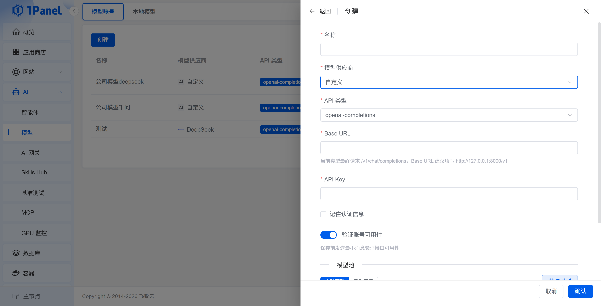
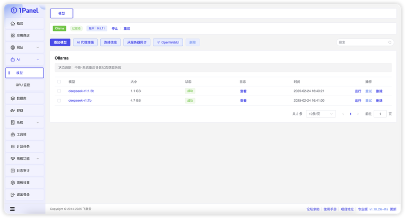
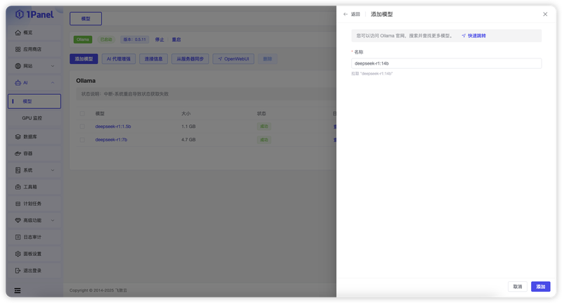
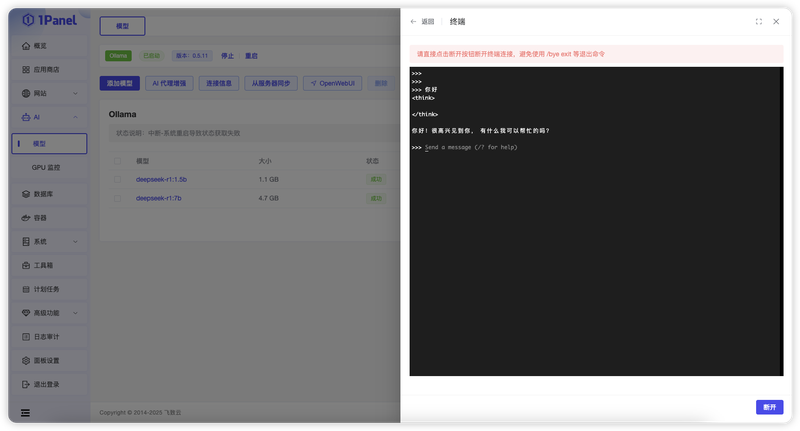

# 模型管理

!!! note ""
    模型管理用于统一维护 AI 功能使用的模型账号和本地模型。入口为左侧菜单 **AI -> 模型**，页面包含 **模型账号** 和 **本地模型** 两个标签页。

!!! info "版本说明"
    模型账号和 Ollama 管理在社区版、专业版、企业版中均可使用。vLLM 和模型下载器需要专业版或企业版许可证。

## 1 模型账号

!!! note ""
    模型账号保存模型服务的连接信息，可供智能体、AI 搜索等功能选择。点击 **创建** 后，按页面提示配置以下信息：
!!! note ""
    - **名称**：模型账号在 1Panel 中的显示名称。   
    - **模型提供商**：选择预置提供商，或选择自定义、Ollama、vLLM 等类型。
    - **API Key**：模型服务的访问凭证。是否需要填写取决于提供商。
    - **Base URL**：模型服务 API 地址。部分预置提供商使用默认地址，自定义、Ollama 和 vLLM 可按实际服务填写。
    - **API 类型**：按提供商支持情况选择兼容协议。
    - **模型池**：维护模型 ID、显示名称、Context Window、Max Tokens、输入类型和推理能力。

>创建完成后，可以在列表中验证连接、编辑账号、维护模型池或删除账号。编辑已经被智能体使用的账号时，可按页面选项同步更新相关智能体配置。

!!! warning "凭证安全"
    API Key 属于敏感信息，仅向受信任的管理员开放模型账号管理权限。

## 2 Ollama

### 2.1 使用前提

!!! note ""
    使用 Ollama 管理前，需要先从 **应用商店** 安装 Ollama。安装完成后，页面会显示应用运行状态，并提供启动、停止、重启和连接信息等操作。

### 2.2 添加和运行模型

>点击 **添加模型**，输入 [Ollama 模型库](https://ollama.com/search)中的模型名称后确认，1Panel 将创建后台拉取任务。模型可用后，可以执行运行、重建或删除等操作。

>点击模型所在行的 **运行**，可在页面内打开终端与模型对话。

### 2.3 连接和同步
!!! note ""
    - **连接信息**：查看不同访问场景下的 Ollama 地址。容器内访问、主机访问和外部访问的地址可能不同，应以页面显示为准。
    - **从服务器同步**：当模型由其他工具添加或删除后，从 Ollama 服务重新读取模型列表。
    - **AI 代理增强**：为 Ollama 配置反向代理，可结合域名、HTTPS 和 IP 白名单限制外部访问。
    - **Open WebUI**：按页面入口跳转至已支持的 Web 管理工具。

## 3 vLLM
!!! note ""
    vLLM 页面用于创建和维护本地推理服务，支持查看状态、编辑、启动、停止、重启、删除和查看任务进度。具体配置参见 [vLLM](./vllm.md)。

## 4 模型下载器

!!! info "版本说明"
    模型下载器需要专业版或企业版许可证。

>模型下载器用于搜索和下载 Hugging Face、ModelScope 或兼容镜像站中的模型，并统一查看下载任务和本地模型目录。可按页面配置下载目录、镜像地址和访问令牌；私有或受限模型必须使用具有相应权限的令牌。
下载任务支持查看进度和错误信息，并可取消或重试。删除本地模型前，应确认该目录未被 vLLM 或其他服务使用。
