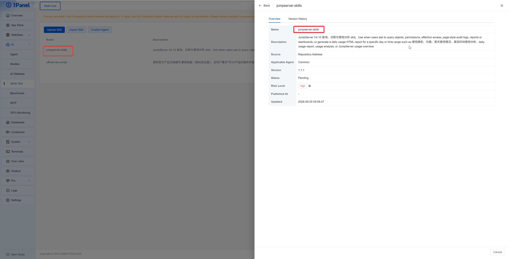

# Skills Hub

!!! info "Applicable Version and Permissions"
    Skills Hub is only available in the 1Panel Enterprise Edition and requires a valid Enterprise Edition license. Viewing and managing are respectively controlled by the `Skills Hub` role permissions.

!!! note ""
    Skills Hub is used to import, review, publish, install, and maintain agent Skills within the enterprise, and retains version and risk check information. The entry point is **AI -> Skills Hub**.

## 1 Importing a Skill

The page supports the following sources:

!!! note ""
    - Upload a Skill archive in `.zip`, `.7z`, `.tar`, or `.tar.gz` format; the file must not exceed 5 MB and the archive must contain `SKILL.md`;

{: .browser-mockup}

!!! note ""
    - Import from a GitHub repository address and branch, or a Tag;

{: .browser-mockup}

{: .browser-mockup}

!!! note ""
    - Import from a downloadable `.zip` package URL.

{: .browser-mockup}

!!! note ""
    Fill in the version when importing. After the system completes parsing, it will record the Skill name, description, source, applicable agent, version, status, and risk level.

## 2 Review and Publishing

!!! note ""
    Skill states include Pending Review, Reviewed, Published, Unpublished, Review Rejected, and Deleted. Users with management permissions can perform the operations of approve, reject, publish, unpublish, and delete.

!!! warning "Risk Check"
    The risk check displays the risk level, file path, rule type, matched keyword, and description. Before publishing, the Skill content and its dependencies should be manually reviewed; the security should not be judged solely based on the automatic check results.
    

{: .browser-mockup}

## 3 Version Management

!!! note ""
    In the Skill details, you can view the overview and version history. The version list records the status, risk level, creation time, publishing time, and version tag, and supports downloading published packages.

## 4 Custom Agents

!!! note ""
    In **Custom Agents**, click **Add Agent** to configure the installation location of the Skill:

    - **Name**: Used to identify the target;
    - **Node**: The 1Panel node where the Skill is installed;
    - **Skill Directory**: The target directory where the package is extracted on the host;
    - **Post-install Command**: The optional command executed after extraction is completed;
    - **Description and Status**: Explain the purpose and control whether the target is selectable.

{: .browser-mockup}

!!! note ""
    When installing a Skill, you can select one or more enabled targets. The post-install command will be executed on the target node. Before configuring it, you should confirm the source of the command and the impact of its execution.

## 5 Offline Environment

!!! note ""
    When the Enterprise Edition offline environment cannot directly access external GitHub repositories or package addresses, you should first prepare and review the Skill package in a networked environment, and then import it using the upload method.
