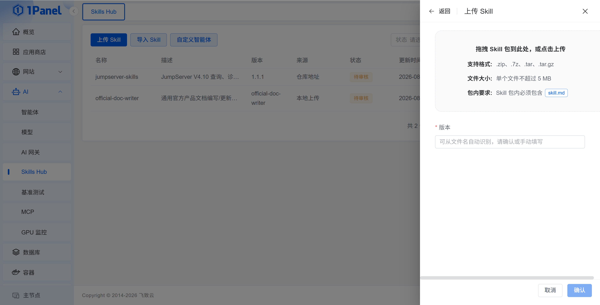
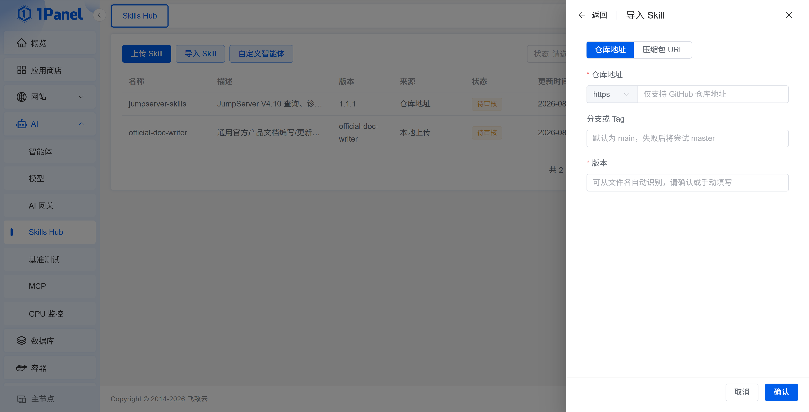
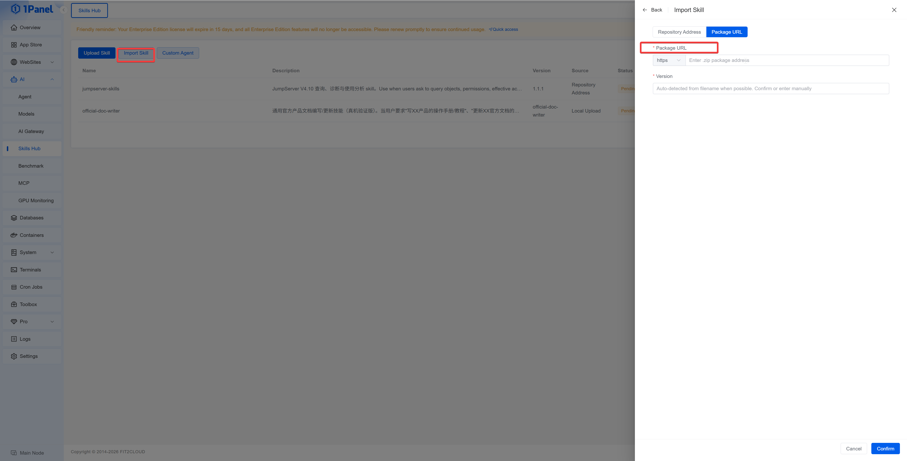
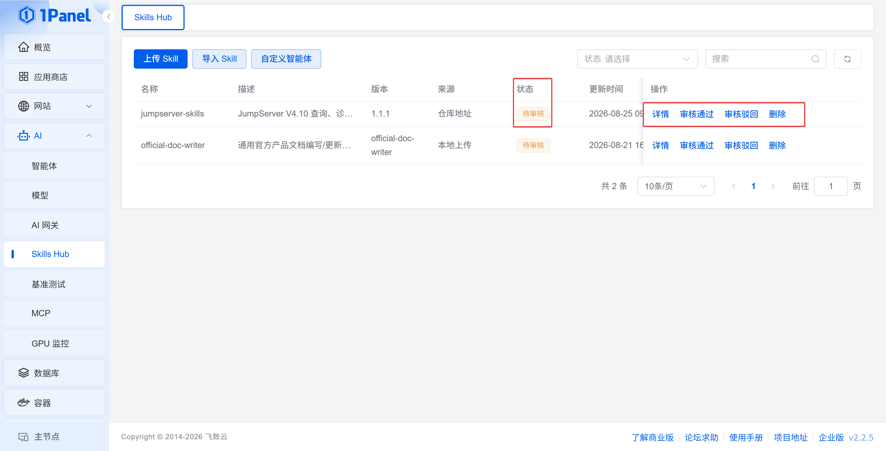
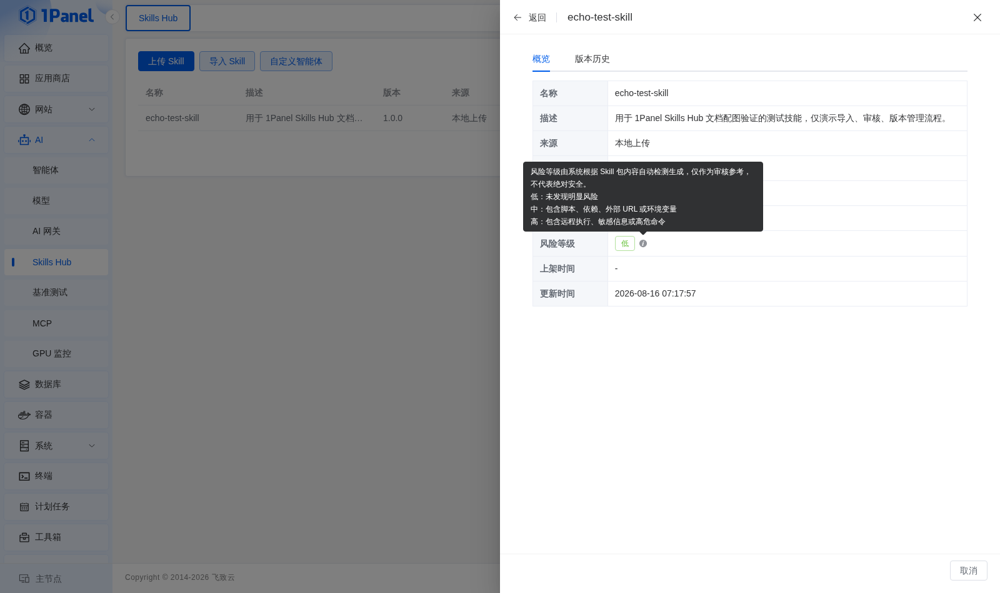
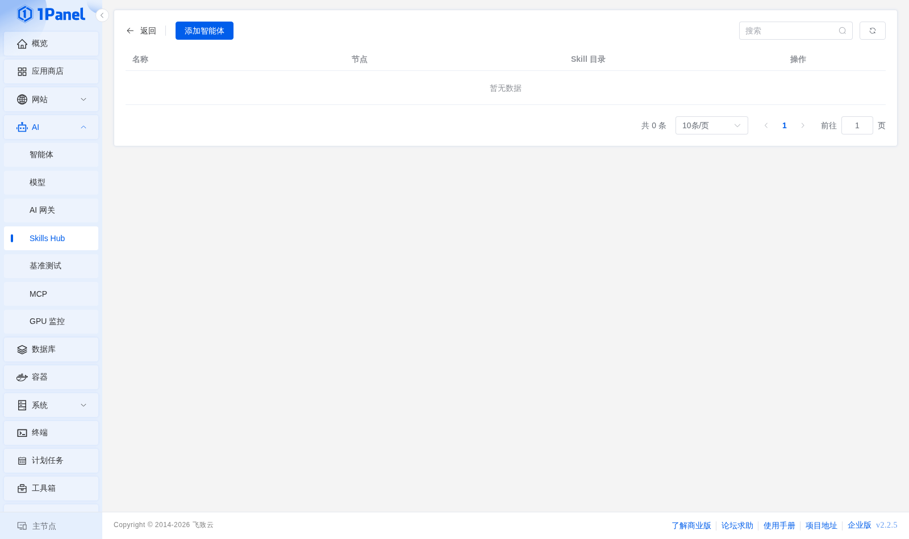

# Skills Hub

!!! info "适用版本与权限"
    Skills Hub 仅在 1Panel 企业版中可用，需要有效企业版许可证。查看和管理分别受 `Skills Hub` 角色权限控制。

!!! note ""
    Skills Hub 用于在企业内部导入、审核、发布、安装和维护智能体 Skill，并保留版本与风险检查信息。入口为 **AI -> Skills Hub**。

## 1 导入 Skill

页面支持以下来源：

!!! note ""
    - 上传 `.zip`、`.7z`、`.tar` 或 `.tar.gz` 格式的 Skill 压缩包，文件不超过 5 MB，压缩包中需包含 `SKILL.md`；
    

{: .browser-mockup}

!!! note ""
    - 从 GitHub 仓库地址和分支或 Tag 导入；
    

{: .browser-mockup}

!!! note ""
    - 从可下载的 `.zip` 软件包 URL 导入。

{: .browser-mockup}

!!! note ""
    导入时填写版本。系统完成解析后会记录 Skill 名称、描述、来源、适用智能体、版本、状态和风险等级。

## 2 审核与发布

!!! note ""
    Skill 状态包括待审核、已审核、已上架、已下架、审核未通过和已删除。具备管理权限的用户可以执行审核通过、审核驳回、上架、下架和删除操作。

{: .browser-mockup}

!!! warning "风险检查"
    风险检查会展示风险等级、文件路径、规则类型、命中关键字和说明。发布前应人工复核 Skill 内容及其依赖，不应仅根据自动检查结果判断安全性。

{: .browser-mockup}

## 3 版本管理

!!! note ""
    在 Skill 详情中可以查看概览和版本历史。版本列表记录状态、风险等级、创建时间、发布时间和版本标记，并支持下载已发布的软件包。

## 4 自定义智能体

!!! note ""
    在 **自定义智能体** 中点击 **添加智能体**，配置 Skill 的安装位置：

    - **名称**：用于识别目标；
    - **节点**：安装 Skill 的 1Panel 节点；
    - **Skill 目录**：软件包解压到主机的目标目录；
    - **安装后命令**：解压完成后执行的可选命令；
    - **描述和状态**：说明用途并控制目标是否可选。

{: .browser-mockup}

安装 Skill 时可以选择一个或多个已启用目标。安装后命令会在目标节点执行，配置前应确认命令来源和执行影响。

## 5 离线环境

!!! note ""
    企业版离线环境不能直接访问外部 GitHub 仓库或软件包地址时，应先在可联网环境准备并审查 Skill 包，再使用上传方式导入。
