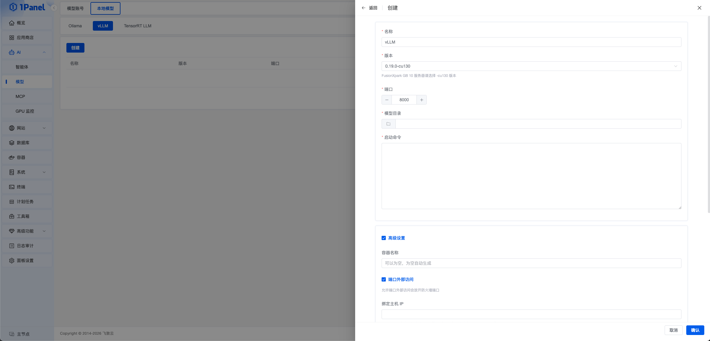

!!! note ""
    vLLM 是面向大语言模型的高吞吐、内存高效推理与服务引擎。1Panel 在 **AI -> 模型 -> 本地模型 -> vLLM** 页面提供可视化管理能力，可用于统一创建、编辑、启停和维护本地 vLLM 服务。

    该功能需要 **1Panel 专业版或企业版** 许可证。

## 1 前置条件

!!! note ""
    在创建 vLLM 服务前，请先确认以下条件已满足：

    - 服务器已安装与所选 vLLM 镜像和加速设备匹配的驱动及容器运行环境
    - 使用 NVIDIA GPU 时，执行 `nvidia-smi` 可以正常查看显卡信息，并已配置 `NVIDIA Container Toolkit`
    - 使用 Intel 或昇腾加速设备时，已按对应厂商要求完成驱动和容器运行环境配置
    - 已提前将需要加载的模型文件放置到服务器本地目录中

    如需先检查 GPU 是否可用，可参考 [GPU 监控](./gpu.md) 文档。

## 2 创建 vLLM 服务

!!! note ""
    打开 1Panel 面板后，进入 **AI -> 模型**，切换到 **本地模型 -> vLLM**，点击 **创建**。

    按页面要求填写 vLLM 的部署参数后，点击 **确认** 即可开始创建。创建过程会以任务的方式在后台执行，完成后可在列表中查看服务状态。

{: .original}

!!! info "参数说明"
    - **名称**：vLLM 服务名称，用于列表展示与后续管理
    - **加速设备**：按当前服务器硬件选择页面提供的 NVIDIA、Intel 或昇腾类型。可选项以当前版本和节点检测结果为准
    - **版本**：选择需要部署的 vLLM 应用版本。不同加速设备使用不同的镜像和版本
    - **端口**：vLLM 服务对外提供 API 的端口，默认可使用 `8000`
    - **模型目录**：服务器上的本地模型目录。选择后，1Panel 会将该目录挂载到容器中
    - **启动命令**：用于启动 vLLM 服务的命令参数。选择模型目录后，系统会根据目录名称自动生成默认命令；如有特殊推理参数需求，也可自行调整

> vLLM 服务创建完成后，会以 OpenAI 兼容接口的形式对外提供推理能力，便于后续接入智能体或其他 AI 应用。

创建完成后，可将服务同步为 **模型账号**，供智能体及其他 AI 功能选择。同步时应确认 Base URL、API 类型和模型信息与实际服务一致。

## 3 高级设置

!!! note ""
    如需对容器运行方式做进一步控制，可展开 **高级设置**。

!!! info "高级设置说明"
    - **容器名称**：自定义 vLLM 容器名称，默认会跟随服务名称自动填写
    - **端口外部访问**：开启后会放开防火墙端口，允许通过外部网络访问该服务
    - **绑定主机 IP**：用于限制端口只绑定到指定主机地址或网卡；如果不清楚用途，建议保持默认
    - **重启策略**：配置容器异常退出后的重启方式
    - **CPU / 内存限制**：限制 vLLM 容器可使用的主机资源
    - **拉取镜像**：在启动前主动执行镜像拉取，确保使用目标版本镜像
    - **编辑 compose 文件**：允许手动调整部署使用的 Compose 配置；该选项适合有经验的用户，修改不当可能导致创建失败

## 4 日常管理

列表支持查看状态和运行目录，并提供编辑、启动、停止、重启、删除、查看日志和任务追踪等操作。修改镜像、启动命令、挂载或资源限制可能触发容器重建；未挂载到主机目录的数据不会随容器保留。

!!! warning "外部访问"
    开启端口外部访问前，应结合防火墙、授权 IP 或反向代理限制访问范围。模型 API 默认不等同于已完成身份认证，不应直接暴露到不受信任的网络。
