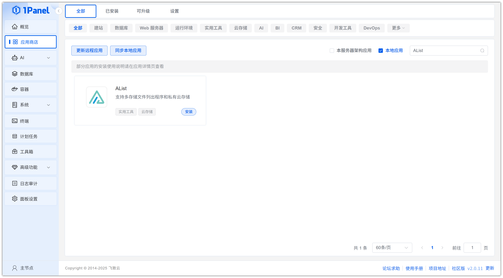
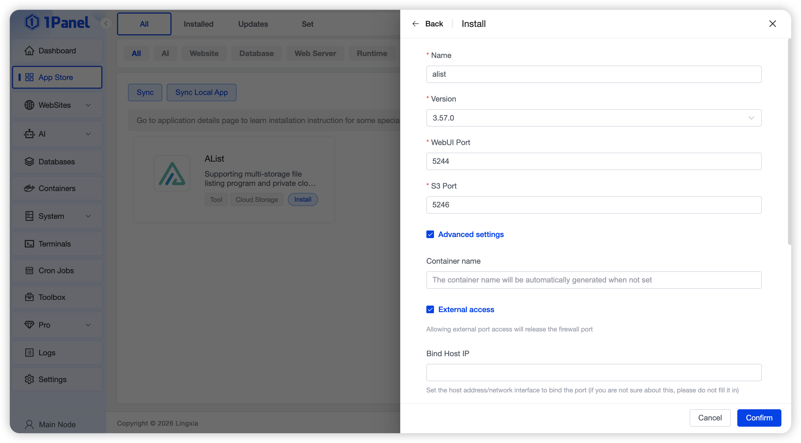
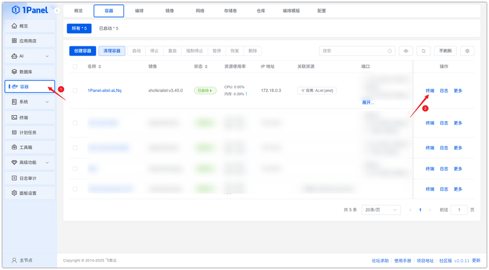
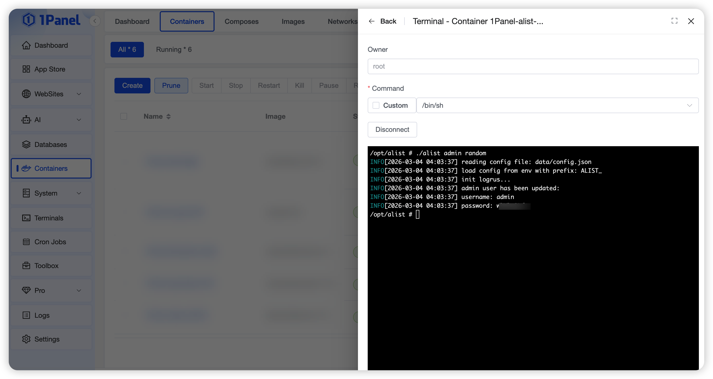
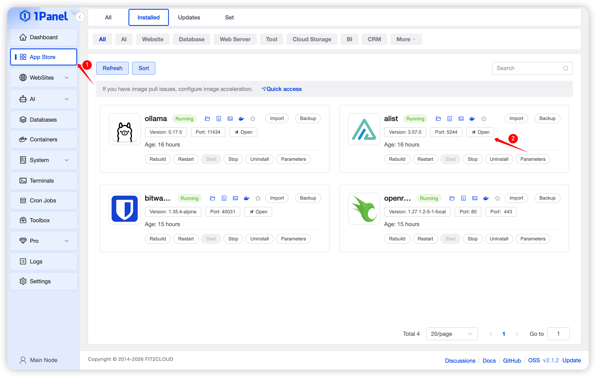

# Install AList Visually Using 1Panel

!!! note ""
    **AList** is a file listing program that supports multiple storage providers, web browsing, and WebDAV. It is powered by gin and Solidjs.

## 1. Open the App Store

!!! note ""
    After entering the 1Panel console, click **App Store** in the left menu.

{: .original}

## 2. Search for AList and Install

!!! note ""
    Enter **AList** in the search box in the upper right corner, click the application card to go to the details page, and select **Install**.

{: .original}

## 3. Configure Installation Parameters

!!! note ""
    You can configure the following as needed:

    - **Name**: Customize the application name (default: alist)
    - **Version**: Select the desired AList version from the dropdown
    - **WebUI Port**: Port for the web management interface (default: 5244)
    - **S3 Port**: Port for the S3 service (default: 5246)
    - **Port External Access**: When enabled, allows external network access to the application ports

    After confirming the settings are correct, click the **Confirm** button to start installation.

{: .original}

!!! note ""
    Wait for the installation to complete.

## 4. Configure Access to the AList Service

!!! note ""
    After installation, confirm the default access address in 1Panel. Skip this step if already configured.

{: .original}

!!! note ""
    Click **Containers** in the left menu, find the AList container, and click **Terminal**.

{: .original}

!!! note ""
    Connect to the terminal and generate a password. Two methods are available:

    - **Generate random password**: `./alist admin random`
    - **Set password manually**: `./alist admin set NEW_PASSWORD`

{: .original}

!!! note ""
    Return to the App Store and click **Jump** to access the AList service.

{: .original}

!!! note ""
    Enter the generated password to log in.

{: .original}
