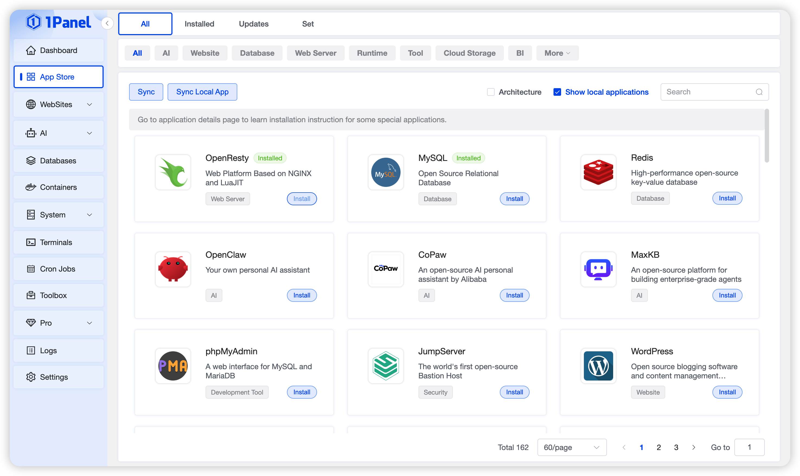

## 1 Feature Overview

!!! note ""

    - **Feature Overview**
    
    The App Store is designed to provide users with a convenient and efficient experience for application deployment and management. Through the App Store, users can install a wide range of common website-building tools, services, and development environments with one click, including WordPress, Halo, PHP, Node.js, MySQL, and more, eliminating the need for complex manual configuration.
    
    In addition, the 1Panel App Store supports application backup, restoration, and upgrade functions, ensuring data security and continuous availability of applications, greatly facilitating daily operation and maintenance as well as site management.

    - **Local Apps**

    Users can add custom applications as needed. The 1Panel App Store also supports local applications. For the creation tutorial, please refer to:
    [Submit Custom Application Tutorial](https://github.com/1Panel-dev/appstore/wiki/How-to-submit-your-own-application).

{: .browser-mockup}
