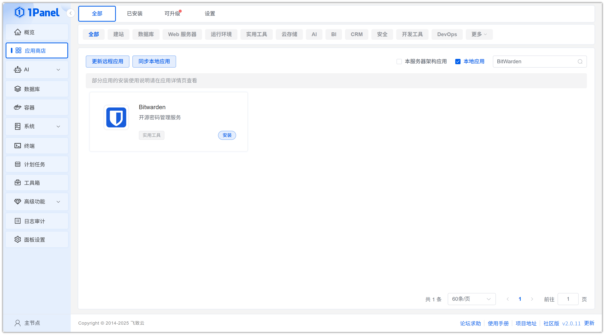
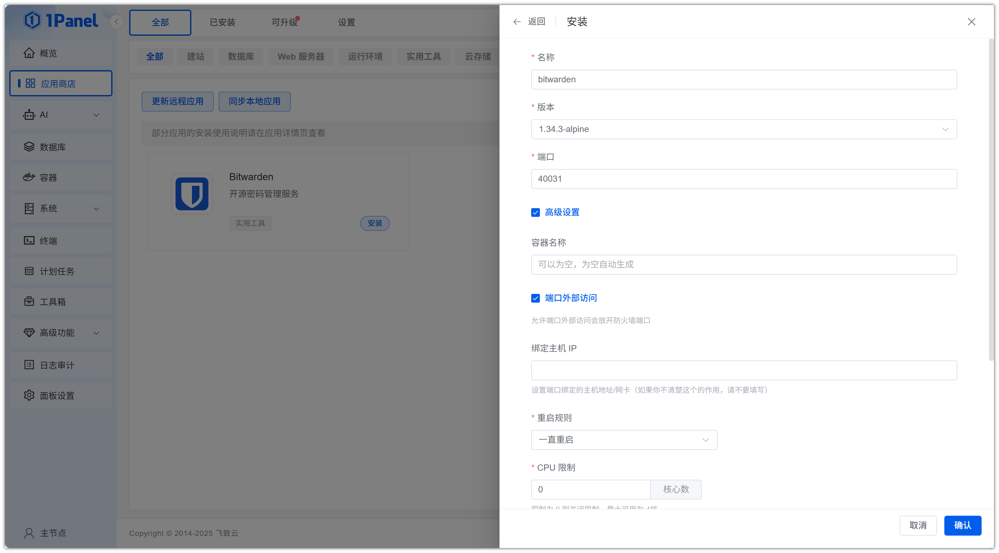
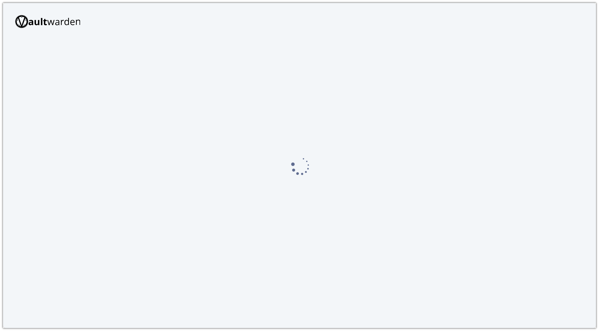
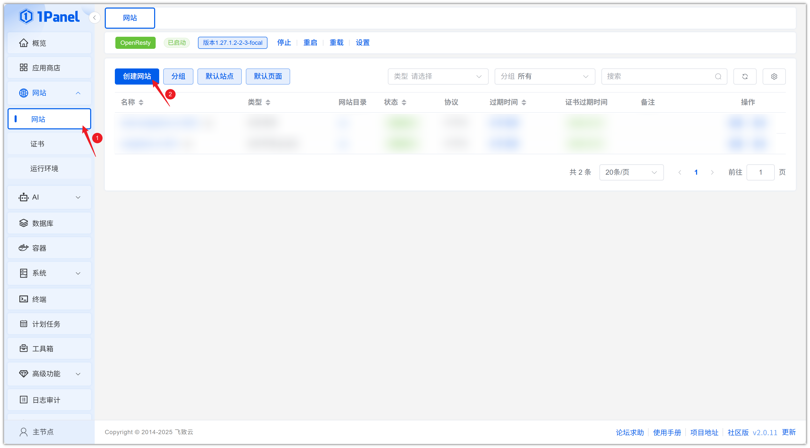
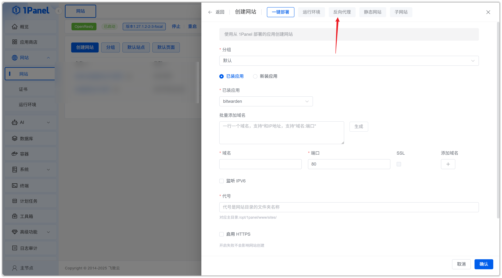
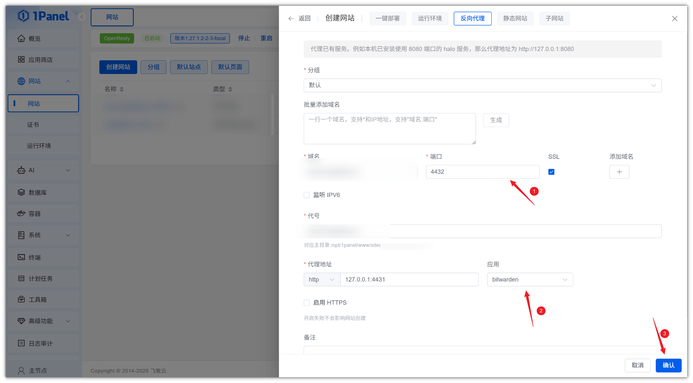
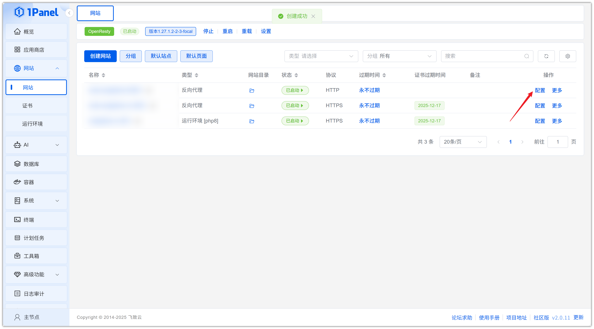
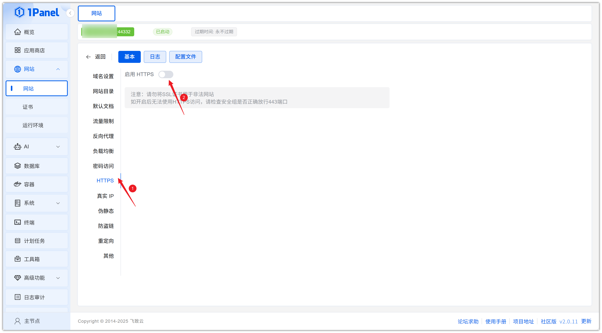
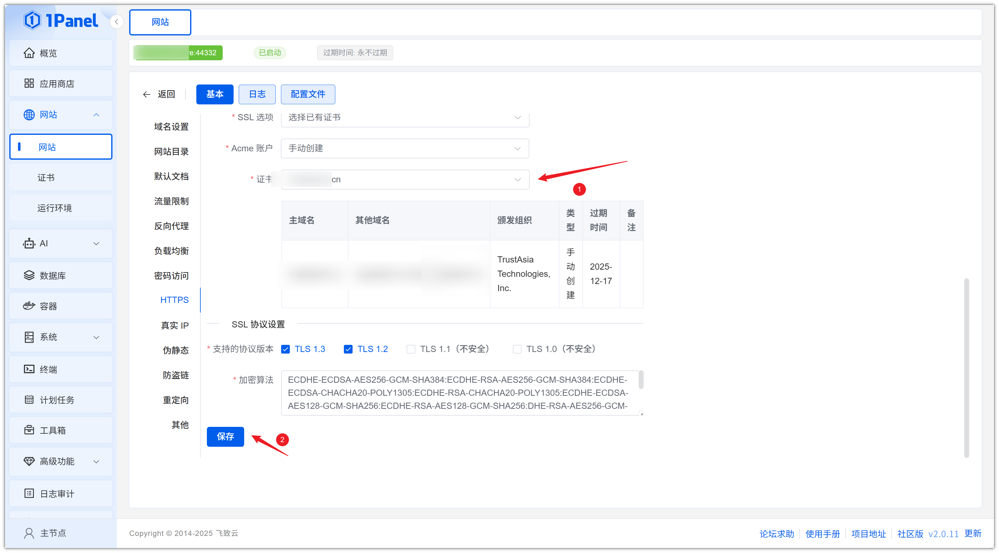
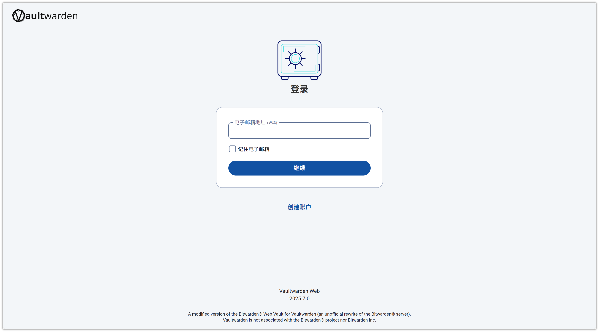

# 使用 1Panel 可视化安装 Bitwarden

!!! note ""
     **Bitwarden** 是一款开源的密码管理器，提供强大的安全性和便捷的密码管理功能。本仓库使用的是 Bitwarden 客户端 API 的替代服务器实现，使用 Rust 编写，与官方 Bitwarden 客户端兼容，非常适合自托管部署，因为在这种情况下运行官方资源繁重的服务可能并不理想。部署服务端后，用户仍然可以使用 Bitwarden 的官方 APP 和浏览器拓展使用兼容的 API 服务。

## 1. 打开应用商店

!!! note ""
    进入 1Panel 控制台后，点击左侧菜单的 **「应用商店」**。

## 2. 搜索 Bitwarden 并安装

!!! note ""
    在右上角搜索框输入 **Bitwarden**，点击应用卡片进入详情页，选择 **安装**。

## 3. 配置安装参数

!!! note ""
     你可以根据需要配置

    - **名称** (输入框内可自定义应用名称，默认为 bitwarden)
    - **版本** (下拉选择所需的 Bitwarden 版本)
    - **端口** (应用的访问端口，默认为 40031)
    - **端口外部访问** (开启后，将允许从外部网络访问此应用端口)
    
    确认设置无误后，点击 **确认** 按钮开始安装。

!!! note ""
     等待安装完成即可

## 4. 配置 Bitwarden SSL 访问

!!! note ""
     注意 Bitwarden 需要配置 SSL证书访问，直接访问会一直转圈

!!! note ""
     点击左侧菜单的网站，选择创建网站

!!! note ""
     点击反向代理

!!! note ""
     输入反向代理后的域名和端口，应用选择 Bitwarden，点击确认

!!! note ""
     网站创建成功后，点击配置

!!! note ""
     左侧选择 HTTPS ，启用 HTTPS

!!! note ""
     导入你的证书，或者选择已有证书，配置好后点击保存即可

## 5. 访问 Bitwarden 服务

!!! note ""
     访问反向代理的域名和端口地址即可

