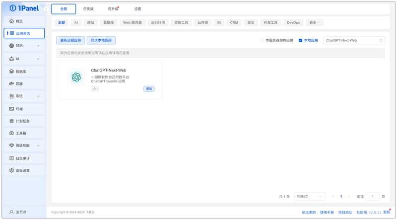
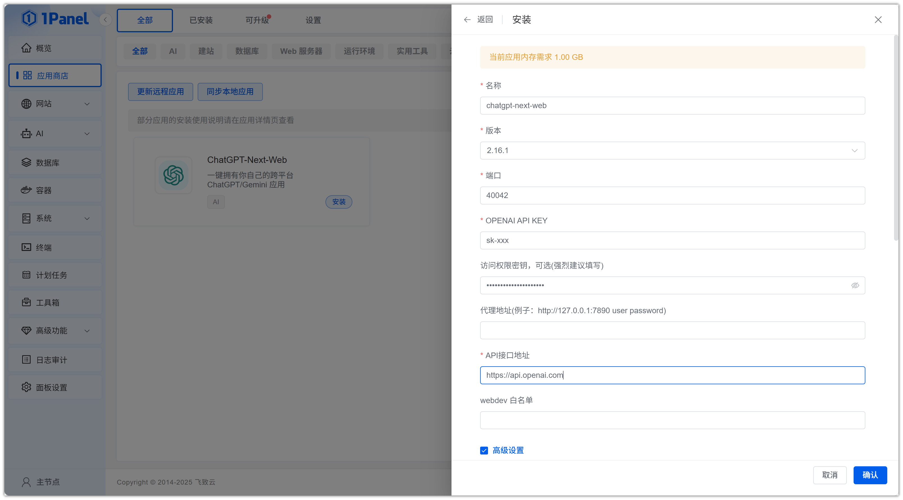
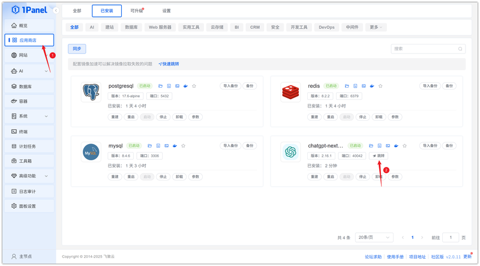
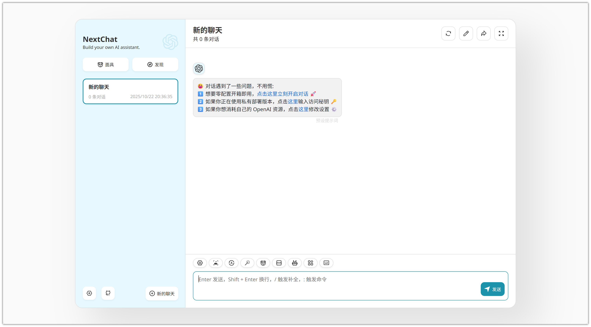

# Install ChatGPT-Next-Web Visually Using 1Panel

!!! note ""
    **ChatGPT-Next-Web** allows you to deploy your cross-platform private ChatGPT application with one click for free, supporting GPT-3, GPT-4 & Gemini Pro models.

## 1. Open the App Store

!!! note ""
    After entering the 1Panel console, click **App Store** in the left menu.

{: .original}

## 2. Search for ChatGPT-Next-Web and Install

!!! note ""
    Enter **ChatGPT-Next-Web** in the search box in the upper right corner, click the application card to go to the details page, then select **Install**.

{: .original}

## 3. Configure Installation Parameters

!!! note ""
    You can configure the following as needed:

    - **Name**: Customize the application name (default: chatgpt-next-web)
    - **Version**: Select the desired ChatGPT-Next-Web version from the dropdown
    - **Port**: Access port for the application (default: 40042)
    - **OPENAI API KEY**: Enter your OpenAI API key
    - **Access Password**: Set a password for the application (recommended)
    - **Proxy Address**: Set the proxy server address for API requests
    - **API Endpoint**: Set the request address for the OpenAI API
    - **WebDev Whitelist**: Set the whitelist for WebDAV access
    - **Port External Access**: When enabled, allows external network access to the application port

    After confirming the settings are correct, click the **Confirm** button to start installation.

{: .original}

!!! note ""
    Wait for the installation to complete.

## 4. Access the ChatGPT-Next-Web Service

!!! note ""
    After installation, confirm the default access address in 1Panel. Skip this step if already configured.

{: .original}

!!! note ""
    Return to the App Store and click **Jump** to access the ChatGPT-Next-Web service.

{: .original}

!!! note ""
    You can now use the service.

{: .original}
