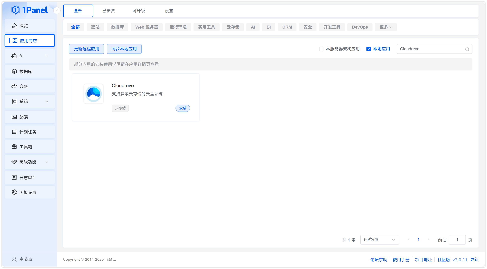
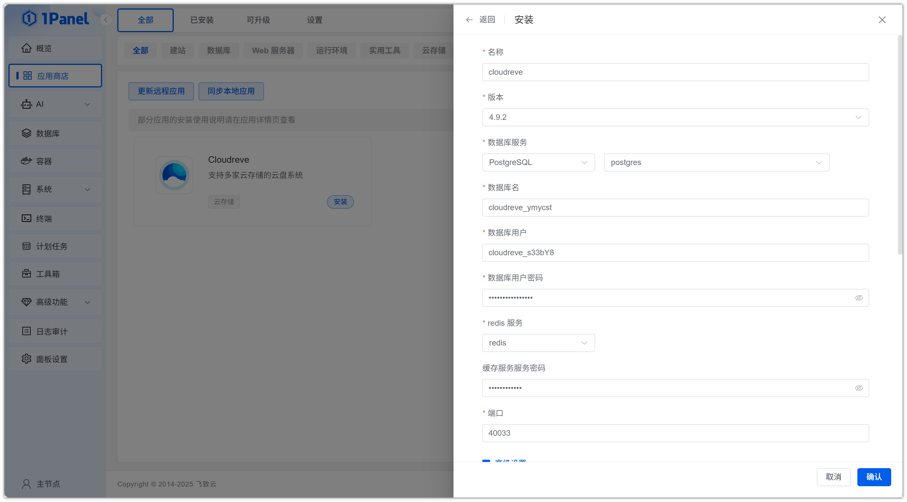
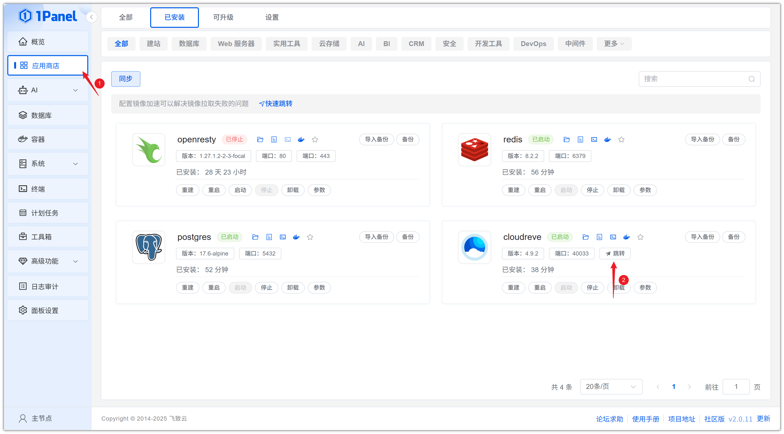
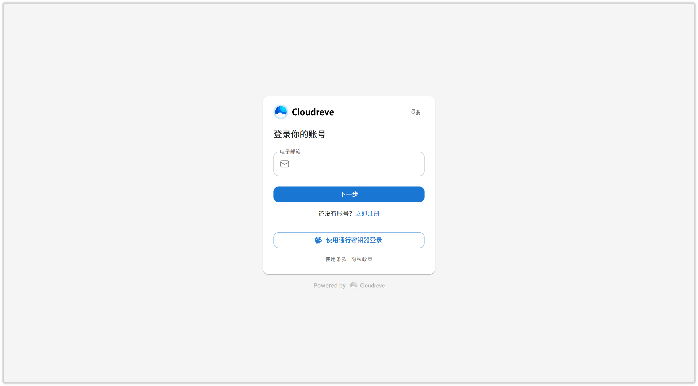

# Install Cloudreve Visually Using 1Panel

!!! note ""
    **Cloudreve** is an open-source cloud storage and file management system that provides comprehensive features, allowing users to build personal or team cloud storage and file-sharing platforms on their own servers.

## 1. Open the App Store

!!! note ""
    After entering the 1Panel console, click **App Store** in the left menu.

{: .original}

## 2. Search for Cloudreve and Install

!!! note ""
    Enter **Cloudreve** in the search box in the upper right corner, click the application card to go to the details page, then select **Install**.

{: .original}

## 3. Configure Installation Parameters

!!! note ""
    You can configure the following as needed. Database service configuration is required.

    - **Name**: Customize the application name (default: cloudreve)
    - **Version**: Select the desired Cloudreve version from the dropdown
    - **Database Service**: Select the database service for data storage, such as PostgreSQL
    - **Database Name**: Name of the database created for the application
    - **Database User**: Username for database connection
    - **Database User Password**: Password for the database user
    - **Redis Service**: Select the Redis service for caching
    - **Cache Database Password**: Password for the Redis service
    - **Port**: Access port for the application (default: 40033)
    - **Port External Access**: When enabled, allows external network access to the application port

    After confirming the settings are correct, click the **Confirm** button to start installation.

{: .original}

!!! note ""
    Wait for the installation to complete.

## 4. Access the Cloudreve Service

!!! note ""
    Configure the default access address. Skip this step if already configured.

{: .original}

!!! note ""
    Return to the App Store and click **Jump** to access the Cloudreve service.

{: .original}

!!! note ""
    Register an account and log in.

{: .original}
