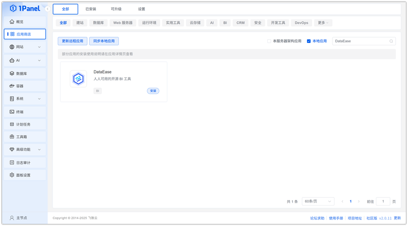
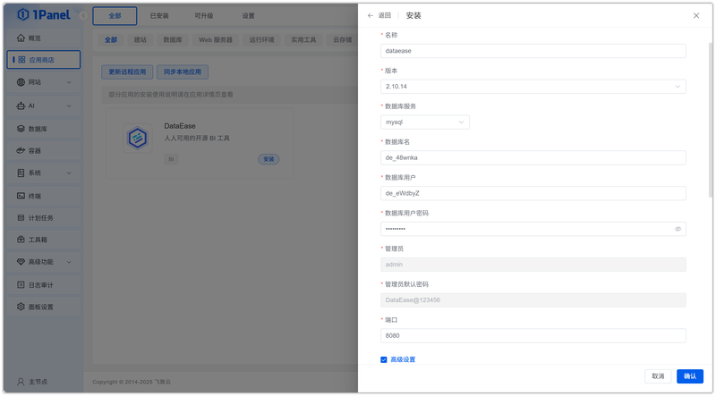
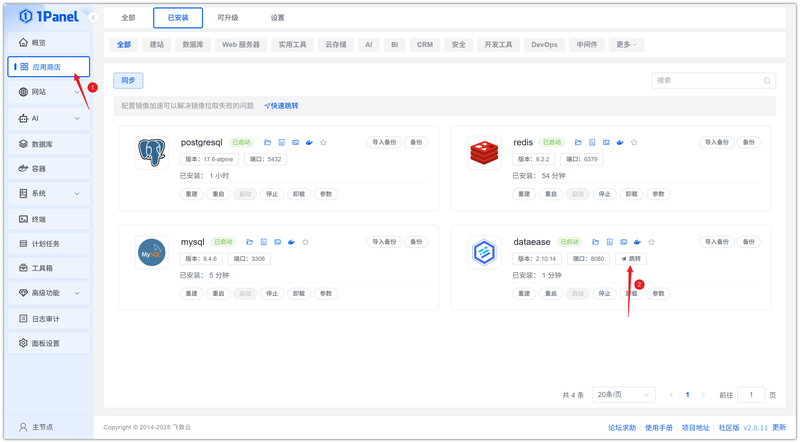
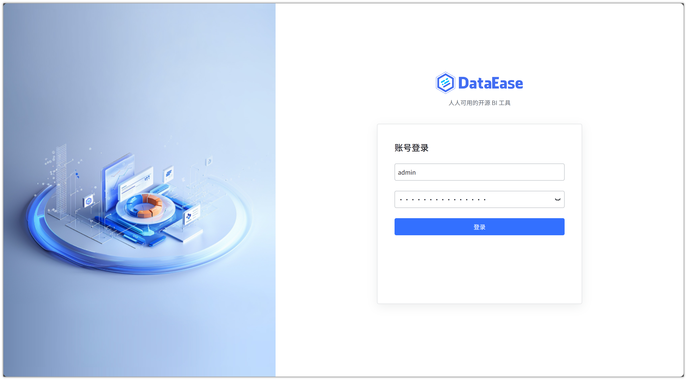

# 使用 1Panel 可视化安装 DataEase

!!! note ""
    **DataEase** 是开源的 BI 工具，帮助用户快速分析数据并洞察业务趋势，从而实现业务的改进与优化。DataEase 支持丰富的数据源连接，能够通过拖拉拽方式快速制作图表，并可以方便的与他人分享。

## 1. 打开应用商店

!!! note ""
    进入 1Panel 控制台后，点击左侧菜单的 **「应用商店」**。

## 2. 搜索 DataEase 并安装

!!! note ""
    在右上角搜索框输入 **DataEase**，点击应用卡片进入详情页，选择 **安装**。

## 3. 配置安装参数

!!! note ""
     你可以根据需要配置

    - **名称** (输入框内可自定义应用名称，默认为 dataease)
    - **版本** (下拉选择所需的 DataEase 版本)
    - **数据库服务** (选择用于存储数据的数据库服务，例如 mysql)
    - **数据库名** (为应用创建的数据库名称)
    - **数据库用户** (用于连接数据库的用户名)
    - **数据库用户密码** (数据库用户的密码)
    - **管理员** (设置 DataEase 的管理员账号)
    - **管理员默认密码** (设置 DataEase 管理员的初始密码)
    - **端口** (应用的访问端口，默认为 8080)
    - **端口外部访问** (开启后，将允许从外部网络访问此应用端口)

    确认设置无误后，点击 **确认** 按钮开始安装。

!!! note ""
     等待安装完成即可

## 4. 访问 DataEase 服务

!!! note ""
     安装完成后，确认 1Panel 配置默认访问地址，已配置过可忽略

!!! note ""
     返回应用商店，点击 **跳转** 即可访问 DataEase 服务

!!! note ""
     使用默认用户名: `admin`  密码: `DataEase@123456`登录即可

