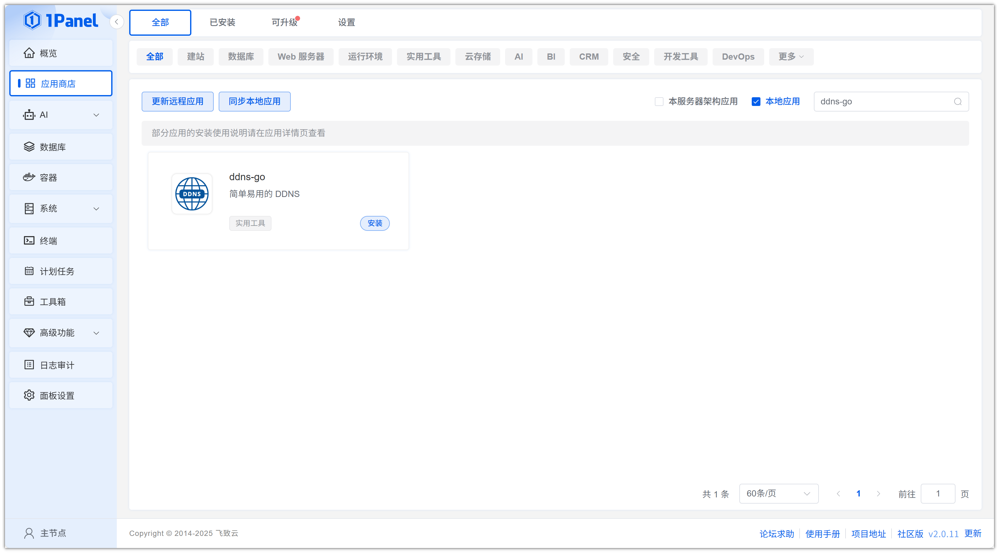
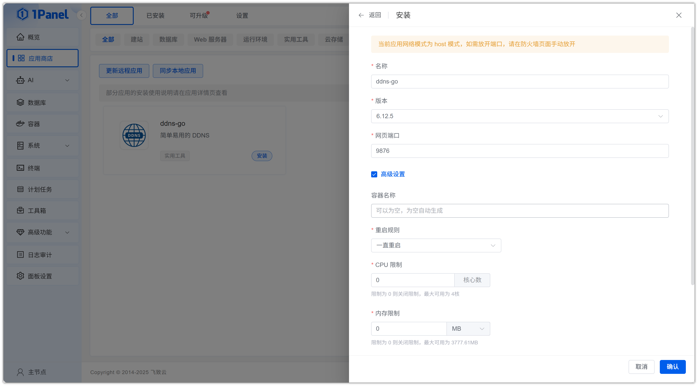
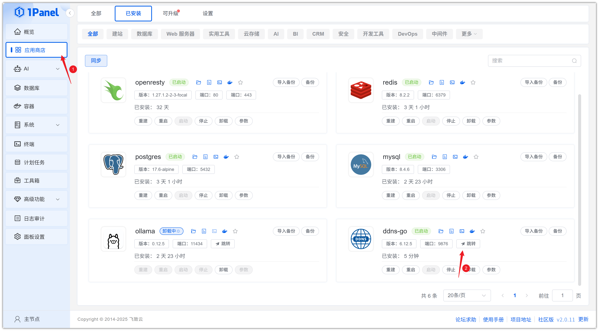
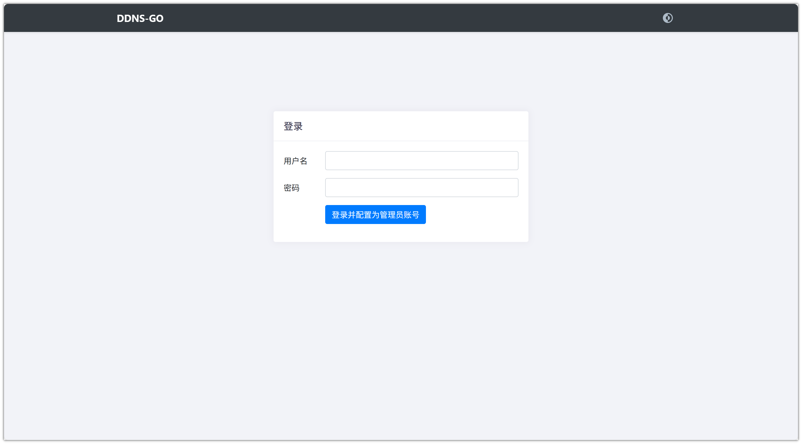

# 使用 1Panel 可视化安装 ddns-go

!!! note ""
     **ddns-go** 是一个自动获得你的公网 IPv4 或 IPv6 地址，并解析到对应的域名服务。

## 1. 打开应用商店

!!! note ""
    进入 1Panel 控制台后，点击左侧菜单的 **「应用商店」**。

## 2. 搜索 ddns-go 并安装

!!! note ""
    在右上角搜索框输入 **ddns-go**，点击应用卡片进入详情页，选择 **安装**。

## 3. 配置安装参数

!!! note ""
     你可以根据需要配置

    - **名称** (输入框内可自定义应用名称，默认为 ddns-go)
    - **版本** (下拉选择所需的 ddns-go 版本)
    - **网页端口** (WebUI 的访问端口，默认为 9876)
    
    确认设置无误后，点击 **确认** 按钮开始安装。

!!! note ""
     等待安装完成即可

## 4. 配置访问 ddns-go 服务

!!! note ""
     安装完成后，确认 1Panel 配置默认访问地址，已配置过可忽略

!!! note ""
     返回应用商店，点击 **跳转** 即可访问 ddns-go 服务

!!! note ""
     首次登录需配置管理员账号

