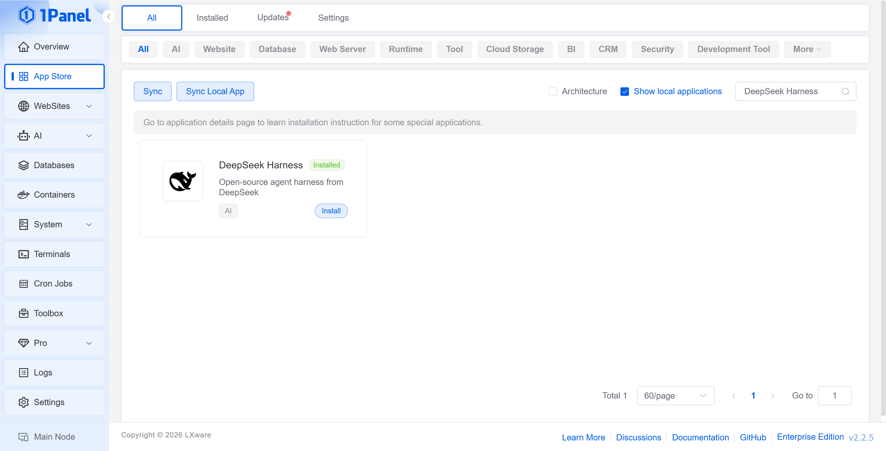

# DeepSeek Harness Installation and Deployment

## Product Introduction

!!! note ""
    **DeepSeek Harness (DSH for short)** is an open-source agent runtime environment launched by DeepSeek for developers. It provides project files, tools, and a runtime environment to large language models, enabling the models to complete development tasks.

    DeepSeek Harness adopts a plugin-based architecture, which can combine capabilities such as web search, Skills, planning, sub-agents, and workflows according to the task, and provides the following four runtime modes:

    - **Standard Mode**: Suitable for daily development tasks; it is recommended for first-time use
    - **PTC Mode**: Suitable for multi-step, complex tool call orchestration
    - **Minimal Mode**: Only retains the basic command and editing tools
    - **Creation Mode**: Used to create and debug custom agent presets

    For more product information, please refer to the [DeepSeek Harness Official Documentation](https://github.com/deepseek-ai/deepseek-harness/blob/master/README.zh.md).

## Prerequisites

!!! note ""
    Before deployment, please confirm the following conditions:

    - 1Panel has been installed and can be accessed normally
    - An API Key from DeepSeek or another model provider has been prepared
    - The planned HTTPS port has been opened in both the cloud security group and the system firewall
    - The IPv4 address or hostname used by your browser to actually access the server has been prepared

## 1. Installing DeepSeek Harness

!!! note ""
    Log in to the 1Panel console, enter the **App Store**, search for **DeepSeek Harness**, enter the app details page, and click **Install**.

    Fill in the installation parameters as required by the page:

    - **Name**: The app name, which can be filled in as `deepseek-harness` by default
    - **Version**: Select the DeepSeek Harness version to install
    - **HTTPS Port**: Used to access the Web UI, e.g., `10443`
    - **Access Address**: Fill in the IPv4 address or hostname actually used by your browser, without `https://` or the port
    - **Web Username**: The authentication username used to access the Web UI
    - **Web Access Password**: Set a strong password of at least 12 characters
    - **Advanced Settings**: Generally keep the defaults

{: .browser-mockup}


{: .browser-mockup}

!!! note ""
    The DeepSeek Harness in the 1Panel App Store integrates Caddy HTTPS and username/password authentication. Harness only listens on the container loopback address; external requests must first pass through Caddy's authentication and decryption before being forwarded to the Harness service.

## 2. Accessing DeepSeek Harness

!!! note ""
    After the installation is completed, access the following address in your browser:

    ```text
    https://<Access Address>:<HTTPS Port>
    ```

    The browser will first ask for the Web username and password set during installation. After authentication succeeds, you can enter DeepSeek Harness.

!!! warning ""
    Caddy uses an internal CA to automatically issue the certificate, so the browser may prompt that the certificate is not trusted on the first visit. For a test experience, you can continue after confirming the address is correct; for a production environment, it is recommended to configure a certificate trusted by the browser.

## 3. Configuring the DeepSeek Official Model

!!! note ""
    When entering DeepSeek Harness for the first time, the page will prompt you to add an API Key. Fill in the official DeepSeek API Key, then click **Save and Continue**.

    You can also click **Configure Later**, and after entering the page, open the **Settings** in the lower left corner and complete the configuration on the **Model** page.


## 4. Configuring a Third-Party Model Provider

!!! note ""
    DeepSeek Harness also supports configuring third-party model providers. Taking OpenCode Go as an example:

    1. Open the **Settings** in the lower left corner.
    2. Enter the **Model** page and select **Add Provider**.
    3. Select `opencode-go` and fill in the API Key.
    4. Configure the API address and model as needed, and click **Save** after confirming they are correct.


{: .browser-mockup}

## 5. Starting the First Task

!!! note ""
    Return to the home page, select the workspace in the lower left corner of the input box, confirm the model and runtime mode in the lower right corner, and then enter the task content to start the conversation.

    For the first experience, it is recommended to select **Standard Mode** and use a test project that does not contain sensitive data.


{: .browser-mockup}

## 6. Security and Upgrade Recommendations

!!! warning ""
    DeepSeek Harness is still in the developer preview stage, so it is recommended for testing and experience only. Please pay attention to the following points:

    - Store the API Key and the Web access password properly
    - Do not mount the host root directory, Docker Socket, or SSH key directory to the workspace
    - Do not place sensitive data in the workspace
    - Back up important data before upgrading
