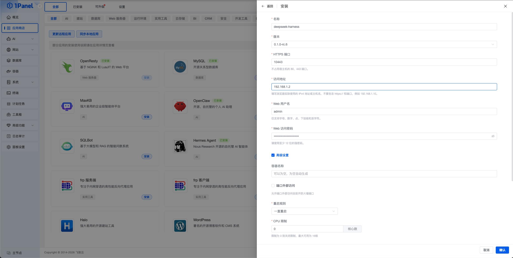
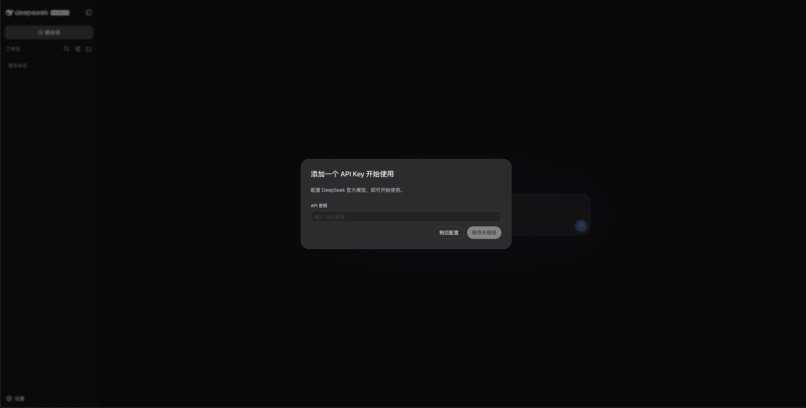
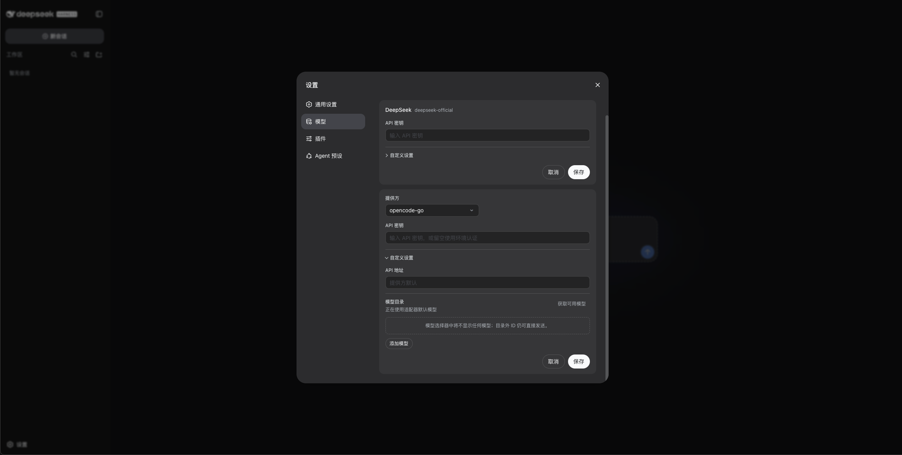
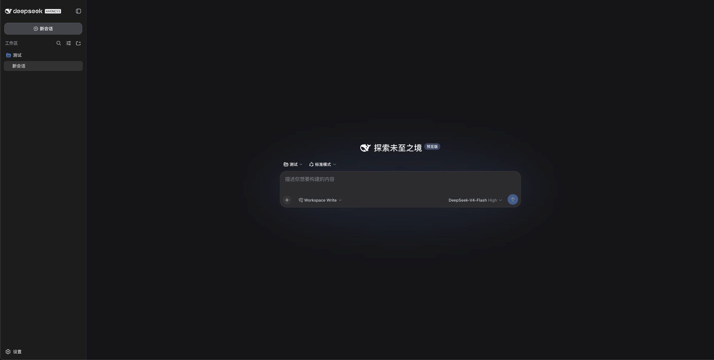

# DeepSeek Harness 安装部署

## 产品介绍

!!! note ""
    **DeepSeek Harness（简称 DSH）** 是 DeepSeek 面向开发者推出的开源智能体运行环境。它负责向大模型提供项目文件、工具和运行环境，让模型可以完成开发任务。

    DeepSeek Harness 采用插件化架构，可按任务组合网页检索、Skills、计划、子 Agent 和工作流等能力，并提供以下四种运行模式：

    - **标准模式**：适合日常开发任务，建议初次使用时选择
    - **PTC 模式**：适合多步骤、复杂的工具调用编排
    - **极简模式**：仅保留基础命令和编辑工具
    - **创造模式**：用于创建和调试自定义 Agent 预设

    更多产品信息，请参阅 [DeepSeek Harness 官方说明](https://github.com/deepseek-ai/deepseek-harness/blob/master/README.zh.md)。

## 前提准备

!!! note ""
    部署前请先确认以下条件：

    - 已安装并可正常访问 1Panel
    - 已准备 DeepSeek 或其他模型提供方的 API Key
    - 已在云安全组和系统防火墙中放行计划使用的 HTTPS 端口
    - 已准备浏览器实际访问服务器时使用的 IPv4 地址或主机名

## 1. 安装 DeepSeek Harness

!!! note ""
    登录 1Panel 后台，进入 **应用商店**，搜索 **DeepSeek Harness**，进入应用详情页并点击 **安装**。

    按页面要求填写安装参数：

    - **名称**：应用名称，默认可填写为 `deepseek-harness`
    - **版本**：选择需要安装的 DeepSeek Harness 版本
    - **HTTPS 端口**：用于访问 Web UI，例如 `10443`
    - **访问地址**：填写浏览器实际使用的 IPv4 地址或主机名，不包含 `https://` 和端口
    - **Web 用户名**：访问 Web UI 时使用的认证用户名
    - **Web 访问密码**：设置至少 12 位的强密码
    - **高级设置**：一般保持默认即可



!!! note ""
    1Panel 应用商店中的 DeepSeek Harness 集成了 Caddy HTTPS 和用户名密码认证。Harness 仅监听容器回环地址，外部请求需要先经过 Caddy 鉴权和解密，再转发到 Harness 服务。

## 2. 访问 DeepSeek Harness

!!! note ""
    安装完成后，在浏览器中访问：

    ```text
    https://<访问地址>:<HTTPS 端口>
    ```

    浏览器会先要求输入安装时设置的 Web 用户名和密码，认证通过后即可进入 DeepSeek Harness。

!!! warning ""
    Caddy 使用内部 CA 自动签发证书，首次访问时浏览器可能提示证书不受信任。测试体验时可以确认地址无误后继续访问；正式环境建议配置受浏览器信任的证书。

## 3. 配置 DeepSeek 官方模型

!!! note ""
    首次进入 DeepSeek Harness 时，页面会提示添加 API Key。填写 DeepSeek 官方 API Key 后，点击 **保存并继续**。

    也可以点击 **稍后配置**，进入页面后再打开左下角的 **设置**，在 **模型** 页面中完成配置。



## 4. 配置第三方模型提供方

!!! note ""
    DeepSeek Harness 也支持配置第三方模型提供方。以 OpenCode Go 为例：

    1. 打开左下角的 **设置**。
    2. 进入 **模型** 页面，选择 **添加提供方**。
    3. 选择 `opencode-go`，填写 API Key。
    4. 按需配置 API 地址和模型，确认无误后点击 **保存**。



## 5. 开始第一个任务

!!! note ""
    返回首页，在输入框左下角选择工作区，在右下角确认模型和运行模式，然后输入任务内容即可开始对话。

    首次体验建议选择 **标准模式**，并使用不包含敏感数据的测试项目。



## 6. 安全与升级建议

!!! warning ""
    DeepSeek Harness 目前仍处于开发者预览阶段，建议仅用于测试体验，并注意以下事项：

    - 妥善保管 API Key 和 Web 访问密码
    - 不要将宿主机根目录、Docker Socket 或 SSH 密钥目录挂载到工作区
    - 不要在工作区中放置敏感数据
    - 升级前备份重要数据
