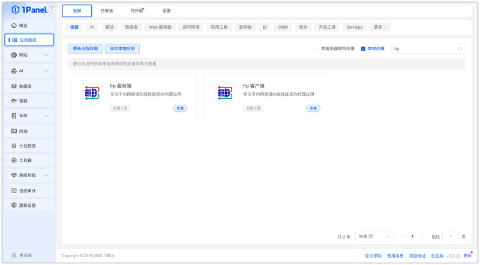
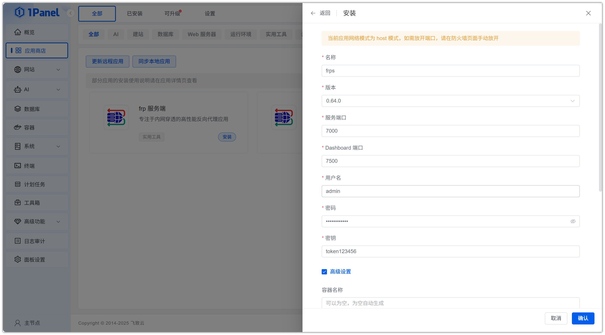
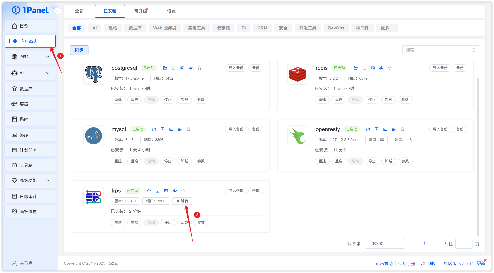
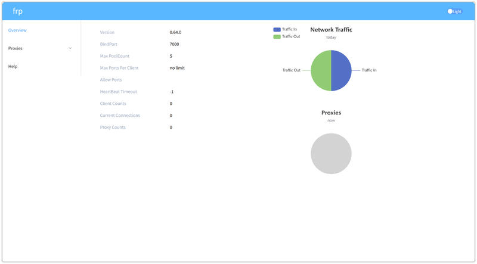
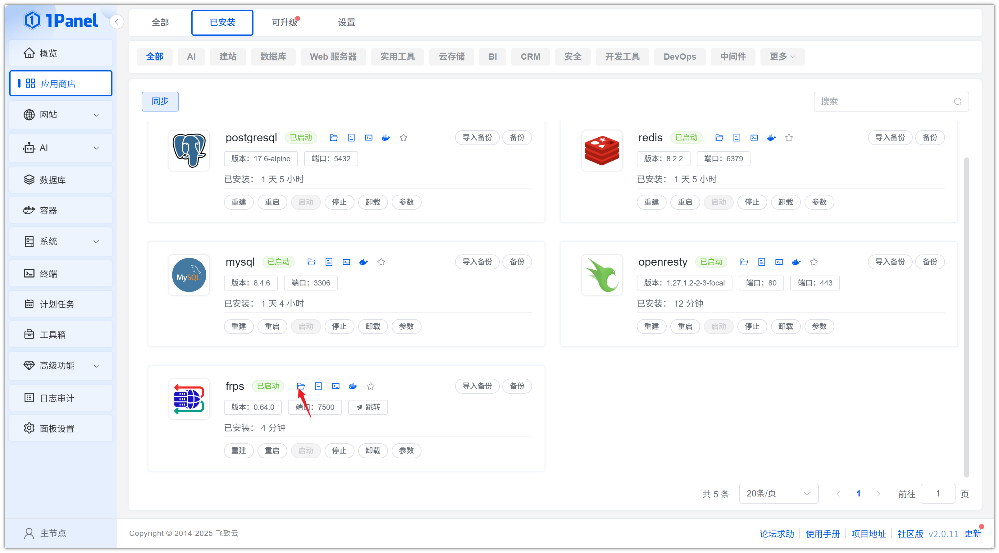
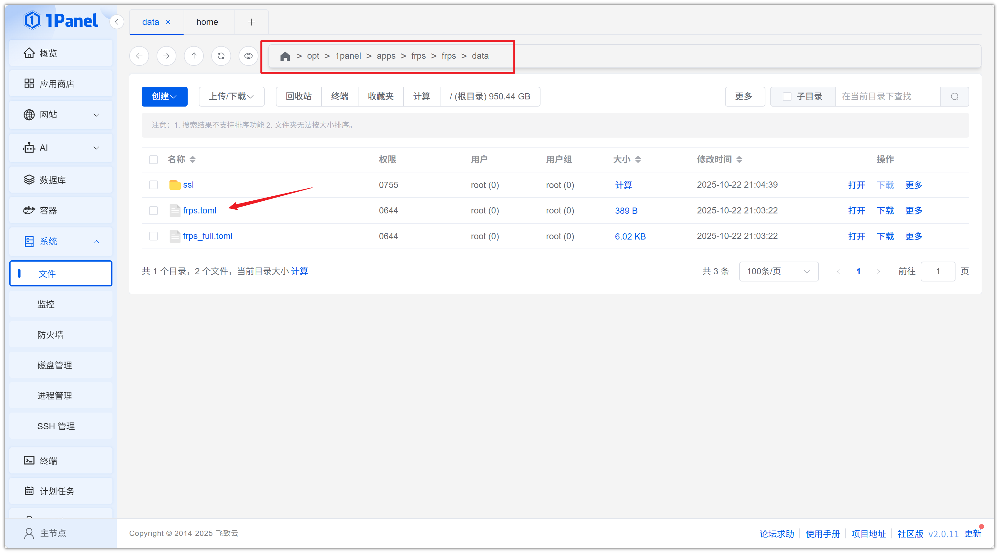

# Install frp Visually Using 1Panel

!!! note ""
    **frp (Fast Reverse Proxy)** is a high-performance open-source reverse proxy tool that allows you to establish secure communication channels between different networks. It supports port mapping, internal network penetration, remote access, and other networking requirements.

## 1. Open the App Store

!!! note ""
    After entering the 1Panel console, click **App Store** in the left menu.

{: .original}

## 2. Search for frp and Install

!!! note ""
    Enter **frp** in the search box in the upper right corner, click the application card to go to the details page, then select **Install**.

{: .original}

## 3. Configure Installation Parameters

!!! note ""
    You can configure the following as needed:

    - **Name**: Customize the application name (default: frps)
    - **Version**: Select the desired frp version from the dropdown
    - **Server Port**: Port for communication between frp server and clients (default: 7000)
    - **Dashboard Port**: Access port for the WebUI management interface (default: 7500)
    - **Username**: Dashboard login username (default: admin)
    - **Password**: Dashboard login password
    - **Token**: Authentication token between frps and frpc

    After confirming the settings are correct, click the **Confirm** button to start installation.

{: .original}

!!! note ""
    Wait for the installation to complete.

## 4. Access the frp Service

!!! note ""
    Configure the default access address. Skip this step if already configured.

{: .original}

!!! note ""
    Return to the App Store and click **Jump** to access the frp web service.

{: .original}

!!! note ""
    Log in with your username and password.

{: .original}

!!! note ""
    To modify the configuration, first go to the installation directory.

{: .original}

!!! note ""
    Edit the frp configuration file directly.

{: .original}
