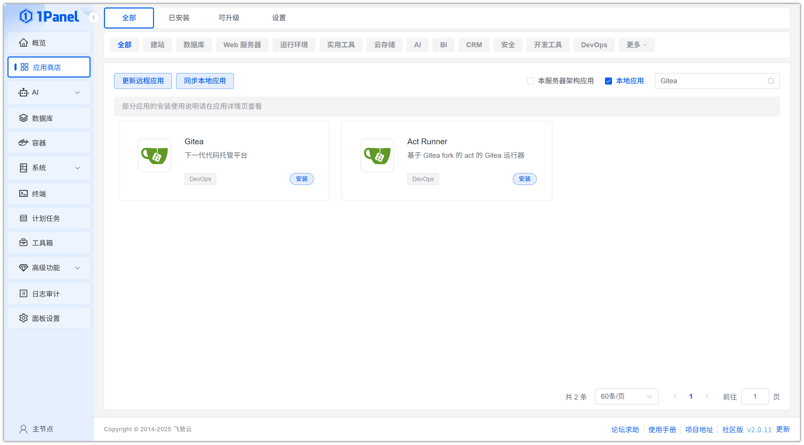
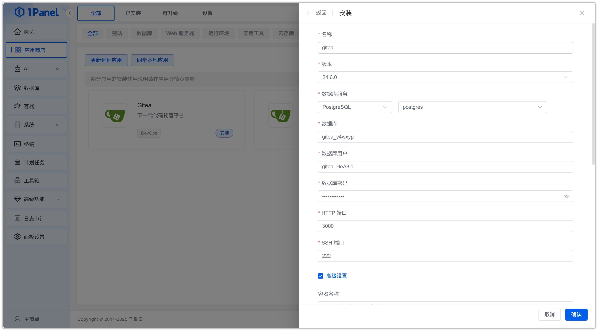
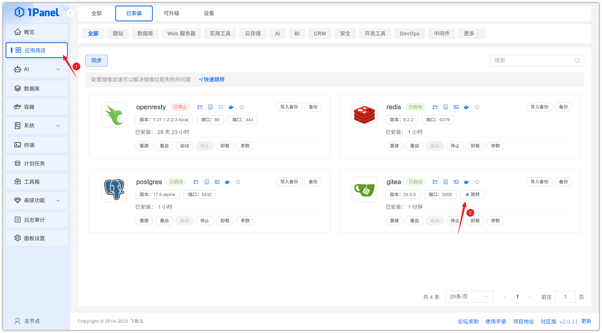
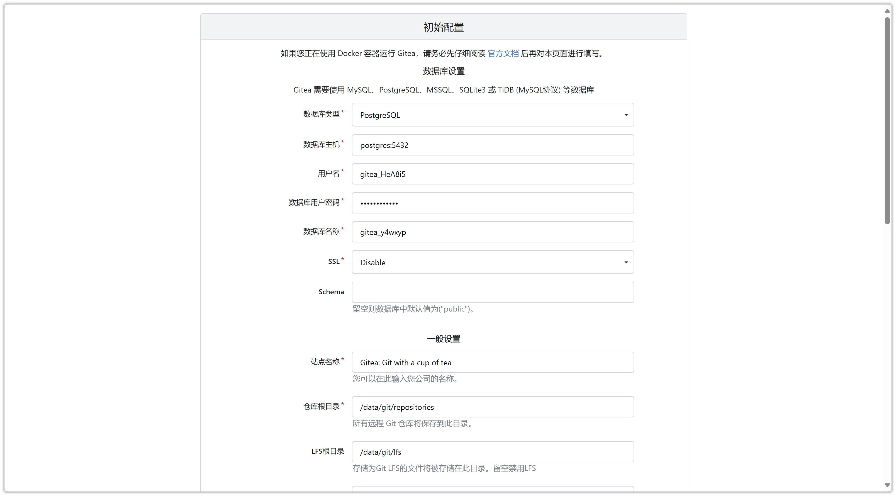
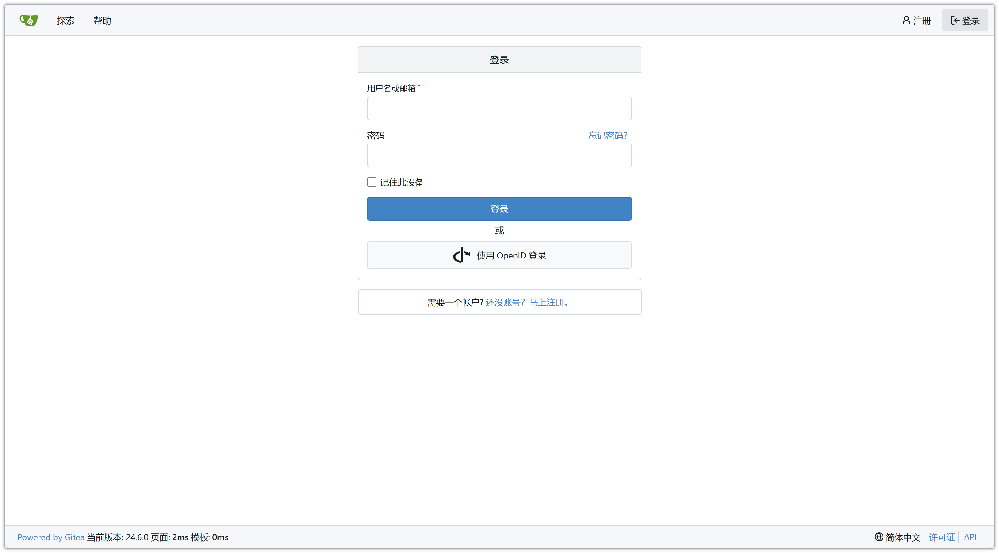

# 使用 1Panel 可视化安装 Gitea

!!! note ""
     **Gitea** 是新一代的代码托管平台，具备基于 Git 的核心代码托管能力和 DevSecOps 延伸能力，为广大软件开发者提供接近 GitHub 的使用体验，并且支持用户开展私有化部署。

## 1. 打开应用商店

!!! note ""
    进入 1Panel 控制台后，点击左侧菜单的 **「应用商店」**。

## 2. 搜索 Gitea 并安装

!!! note ""
    在右上角搜索框输入 **Gitea**，点击应用卡片进入详情页，选择 **安装**。

## 3. 配置安装参数

!!! note ""
     你可以根据需要配置

      - **名称** (输入框内可自定义应用名称，默认为 gitea)
      - **版本** (下拉选择所需的 Gitea 版本)
      - **数据库服务** (选择用于存储数据的数据库服务，例如 PostgreSQL)
      - **数据库名** (为应用创建的数据库名称)
      - **数据库用户** (用于连接数据库的用户名)
      - **数据库密码** (数据库用户的密码)
      - **HTTP 端口** (Web 访问端口，默认为 3000)
      - **SSH 端口** (Git over SSH 的访问端口，默认为 222)
      - **端口外部访问** (开启后，将允许从外部网络访问此应用端口)
    
    确认设置无误后，点击 **确认** 按钮开始安装。

!!! note ""
     等待安装完成即可

## 4. 访问 Gitea 服务

!!! note ""
     配置默认访问地址，已配置则忽略此步骤

!!! note ""
     返回应用商店，点击 **跳转** 即可访问 Gitea 服务

!!! note ""
     填写初始配置，安装服务

!!! note ""
     安装完成后，即可使用

