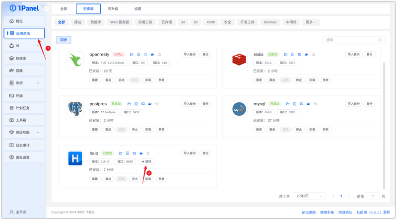
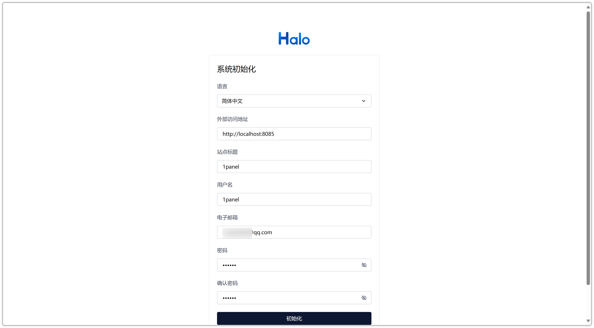
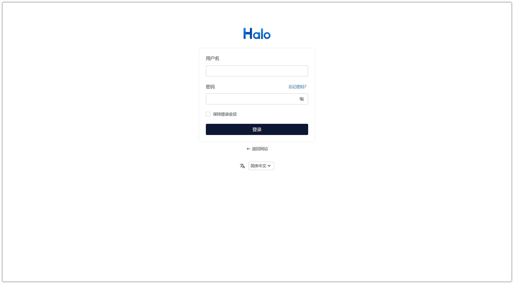

# Install Halo Visually Using 1Panel

!!! note ""
    **Halo** is a clean, efficient open‑source website building platform. It provides an easy‑to‑use interface and rich features, allowing users to easily create personal blogs or professional websites.

## 1. Open the App Store

!!! note ""
    After entering the 1Panel console, click **App Store** in the left menu.

{: .original}

## 2. Search for Halo and Install

!!! note ""
    Enter **Halo** in the search box in the upper right corner, click the application card to go to the details page, then select **Install**.

{: .original}

## 3. Configure Installation Parameters

!!! note ""
    You can configure the following as needed. Database service configuration is required.

    - **Name**: Customize the application name (default: halo)
    - **Version**: Select the desired Halo version from the dropdown
    - **Database Service**: Select the database service for data storage, such as MySQL
    - **Database Name**: Name of the database created for the application
    - **Database User**: Username for database connection
    - **Database User Password**: Password for the database user
    - **External Access URL**: Set the public access URL for the Halo blog
    - **Port**: Access port for the application (default: 8090)
    - **Port External Access**: When enabled, allows external network access to the application port

    After confirming the settings are correct, click the **Confirm** button to start installation.

{: .original}

!!! note ""
    Wait for the installation to complete.

## 4. Access the Halo Service

!!! note ""
    Configure the default access address. Skip this step if already configured.

{: .original}

!!! note ""
    Return to the App Store and click **Jump** to access the Halo service.

{: .original}

!!! note ""
    Set the configuration information and complete initialization.

{: .original}

!!! note ""
    Enter your username and password to log in and start using.

{: .original}
