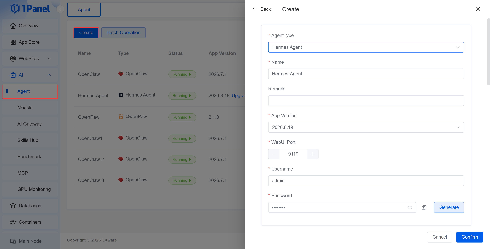
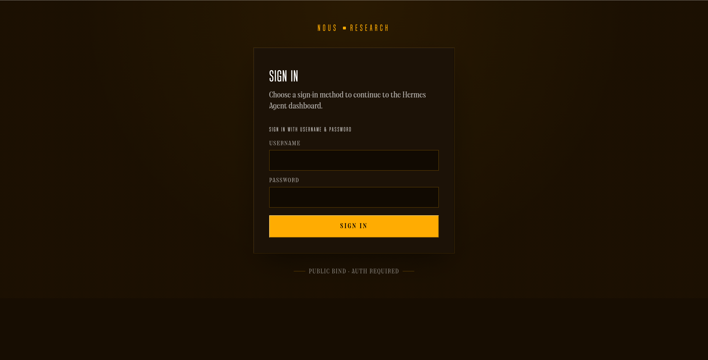

# Hermes Agent Installation and Deployment

## Product Introduction

!!! note ""
    **Hermes Agent** is a self-improving AI agent built by Nous Research. It features a built-in learning loop that can create and improve skills from usage experience, retain long-term memory, retrieve historical sessions, and continuously build an understanding of the user across multiple sessions.

    Hermes Agent is not tied to a local computer; it can run in environments such as VPSs and GPU clusters, and can interact with users through the command line, Web UI, or messaging platforms. The 1Panel installation package provides a browser Web UI for managing configurations and API Keys, and for viewing runtime status and session information.

    This document is based on the **AI -> Agents** feature of 1Panel and introduces how to complete the installation, deployment, and basic verification of Hermes Agent.

    **Scan the QR code to join the communication group**

    

## Prerequisites

!!! note ""
    Before deployment, please confirm the following conditions:

    - 1Panel has been installed and can be accessed normally
    - A usable large language model API Key has been prepared, or a local model has been integrated in 1Panel
    - The server can access the internet normally

## 1. Adding a Model Account

!!! note ""
    After entering the 1Panel dashboard, open the **AI** menu and enter the **Model Account** page.

    Click **Add Model Account**, fill in the corresponding information according to the model provider actually used, and save.

    After saving successfully, you can confirm in the model account list whether the newly created account is displayed normally.

## 2. Creating a Hermes Agent

!!! note ""
    After completing the creation of the model account, enter the **Agents** page under the **AI** menu and click **Create**.

    In the agent type, select **Hermes Agent**, and then fill in the deployment parameters as required by the page.

{: .browser-mockup}

!!! note "Parameter Description"
    - **Agent Type**: Select `Hermes Agent`
    - **Name**: Can be filled in as `hermes-agent` by default, or customized as needed
    - **Application Version**: Select the Hermes Agent version to install
    - **Access Port / WebUI Port**: Configure according to the page defaults or actual requirements
    - **Model Provider**: Select the provider corresponding to the model account created earlier
    - **Model Account / Model**: Select the specific model according to the actual scenario
    - **Other Parameters**: Generally keep the defaults

!!! note ""
    After selecting the model provider, the system will automatically load the maintained model accounts.

    If multiple models have been configured, you can select a specific model on the creation page; if there are additional configuration items, fill them in as prompted by the page.

    After the parameters are filled in, it is recommended to review the name, version, port, and model configuration once more to confirm they are correct before submitting the installation.

## 3. Starting the Installation and Confirming Completion

!!! note ""
    After confirming that the parameters are correct, click **Confirm** to start the installation.

    When the page shows that the installation is complete, it means that Hermes Agent has been successfully deployed.

    If you need to check the progress during the installation, you can watch the status changes on the page and wait for the task to complete.

## 4. Accessing the Hermes Agent WebUI

!!! note ""
    After the installation is completed, return to the **Agents** list page, find Hermes Agent, and click **WebUI** to jump to visit it directly.

    If the page is still initializing on the first visit, wait a moment and then refresh to access it.

{: .browser-mockup}

## 5. Subsequent Configuration Notes

!!! note ""
    After completing the basic deployment, you can continue to adjust the model, access methods, or other runtime parameters of Hermes Agent in 1Panel according to your actual business scenarios.
